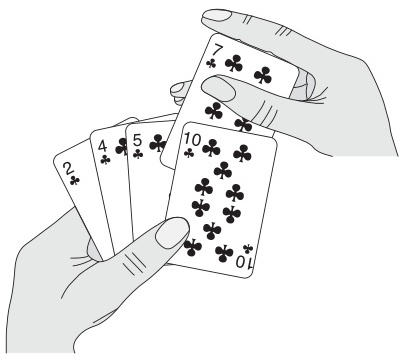
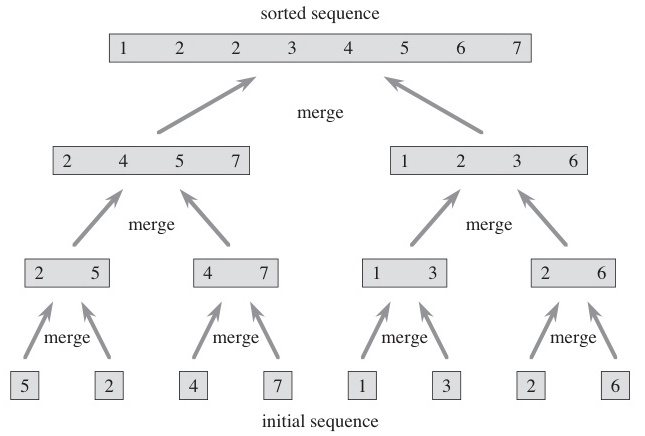
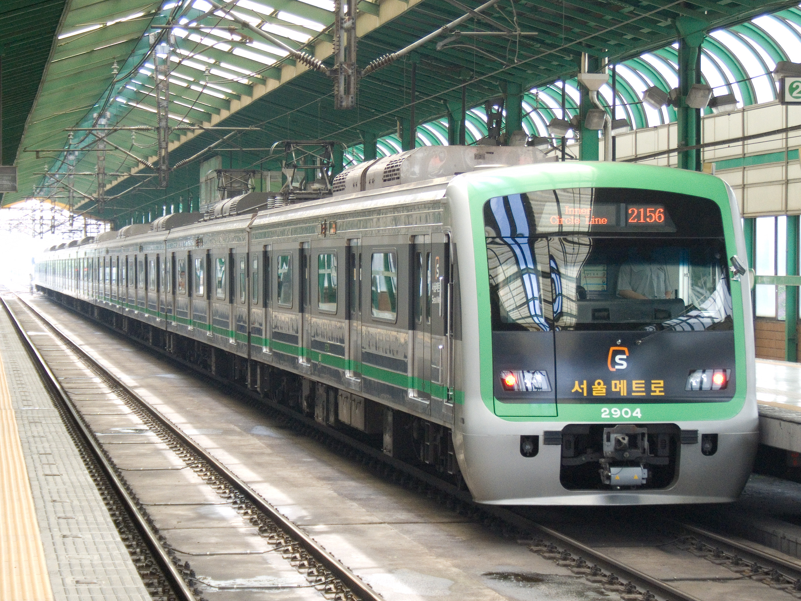
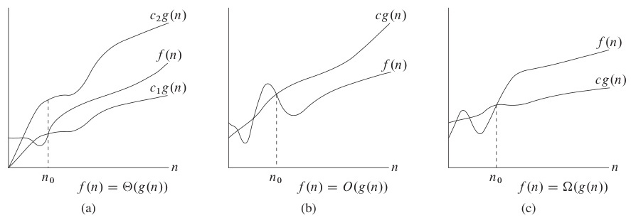

# Week 2 Lecture — Algorithm Design and Complexity Analysis

> **Last Updated:** 2026-03-21

---

## Table of Contents

- [1. Algorithm Basics](#1-algorithm-basics)
  - [1.1 What Is an Algorithm?](#11-what-is-an-algorithm)
  - [1.2 Properties of Algorithms](#12-properties-of-algorithms)
  - [1.3 Euclidean GCD Algorithm](#13-euclidean-gcd-algorithm)
  - [1.4 Representing Algorithms](#14-representing-algorithms)
  - [1.5 Algorithm Classification](#15-algorithm-classification)
- [2. Time Complexity](#2-time-complexity)
  - [2.1 What Is Time Complexity?](#21-what-is-time-complexity)
  - [2.2 Execution Time Examples](#22-execution-time-examples)
  - [2.3 Types of Complexity Analysis](#23-types-of-complexity-analysis)
- [3. Asymptotic Notation](#3-asymptotic-notation)
  - [3.1 Why Asymptotic Notation?](#31-why-asymptotic-notation)
  - [3.2 Big-O Notation](#32-big-o-notation)
  - [3.3 Big-Omega Notation](#33-big-omega-notation)
  - [3.4 Theta Notation](#34-theta-notation)
  - [3.5 Common Complexity Classes](#35-common-complexity-classes)
  - [3.6 Why Efficient Algorithms Matter](#36-why-efficient-algorithms-matter)
- [4. Recurrence Relations](#4-recurrence-relations)
  - [4.1 What Is a Recurrence Relation?](#41-what-is-a-recurrence-relation)
  - [4.2 Method 1: Repeated Substitution](#42-method-1-repeated-substitution)
  - [4.3 Method 2: Guess and Verify](#43-method-2-guess-and-verify)
  - [4.4 Method 3: Master Theorem](#44-method-3-master-theorem)
- [Summary](#summary)
- [Appendix](#appendix)

---

<br>

## 1. Algorithm Basics

### 1.1 What Is an Algorithm?

- An **algorithm** is a step-by-step procedure or method for solving a problem.
- The problems we deal with are solved **using computers**.
- An algorithm takes **input** and produces **output** (a solution).

```
┌───────┐      ┌─────────────┐      ┌────────┐
│ Input  │ ───► │  Algorithm   │ ───► │ Output │
└───────┘      └─────────────┘      └────────┘
```

### 1.2 Properties of Algorithms

| Property | Description |
|:---------|:------------|
| **Correctness** | Must produce the correct output for all valid inputs (same input -> same output) |
| **Executability** | Each step must be executable on a computer |
| **Finiteness** | Must terminate within a finite amount of time |
| **Efficiency** | The more efficient in time and space, the more valuable |

> **Key Point:** **Finiteness** is especially important — a program stuck in an infinite loop is not an algorithm. For example, `while True: pass` is not an algorithm. In contrast, the Euclidean GCD always terminates because b decreases with each step and must eventually reach 0.

### 1.3 Euclidean GCD Algorithm

The **oldest known algorithm**, created around ~300 BCE.

- **Greatest Common Divisor (GCD)**: The largest number that divides both natural numbers
- Key insight: GCD(A, B) = GCD(B, A mod B)

**Mathematical Basis:**

Given $A > B$ and $A = a \cdot G$, $B = b \cdot G$ ($G$ = GCD):

$$A \mod B = (a \mod b) \cdot G$$

Repeatedly applying this reduces $B$ to $0$, and $A$ at that point is the GCD.

> **Note:** The remainder A mod B is also a multiple of G. That is, the GCD is preserved through the modulo operation. This is why GCD(A, B) = GCD(B, A mod B) holds.

> **Note:** Proof: Since $A = B \cdot q + r$ (q is the quotient, r is the remainder), $a \cdot G = b \cdot G \cdot q + r$. Therefore $r = (a - bq) \cdot G = (a \bmod b) \cdot G$. Since G remains a factor in the remainder, the GCD is preserved.

**Pseudocode:**

```
Euclid(a, b)
  Input:  integers a, b  (a >= b >= 0)
  Output: GCD(a, b)

  if b == 0
      return a
  return Euclid(b, a mod b)
```

**Trace: GCD(24, 14)**

| Call | a | b | a mod b |
|:-----|:--|:--|:--------|
| 1 | 24 | 14 | 10 |
| 2 | 14 | 10 | 4 |
| 3 | 10 | 4 | 2 |
| 4 | 4 | 2 | 0 |
| 5 | 2 | 0 | — (return 2) |

**Iterative Version:**

```python
def gcd_iter(a, b):
    while b != 0:
        a, b = b, a % b
    return a
```

**Recursive Version:**

```python
def gcd_rec(a, b):
    if b == 0:
        return a
    return gcd_rec(b, a % b)
```

Both versions produce the same result. Recursion uses the **call stack**, where each call pushes a new frame. Iteration avoids stack overhead.

> **[Data Structures]** **Recursion** is when a function calls itself. Every recursive function consists of (1) a **base case**: the condition that stops the recursion, and (2) a **recursive step**: reducing the problem to a smaller size and calling itself. In the GCD function above, `b == 0` is the base case, and `gcd_rec(b, a % b)` is the recursive step.

**Recursive Call Stack Trace:**

```
gcd_rec(24, 14)
  └─► gcd_rec(14, 10)
        └─► gcd_rec(10, 4)
              └─► gcd_rec(4, 2)
                    └─► gcd_rec(2, 0) → returns 2
                  returns 2
            returns 2
      returns 2
returns 2
```

Each recursive call **pushes** a frame onto the stack. When `b == 0`, the value is **popped** back up.

> **[Data Structures]** A stack is a **LIFO (Last In, First Out)** data structure. Program function calls are also managed using a stack structure — a function call pushes, and a return pops. If recursion goes too deep, a **Stack Overflow** can occur. Python's default recursion depth limit is 1000.

### 1.4 Representing Algorithms

An algorithm is a step-by-step procedure, similar to a cooking recipe. There are three common ways to represent them:

| Method | Description |
|:-------|:------------|
| **Natural Language** | Describe each step in words |
| **Pseudocode** | A structured notation similar to programming languages (most common) |
| **Flowchart** | A visual diagram with shapes and arrows |

**Example — Finding the Maximum:**

Problem: Find the largest number among $n$ number cards.



**Natural Language:**

1. Read the first card's number and remember it
2. Read the next card and compare it with the remembered number
3. Keep the larger number in memory
4. If cards remain, go to step 2
5. The remembered number is the maximum

**Pseudocode:**

```
FindMax(A[], n)
  max = A[0]
  for i = 1 to n-1
      if A[i] > max
          max = A[i]
  return max
```

> **Note:** Pseudocode is not a specific programming language but a conventional notation for clearly expressing the logic of an algorithm. The CLRS textbook uses its own pseudocode style, and you will write algorithms in this format on exams.

**Flowchart:**

```
  ┌─────────┐
  │  Start   │
  └────┬────┘
       ▼
  ┌─────────┐
  │max=A[0] │
  │ i = 1   │
  └────┬────┘
       ▼
  ◇ i < n ? ◇──No──► ┌────────────┐
       │              │ return max │
       Yes            └────────────┘
       ▼
  ◇ A[i]>max? ◇
  │           │
  Yes        No
  ▼           │
┌────────┐    │
│max=A[i]│    │
└───┬────┘    │
    │◄────────┘
    ▼
┌────────┐
│i = i+1 │
└───┬────┘
    │
    └──► (back to i < n ?)
```

Flowcharts are intuitive for simple algorithms but become complex for large programs, so pseudocode is predominantly used in modern textbooks.

### 1.5 Algorithm Classification

Six major types based on problem-solving strategy:

| Type | Core Idea |
|:-----|:----------|
| **Divide and Conquer** | Split into subproblems -> solve each -> combine results |
| **Greedy** | Make the locally optimal choice at each step |
| **Dynamic Programming (DP)** | Solve subproblems and store results for reuse |
| **Approximation** | Near-optimal solutions for NP-hard problems |
| **Backtracking** | Explore all possibilities, pruning infeasible branches |
| **Branch and Bound** | Similar to backtracking, but uses bounds for more aggressive pruning |

> **Key Point:** These 6 categories form the core framework running through the entire course. Among them, **Divide and Conquer, Greedy, and Dynamic Programming** are the three most heavily covered strategies.

**Divide and Conquer:**

Divide a large problem into smaller subproblems, solve each recursively, then combine the results. **Advantage:** Effective when the problem structure is naturally recursive. Examples: Merge Sort, Quick Sort, Binary Search.



> **[Data Structures]** Divide and conquer always consists of 3 stages:
> 1. **Divide**: Split the problem into smaller subproblems
> 2. **Conquer**: Solve each subproblem recursively (solve directly if small enough)
> 3. **Combine**: Merge the solutions of subproblems to form the solution to the original problem
>
> In merge sort: Divide = split the array in half, Conquer = recursively sort each half, Combine = merge the two sorted halves.

**Greedy Algorithms:**

Make the choice that looks **best right now** at each step. Does **not** always guarantee a globally optimal solution, but does under specific conditions. Examples: Minimum Spanning Tree (Kruskal, Prim), Dijkstra's Shortest Path, Huffman Coding.

> **Note:** For a greedy algorithm to guarantee an optimal solution, two conditions are required:
> 1. **Greedy Choice Property**: A locally optimal choice leads to a globally optimal solution
> 2. **Optimal Substructure**: The optimal solution of the problem contains optimal solutions of subproblems
>
> If these conditions are not met, the greedy approach can yield incorrect solutions. This will be covered rigorously in Weeks 5-6.

**Dynamic Programming (DP):**

Divide the problem into subproblems (like divide and conquer), but **store and reuse the results of overlapping subproblems**.

Key conditions:
- Overlapping Subproblems
- Optimal Substructure

Examples: Fibonacci sequence, Longest Common Subsequence (LCS), Knapsack Problem.

**DP vs Divide and Conquer:** In divide and conquer, subproblems are **independent**; in DP, subproblems **overlap**.

> **Note:** Examining the difference using Fibonacci:
> - **Divide and Conquer**: fib(5) -> fib(4) + fib(3), fib(4) -> fib(3) + fib(2)... Here, fib(3) is **computed redundantly**. O(2^n).
> - **DP**: Compute sequentially from fib(1), fib(2), storing results in a table for reuse. No redundant computation, yielding O(n).

**Approximation, Backtracking, Branch and Bound:**

| Type | Description |
|:-----|:------------|
| **Approximation Algorithms** | For NP-hard problems where exact solutions are too costly. Trade optimality for speed. Examples: TSP approximation, Vertex Cover |
| **Backtracking** | Explore all possibilities but prune infeasible branches. Examples: N-Queens, Maze Search |
| **Branch and Bound** | Similar to backtracking, but computes upper/lower bounds for more effective pruning. Examples: TSP, Knapsack (exact solution) |

> **Note:** NP-hard problems are problems that cannot be efficiently solved (in polynomial time) by any known algorithm. For example, the Traveling Salesman Problem (TSP) becomes practically impossible to check all cases as n grows. This will be covered in detail in Week 14.

> **Note:** The key difference between backtracking and branch and bound:
> - **Backtracking**: "Can a **solution exist** if we go in this direction?" (feasibility check)
> - **Branch and Bound**: "Can we **improve upon the current best solution** if we go in this direction?" (optimality check)
>
> Branch and bound computes upper or lower bounds and prunes entire branches that have no chance of improving the current best solution.

**Other Classifications:**
- **By problem domain:** Sorting, Graphs, Computational Geometry
- **By computing environment:** Parallel, Distributed, Quantum
- **Other:** AI / Machine Learning algorithms

---

<br>

## 2. Time Complexity

### 2.1 What Is Time Complexity?

**Time complexity** is the number of **basic operations** as a function of input size $n$. **Basic operations** are simple operations that take constant time, such as comparisons, reads, writes, and arithmetic operations.

**Example: Finding the maximum among $n$ cards**

- Sequential scan: compare each card with the current maximum
- Number of comparisons: $n - 1$
- Time complexity: $T(n) = n - 1$

> **Key Point:** The key to computing time complexity is **"counting how many basic operations are performed for input size n."** It is an abstract count of operations, not actual execution time (seconds). This allows comparing the fundamental efficiency of algorithms regardless of computer performance.

### 2.2 Execution Time Examples

**Example 1 — O(1):**

```
sample1(A[], n)
    k = n / 2
    return A[k]
```

1 division + 1 array access → **constant time** regardless of $n$.

**Example 2 — O(n):**

```
sample2(A[], n)
    sum = 0
    for i = 1 to n
        sum = sum + A[i]
    return sum
```

The loop executes $n$ times → **linear time**.

**Example 3 — O(n^2):**

```
sample3(A[], n)
    sum = 0
    for i = 1 to n
        for j = 1 to n
            sum = sum + A[i] * A[j]
    return sum
```

Nested loops, each executing $n$ times → $n \times n$ = **quadratic time**.

> **Note:** The basic principle for determining nested loop time complexity: **inner loop iterations x outer loop iterations**. Here it is n x n = n^2. A triple-nested loop would be O(n^3).

**Example 4 — O(n^2) (Triangular Loop):**

```
sample5(A[], n)
    sum = 0
    for i = 1 to n-1
        for j = i+1 to n
            sum = sum + A[i] * A[j]
    return sum
```

The inner loop executes $(n-1) + (n-2) + \cdots + 1 = \frac{n(n-1)}{2}$ times → still $O(n^2)$.

> **Note:** $1 + 2 + \cdots + (n-1) = \frac{n(n-1)}{2}$ is the arithmetic series sum formula. In Big-O, we keep only the highest-order term and ignore coefficients, yielding O(n^2). This "triangular double loop" pattern appears very frequently (e.g., duplicate checking, all-pairs comparison).

**Example 5 — O(n) (Recursion):**

```
factorial(n)
    if n == 1 return 1
    return n * factorial(n - 1)
```

Recursion depth is $n$ → **linear time**.

> **Note:** The time complexity of a recursive function is determined by "how many total recursive calls occur." factorial(n) is called exactly n times, so it is O(n). Since the work done in each call (one multiplication) is O(1), the total time complexity is O(n) x O(1) = O(n).

### 2.3 Types of Complexity Analysis

| Type | Meaning |
|:-----|:--------|
| **Worst-case** | Upper bound — "will never take longer than this for any input" |
| **Average-case** | Expected time under a probability distribution (usually uniform) |
| **Best-case** | Fastest execution — used to find the optimal algorithm |
| **Amortized** | Average cost per operation over a sequence of operations |

In practice, **worst-case analysis** is the most commonly used.

> **Key Point:** The reason worst-case is primarily used is that it provides a **guarantee**. "This algorithm will never exceed n^2 time for any input" is a solid promise. Average analysis, on the other hand, is merely an estimate of "usually around this much." For example, quick sort averages O(n log n) but has a worst case of O(n^2).

**Commute Time Analogy:**



Scenario: Home -> Station (6 min) -> Subway (20 min) -> Classroom (10 min)

| Case | Time | Description |
|:-----|:-----|:------------|
| **Best** | 36 min | Train arrives immediately |
| **Worst** | 40 min | Just missed it, 4 min wait |
| **Average** | 38 min | Average wait ~2 min |

Same way of thinking about algorithm analysis — the **worst case** provides a guarantee.

---

<br>

## 3. Asymptotic Notation

### 3.1 Why Asymptotic Notation?



- Time complexity is a function of $n$ (usually a polynomial with multiple terms).
- As $n$ grows, only the **dominant term** matters.
- **Asymptotic notation** simplifies the expression by focusing on the growth rate.

| Notation | Meaning | Intuitive Interpretation |
|:---------|:--------|:------------------------|
| $O$ (Big-O) | Upper bound | "At most this fast" |
| $\Omega$ (Big-Omega) | Lower bound | "At least this fast" |
| $\Theta$ (Theta) | Tight bound | Exact growth rate |

> **Key Point:** "Asymptotic" means "behavior as n approaches infinity." For example, in $3n^2 + 100n + 5000$, when n is 1,000,000, $3n^2 = 3 \times 10^{12}$ and $100n = 10^8$, so $100n$ is negligibly small compared to $3n^2$. That is why we **keep only the highest-order term** and ignore the rest.

### 3.2 Big-O Notation

**Formal Definition:**

$O(g(n))$ = the set of functions that grow **at most as fast as** $g(n)$.

$$O(g(n)) = \{ f(n) \mid \exists\, c > 0,\; n_0 \geq 0 \;\text{s.t.}\; \forall\, n \geq n_0,\; f(n) \leq c \cdot g(n) \}$$

- $g(n)$ is the **asymptotic upper bound** of $f(n)$
- Convention: Technically $f(n) \in O(g(n))$, but we write $f(n) = O(g(n))$

**Intuitive Meaning:** $f(n) = O(g(n))$ means $f$ **does not grow faster than** $g$ (ignoring constant factors).

> **Note:** In plain terms: "for sufficiently large n (n >= n_0), f(n) is always at most c x g(n)." Here, c and n_0 are constants that need to be found. On exams, you may be asked to find specific values of c and n_0 in a proof.

**Proof Example:** $f(n) = 2n^2 - 8n + 3 = O(n^2)$

We need to find constants $c > 0$ and $n_0 \geq 0$ such that $2n^2 - 8n + 3 \leq c \cdot n^2$ for all $n \geq n_0$.

Choose $c = 5$:

$$2n^2 - 8n + 3 \leq 5n^2 \quad \text{(for all } n \geq 1 \text{)}$$

Rearranging: $-3n^2 - 8n + 3 \leq 0$, which holds for $n \geq 1$.

> **Note:** Expanding: Subtracting $5n^2$ from both sides of $2n^2 - 8n + 3 \leq 5n^2$ gives $-3n^2 - 8n + 3 \leq 0$. For $n \geq 1$, $-3n^2 \leq -3$ and $-8n \leq -8$, so the left side is $-3 - 8 + 3 = -8 \leq 0$. As n grows, $-3n^2$ dominates, making the expression even more negative, so it always holds.

Therefore $c = 5$, $n_0 = 1$ gives $f(n) = O(n^2)$. $\square$

> **Exam Tip:** A practical method for finding c — for a polynomial $a_k n^k + a_{k-1} n^{k-1} + \cdots + a_0$, taking the **sum of absolute values of all coefficients** $|a_k| + |a_{k-1}| + \cdots + |a_0|$ as c almost always works. Example: for $2n^2 - 8n + 3$, $c = 2 + 8 + 3 = 13$, $n_0 = 1$.

**Functions contained in $O(n^2)$:**
- $3n^2 + 2n$ yes, $7n^2 - 100n$ yes, $n \log n + 5n$ yes, $3n$ yes

**Functions NOT in $O(n^2)$:**
- $n^3$ no, $3^n$ no

**Best Practice:** Write as **tightly** as possible. $n \log n + 5n = O(n \log n)$, not $O(n^2)$. A loose bound means **loss of information**.

> **Note:** "This algorithm is O(n^2)" and "this algorithm is O(n log n)" can both be true, but O(n log n) is more useful information. Just as "this apple costs at most 50 won" is more useful than "this apple costs at most 100 won."

**More Big-O Examples:**

| Expression | Big-O | Reason |
|:-----------|:------|:-------|
| $3n + 2$ | $O(n)$ | $3n+2 \leq 4n$ (for $n \geq 2$) |
| $100n + 6$ | $O(n)$ | $100n+6 \leq 101n$ (for $n \geq 10$) |
| $10n^2 + 4n + 2$ | $O(n^2)$ | $10n^2+4n+2 \leq 11n^2$ (for $n \geq 5$) |
| $6 \cdot 2^n + n^2$ | $O(2^n)$ | $6 \cdot 2^n + n^2 \leq 7 \cdot 2^n$ (for $n \geq 4$) |

### 3.3 Big-Omega Notation

**Formal Definition:**

$\Omega(g(n))$ = the set of functions that grow **at least as fast as** $g(n)$.

$$\Omega(g(n)) = \{ f(n) \mid \exists\, c > 0,\; n_0 \geq 0 \;\text{s.t.}\; \forall\, n \geq n_0,\; f(n) \geq c \cdot g(n) \}$$

- $g(n)$ is the **asymptotic lower bound** of $f(n)$
- Symmetric to Big-O

**Intuitive Meaning:** $f(n) = \Omega(g(n))$ means $f$ **does not grow slower than** $g$.

**Examples:**

| Expression | Big-Omega | Reason |
|:-----------|:----------|:-------|
| $3n + 2$ | $\Omega(n)$ | $3n+2 \geq 3n$ (for $n \geq 1$) |
| $100n + 6$ | $\Omega(n)$ | $100n+6 \geq 100n$ (for $n \geq 1$) |
| $10n^2 + 4n + 2$ | $\Omega(n^2)$ | $10n^2+4n+2 \geq n^2$ (for $n \geq 1$) |
| $6 \cdot 2^n + n^2$ | $\Omega(2^n)$ | $6 \cdot 2^n + n^2 \geq 2^n$ (for $n \geq 1$) |

**Best Practice:** Write as tightly as possible. $n \log n + 5n = \Omega(n \log n)$, not $\Omega(n)$.

### 3.4 Theta Notation

**Formal Definition:**

$\Theta(g(n))$ = the set of functions that grow **at the same rate as** $g(n)$.

$$\Theta(g(n)) = O(g(n)) \;\cap\; \Omega(g(n))$$

$$\Theta(g(n)) = \{ f(n) \mid \exists\, c_1, c_2 > 0,\; n_0 \geq 0 \;\text{s.t.}\; \forall\, n \geq n_0,\; c_2 \cdot g(n) \leq f(n) \leq c_1 \cdot g(n) \}$$

**Intuitive Meaning:** $f(n) = \Theta(g(n))$ means $f$ and $g$ grow **at the same rate** (up to constant factors).

> **Key Point:** Theta is the most precise notation:
> - O(n^2): "This algorithm is **at most** n^2 level" (could be faster)
> - Omega(n^2): "This algorithm is **at least** n^2 level" (could be slower)
> - Theta(n^2): "This algorithm is **exactly** n^2 level"

**Examples:**

| Expression | Theta |
|:-----------|:------|
| $3n + 2$ | $\Theta(n)$ — $3n \leq 3n+2 \leq 4n$ (for $n \geq 2$) |
| $10n^2 + 4n + 2$ | $\Theta(n^2)$ |
| $6 \cdot 2^n + n^2$ | $\Theta(2^n)$ |

**Counterexample:** $2n^2 + 3n + 5 \neq \Theta(n^3)$ and $2n^2 + 3n + 5 \neq \Theta(n)$ — Theta requires **both** the upper and lower bounds to match.

### 3.5 Common Complexity Classes

| Notation | Name | Example |
|:---------|:-----|:--------|
| $O(1)$ | Constant | Array index access |
| $O(\log n)$ | Logarithmic | Binary search |
| $O(n)$ | Linear | Linear search |
| $O(n \log n)$ | Log-linear | Merge sort |
| $O(n^2)$ | Quadratic | Bubble sort |
| $O(n^3)$ | Cubic | Matrix multiplication (naive) |
| $O(2^n)$ | Exponential | Subset exhaustive search |

**Hierarchy:** $O(1) \subset O(\log n) \subset O(n) \subset O(n \log n) \subset O(n^2) \subset O(n^3) \subset O(2^n)$

> **Key Point:** Practical intuition:
> - **O(1)**: Hash table lookup — instant
> - **O(log n)**: Even for n=1 billion, ~30 steps — very fast
> - **O(n)**: For n=1 billion, 1 billion steps — typically a few seconds
> - **O(n log n)**: Most sorting — practical limit
> - **O(n^2)**: For n=100,000, 10 billion steps — starts getting slow
> - **O(2^n)**: For n=40, 1 trillion steps — practically impossible

**Growth Rate Comparison:**

| $n$ | $\log n$ | $n$ | $n \log n$ | $n^2$ | $n^3$ | $2^n$ |
|:----|:---------|:----|:-----------|:------|:------|:------|
| 10 | 3.3 | 10 | 33 | 100 | 1,000 | 1,024 |
| 100 | 6.6 | 100 | 664 | 10,000 | $10^6$ | $10^{30}$ |
| 1,000 | 10 | 1,000 | 10,000 | $10^6$ | $10^9$ | $10^{301}$ |
| $10^6$ | 20 | $10^6$ | $2 \times 10^7$ | $10^{12}$ | $10^{18}$ | — |

The gap between polynomial and exponential is **enormous**.

> **Note:** $2^{100} \approx 10^{30}$, and the estimated number of atoms in the observable universe is roughly $10^{80}$. Even at just n=100, $2^n$ reaches an unimaginable scale. This is what "exponential-time algorithms are impractical" means.

> **Note:** In the table above, $\log n$ means $\log_2 n$. In CS, log without specifying a base usually means **base 2**. In Big-O, the base does not matter — since $\log_a n = \frac{\log_b n}{\log_b a}$, changing bases is just a constant factor, and constants are ignored in Big-O.

### 3.6 Why Efficient Algorithms Matter

**Sorting 1 billion numbers:**

| Algorithm | $n$ = 1,000 | $n$ = 1,000,000 | $n$ = 1,000,000,000 |
|:----------|:------------|:----------------|:--------------------|
| $O(n^2)$ (PC) | < 1 sec | ~2 hours | **~300 years** |
| $O(n^2)$ (Supercomputer) | < 1 sec | ~1 sec | ~1 week |
| $O(n \log n)$ (PC) | < 1 sec | < 1 sec | **~5 min** |
| $O(n \log n)$ (Supercomputer) | < 1 sec | < 1 sec | < 1 sec |

> An efficient algorithm is **worth more than a supercomputer**.
>
> Investing in a better algorithm is far more cost-effective than investing in better hardware.

> **Key Point:** Running O(n^2) on a supercomputer is **tens of thousands of times slower** than running O(n log n) on a regular PC. Hardware can only provide constant-factor improvement, but an algorithm improvement changes the **order** itself.

---

<br>

## 4. Recurrence Relations

### 4.1 What Is a Recurrence Relation?

A **recurrence relation** expresses a function in terms of its values on **smaller inputs**.

Examples:
- $a_n = a_{n-1} + 2$
- $f(n) = n \cdot f(n-1)$ — Factorial
- $f(n) = f(n-1) + f(n-2)$ — Fibonacci
- $f(n) = f(n/2) + n$ — Binary reduction

Many recursive algorithms naturally produce recurrence relations for their running time.

> **Note:** A recurrence relation can be thought of as a "recursively defined function." Recursive algorithms are difficult to express directly as T(n) = ..., so instead we express "T(n) in terms of T(n/2) or T(n-1), etc." The goal is to solve the recurrence and obtain a closed form.

**Merge Sort Recurrence:**

$$T(n) = 2T(n/2) + n$$

- $2T(n/2)$: Two recursive calls on halves
- $n$: Merge overhead (linear scan)
- $T(1) = 1$

> **[Data Structures]** How merge sort works:
> 1. Split array [5, 2, 4, 1, 3] in half: [5, 2] / [4, 1, 3]
> 2. Recursively sort each half: [2, 5] / [1, 3, 4]
> 3. Merge the two sorted arrays: [1, 2, 3, 4, 5]
>
> The merge process compares elements from the front of both arrays, taking the smaller one, so it is O(n). The $n$ in the recurrence is precisely this merge cost.

**Three methods for solving recurrence relations:**

| Method | Idea |
|:-------|:-----|
| **Repeated Substitution** | Expand the recurrence step by step to find a pattern |
| **Guess and Verify** | Guess the form, then prove it by mathematical induction |
| **Master Theorem** | Apply a formula directly to recurrences of a specific form |

### 4.2 Method 1: Repeated Substitution

**Example:** $T(n) = T(n-1) + c$, $T(1) \leq c$

$$
\begin{aligned}
T(n) &= T(n-1) + c \\
     &= (T(n-2) + c) + c = T(n-2) + 2c \\
     &= T(n-3) + 3c \\
     &\;\;\vdots \\
     &= T(1) + (n-1)c \\
     &\leq c + (n-1)c = cn = O(n)
\end{aligned}
$$

This is the recurrence for **factorial**, with linear time.

> **Note:** The key strategy of repeated substitution: repeatedly substitute the recurrence into T(n) to find a pattern, then generalize it. In the example above, the pattern is "after k substitutions, T(n-k) + kc." Substituting k = n-1 gives T(1) + (n-1)c.

**Applied to Merge Sort:** $T(n) = 2T(n/2) + n$, $T(1) = 1$

Assume $n = 2^k$:

$$
\begin{aligned}
T(n) &= 2T(n/2) + n \\
     &= 2(2T(n/4) + n/2) + n = 4T(n/4) + 2n \\
     &= 8T(n/8) + 3n \\
     &\;\;\vdots \\
     &= 2^k T(n/2^k) + kn \\
     &= n \cdot T(1) + n \log_2 n \\
     &= n + n \log n = O(n \log n)
\end{aligned}
$$

> **Note:** The expansion pattern:
> - 1 substitution: $2T(n/2) + n$ -> coefficient 2, problem size n/2
> - 2 substitutions: $4T(n/4) + 2n$ -> coefficient 4, problem size n/4
> - k substitutions: $2^k T(n/2^k) + kn$
>
> If $n = 2^k$, then $k = \log_2 n$ and $2^k = n$, so we get $n \cdot T(1) + n\log n$. **Assuming $n = 2^k$ is for computational convenience**, and the same result holds for general n.

### 4.3 Method 2: Guess and Verify (Induction)

**Recurrence:** $T(n) = 2T(n/2) + n$

**Guess:** $T(n) = O(n \log n)$, i.e., $T(n) \leq cn \log n$ for some constant $c > 0$.

> **[Discrete Mathematics]** The 3 steps of mathematical induction:
> 1. **Base Case**: Show the statement is true for the smallest case
> 2. **Inductive Hypothesis**: Assume the statement is true for n = k
> 3. **Inductive Step**: Show it is also true for n = k+1
>
> Completing these three steps proves the statement for all natural numbers.

**Proof by Mathematical Induction:**

*Base case:* $T(2) \leq c \cdot 2 \log 2$ — holds for sufficiently large $c$.

*Inductive hypothesis:* Assume $T(n/2) \leq c(n/2)\log(n/2)$.

*Inductive step:*

$$
\begin{aligned}
T(n) &= 2T(n/2) + n \\
     &\leq 2 \cdot c(n/2)\log(n/2) + n \\
     &= cn\log n - cn\log 2 + n \\
     &= cn\log n + (-c\log 2 + 1)n \\
     &\leq cn\log n \quad \text{(when } c \geq 1/\log 2 \text{)}
\end{aligned}
$$

Therefore $T(n) = O(n \log n)$. $\square$

**Common Pitfall:**

**Warning:** The constant $c$ in the hypothesis must be **the same** $c$ in the conclusion.

Incorrect proof attempt — $T(n) = 2T(n/2) + 1$, guess $T(n) = O(n)$:

$$T(n) \leq 2 \cdot c(n/2) + 1 = cn + 1$$

This is $cn + 1$, which is **not** $\leq cn$. Proof fails!

Fix — strengthen the guess to $T(n) \leq cn - 2$:

$$T(n) \leq 2(c(n/2) - 2) + 1 = cn - 4 + 1 = cn - 3 \leq cn - 2 \;\checkmark$$

> **Exam Tip:** This pitfall appears frequently on exams! The most common mistake in induction proofs is getting "cn + (constant)" and saying "it's O(n), so we're done." In induction, you must show **exactly the same form** ($\leq cn$). The solution is to "slightly reduce" the guess to $cn - d$ (for an appropriate constant d) to create slack.

> **Note:** A systematic method for determining the constant $d$: the original proof gave $T(n) \leq cn + 1$ but needed $\leq cn$. Set the guess to $cn - d$ and expand the inductive step: $T(n) \leq 2(c(n/2) - d) + 1 = cn - 2d + 1$. For this to be $\leq cn - d$, we need $-2d + 1 \leq -d$, i.e., $d \geq 1$ suffices. The key is "creating slack to absorb the excess."

### 4.4 Method 3: Master Theorem

For recurrences of the form:

$$T(n) = aT(n/b) + f(n) \quad \text{(where } a \geq 1, \; b > 1\text{)}$$

Let $h(n) = n^{\log_b a}$. Compare $f(n)$ and $h(n)$:

| Case | Condition | Result |
|:-----|:---------|:-------|
| **Case 1** | $f(n) = O(n^{\log_b a - \varepsilon})$ (for some $\varepsilon > 0$) | $T(n) = \Theta(n^{\log_b a})$ |
| **Case 2** | $f(n) = \Theta(n^{\log_b a})$ | $T(n) = \Theta(n^{\log_b a} \log n)$ |
| **Case 3** | $f(n) = \Omega(n^{\log_b a + \varepsilon})$ (for some $\varepsilon > 0$), and $af(n/b) \leq cf(n)$ (for some $c < 1$) | $T(n) = \Theta(f(n))$ |

> **Note:** What "polynomially smaller/larger" means: The requirement that $\varepsilon > 0$ exists in $f(n) = O(n^{\log_b a - \varepsilon})$ means f(n) must be smaller than $n^{\log_b a}$ by a factor of **$n^{\varepsilon}$**. For example, if $n^{\log_b a} = n$ and $f(n) = n / \log n$, this is smaller than n but not "polynomially" smaller. In such cases, the Master Theorem cannot be directly applied.

> **Key Point:** The Master Theorem is a **powerful tool that solves divide-and-conquer recurrences in one step**. The core is simple:
> - $a$: Number of recursive calls
> - $b$: Factor by which the problem shrinks
> - $f(n)$: Cost of dividing and combining
> - $n^{\log_b a}$: Cost at the leaf level of the recursion tree
>
> The 3 Cases determine "do the leaves dominate (Case 1), does the root dominate (Case 3), or is it a tie (Case 2)?"

**Intuition:**

$$T(n) = aT(n/b) + f(n)$$

Each level of the recursion tree does work. **Who dominates?**


| Scenario | Winner | Result |
|:---------|:-------|:-------|
| Leaves dominate | Leaf work wins | $T(n) = \Theta(n^{\log_b a})$ |
| Root dominates | Root work wins | $T(n) = \Theta(f(n))$ |
| Balanced | Equal per level | $T(n) = \Theta(n^{\log_b a} \log n)$ |

The tree height is $\log_b n$, and the total cost at each level is summed.

> **[Data Structures]** A recursion tree is an application of trees. The root is the original problem, each internal node is a recursive call, and leaves are base cases. The tree height is $\log_b n$ because the problem size shrinks by a factor of $1/b$ at each level (n -> n/b -> n/b^2 -> ... -> 1).

**Examples:**

**Example 1:** $T(n) = 2T(n/3) + c$

- $a = 2$, $b = 3$, $h(n) = n^{\log_3 2} \approx n^{0.63}$, $f(n) = c = O(1)$
- $f(n)$ is polynomially smaller -> **Case 1**
- $T(n) = \Theta(n^{\log_3 2})$

**Example 2:** $T(n) = 2T(n/4) + n$

- $a = 2$, $b = 4$, $h(n) = n^{\log_4 2} = n^{0.5} = \sqrt{n}$, $f(n) = n$
- $f(n)$ is polynomially larger -> **Case 3**
- $T(n) = \Theta(n)$

**Example 3:** $T(n) = 2T(n/2) + n$

- $a = 2$, $b = 2$, $h(n) = n^{\log_2 2} = n$, $f(n) = n$
- $f(n) = \Theta(h(n))$ -> **Case 2**
- $T(n) = \Theta(n \log n)$

> **Note:** Master Theorem application steps:
> 1. Identify a, b, and f(n)
> 2. Compute $n^{\log_b a}$
> 3. Compare f(n) with $n^{\log_b a}$
> 4. Apply the corresponding Case
>
> Example 3 is precisely the recurrence for **merge sort**! Using the Master Theorem, you get O(n log n) immediately without repeated substitution or induction.

> **Exam Tip:** **Case 3 of the Master Theorem is rarely tested** because verifying the regularity condition ($af(n/b) \leq cf(n)$) is tricky. Most exam problems can be solved with Case 1 or Case 2. Focusing on computing $n^{\log_b a}$ and comparing it with f(n) is the most effective strategy.

---

<br>

## Summary

| Concept | Key Takeaway |
|:--------|:-------------|
| Algorithm | A step-by-step procedure for solving problems; correctness, executability, finiteness, and efficiency are essential properties |
| Euclidean GCD | Oldest known algorithm (~300 BCE); repeatedly applies GCD(A, B) = GCD(B, A mod B) |
| Iteration vs Recursion | Iteration uses loops, recursion uses self-calls; same results but recursion uses the call stack |
| Algorithm Representation | Natural language, **pseudocode** (most common), flowchart |
| Algorithm Classification | Divide and Conquer, Greedy, DP, Approximation, Backtracking, Branch and Bound — 3 core: **Divide and Conquer, Greedy, DP** |
| Time Complexity | Number of basic operations as a function of input size $n$; computed as abstract operation counts, not actual time (seconds) |
| Complexity Analysis Types | **Worst-case** (most common — provides guarantee), Average, Best, Amortized |
| Big-O ($O$) | Asymptotic **upper bound**; $f(n) \leq c \cdot g(n)$ for all $n \geq n_0$; "at most this much" |
| Big-Omega ($\Omega$) | Asymptotic **lower bound**; $f(n) \geq c \cdot g(n)$ for all $n \geq n_0$; "at least this much" |
| Theta ($\Theta$) | **Tight bound**; $O \cap \Omega$; "exactly this level" |
| Write tightly | $O(n \log n)$ is more useful than $O(n^2)$; a loose bound means information loss |
| Complexity Hierarchy | $O(1) \subset O(\log n) \subset O(n) \subset O(n \log n) \subset O(n^2) \subset O(n^3) \subset O(2^n)$ |
| Algorithm > Hardware | Running O(n log n) on a PC is faster than running O(n^2) on a supercomputer |
| Recurrence Relations | Express a function in terms of values on smaller inputs; used to analyze time complexity of recursive algorithms |
| Repeated Substitution | Repeatedly expand the recurrence to find and generalize a pattern |
| Guess and Verify | Guess the form and prove by mathematical induction; **beware the pitfall of the constant c needing to be identical** |
| Master Theorem | Apply to $T(n) = aT(n/b) + f(n)$; determine the Case by comparing $n^{\log_b a}$ with $f(n)$ |
| Textbook Coverage | CLRS Chapters 1-3 |

---

<br>

## Appendix

- **Assignment 1** has been posted — check the LMS for details
- No quiz this week; quizzes start in **Week 3**
- Next week: **Arrays, Sorting Algorithms** — basic and advanced sorting

**Contact:** *[Redacted]*

---
