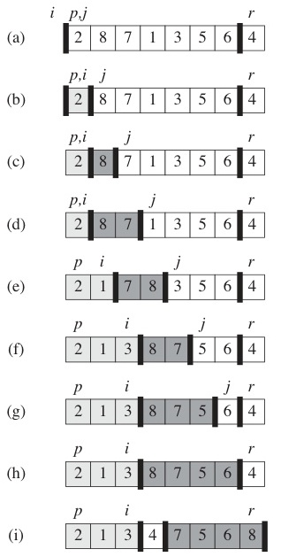
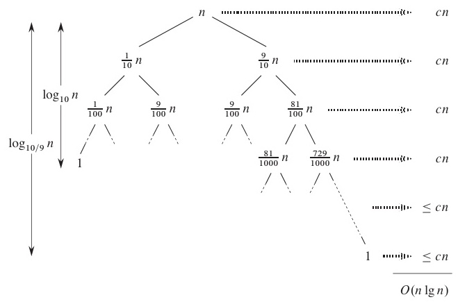
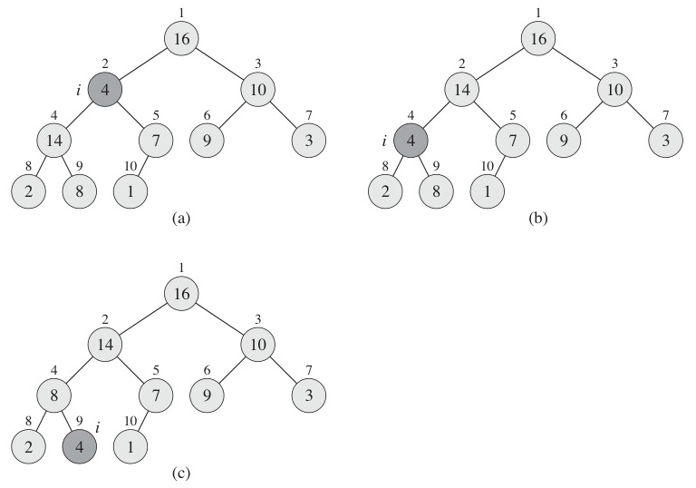

# 3주차 이론 — 배열, 스택, 큐, 그리고 기본 정렬 알고리즘

> **최종 수정일:** 2026-03-21

> **선수 지식**: 2주차: Big-O 표기법, 시간 복잡도 분석. [자료구조] 배열, 연결 리스트, 스택, 큐에 대한 기초 이해. [자료구조] 재귀(함수가 자기 자신을 호출하는 것)의 개념.
>
> **학습 목표**: 이 자료를 학습한 후 다음을 할 수 있어야 한다:
> 1. 기본 자료구조 복습: 리스트, 스택, 큐, 힙
> 2. 기초 정렬 알고리즘과 O(n²) 동작 이해
> 3. 고급 정렬 알고리즘과 O(n log n) 동작 이해
> 4. 선형 시간 정렬과 이를 가능하게 하는 조건 이해
> 5. 정렬 알고리즘의 **재귀적(귀납적) 구조** 파악
> 6. 정렬 알고리즘 복잡도 비교

---

## 목차

- [1. 기본 자료구조와 기초 정렬](#1-기본-자료구조와-기초-정렬)
  - [1.2 연결 리스트](#12-연결-리스트)
  - [1.3 스택](#13-스택)
  - [1.4 큐](#14-큐)
  - [1.5 힙](#15-힙)
  - [1.6 정렬 알고리즘 — 전체 조감도](#16-정렬-알고리즘--전체-조감도)
- [2. 기초 정렬 — O(n²)](#2-기초-정렬--on²)
  - [2.1 선택 정렬 — 아이디어](#21-선택-정렬--아이디어)
  - [2.2 선택 정렬 — 의사코드](#22-선택-정렬--의사코드)
  - [2.3 선택 정렬 — 단계별 예시](#23-선택-정렬--단계별-예시)
  - [2.4 버블 정렬 — 아이디어](#24-버블-정렬--아이디어)
  - [2.5 버블 정렬 — 의사코드](#25-버블-정렬--의사코드)
  - [2.6 버블 정렬 — 단계별 예시](#26-버블-정렬--단계별-예시)
  - [2.7 삽입 정렬 — 아이디어](#27-삽입-정렬--아이디어)
  - [2.8 삽입 정렬 — 의사코드](#28-삽입-정렬--의사코드)
  - [2.9 삽입 정렬 — 정확성의 귀납적 증명](#29-삽입-정렬--정확성의-귀납적-증명)
  - [2.10 기초 정렬의 재귀적 구조](#210-기초-정렬의-재귀적-구조)
- [3. 고급 정렬 — O(n log n)](#3-고급-정렬--on-log-n)
  - [3.1 병합 정렬 — 아이디어](#31-병합-정렬--아이디어)
  - [3.2 병합 정렬 — 의사코드](#32-병합-정렬--의사코드)
  - [3.3 병합 정렬 — 합병 과정 예시](#33-병합-정렬--합병-과정-예시)
  - [3.4 병합 정렬 — 복잡도 분석](#34-병합-정렬--복잡도-분석)
  - [3.5 퀵 정렬 — 아이디어](#35-퀵-정렬--아이디어)
  - [3.6 퀵 정렬 — 의사코드](#36-퀵-정렬--의사코드)
  - [3.7 퀵 정렬 — 분할 예시](#37-퀵-정렬--분할-예시)
  - [3.8 퀵 정렬 — 복잡도 분석](#38-퀵-정렬--복잡도-분석)
  - [3.9 퀵 정렬 — 평균 O(n log n)인 이유](#39-퀵-정렬--평균-on-log-n인-이유)
  - [3.10 힙 정렬 — 힙 복습](#310-힙-정렬--힙-복습)
  - [3.11 힙 정렬 — 알고리즘](#311-힙-정렬--알고리즘)
  - [3.12 힙 정렬 — buildHeap과 heapify](#312-힙-정렬--buildheap과-heapify)
  - [3.13 힙 정렬 — buildHeap 예시](#313-힙-정렬--buildheap-예시)
  - [3.14 힙 정렬 — 정렬 단계](#314-힙-정렬--정렬-단계)
  - [3.15 힙 정렬 — 복잡도](#315-힙-정렬--복잡도)
- [4. 선형 시간 정렬 — O(n)](#4-선형-시간-정렬--on)
  - [4.1 비교 기반 정렬의 하한](#41-비교-기반-정렬의-하한)
  - [4.2 기수 정렬](#42-기수-정렬)
  - [4.3 기수 정렬 — 예시](#43-기수-정렬--예시)
  - [4.4 계수 정렬](#44-계수-정렬)
  - [4.5 계수 정렬 — 예시](#45-계수-정렬--예시)
  - [4.6 복잡도 비교 — 모든 정렬 알고리즘](#46-복잡도-비교--모든-정렬-알고리즘)
- [요약](#요약)
- [부록](#부록)

---

<br>

## 1. 기본 자료구조와 기초 정렬

### 1.2 연결 리스트

- **노드(node)** 의 연속으로, 각 노드는 데이터와 다음 노드를 가리키는 포인터를 포함한다.

```
┌──────┬───┐    ┌──────┬───┐    ┌──────┬───┐
│ data │  ─┼───►│ data │  ─┼───►│ data │ / │
└──────┴───┘    └──────┴───┘    └──────┴───┘
```

```c
typedef int element;

typedef struct ListNode {
    element data;
    struct ListNode *link;
} ListNode;
```

> **참고:** Python에서는 연결 리스트를 클래스로 구현한다:
> ```python
> class ListNode:
>     def __init__(self, data, next=None):
>         self.data = data
>         self.next = next  # 다음 노드를 가리키는 참조
> ```
> C의 포인터(`*link`)가 Python에서는 객체 참조(`self.next`)에 해당한다.

- 연산: 삽입, 삭제, 탐색 — 모두 최악의 경우 O(n)
- 시각화: [https://visualgo.net/en/list](https://visualgo.net/en/list)

> **[자료구조]** 연결 리스트와 배열의 핵심 차이는 다음과 같다:
> - **배열**: 메모리에 연속 저장, 인덱스 접근 O(1), 삽입/삭제 O(n) (밀거나 당겨야 한다)
> - **연결 리스트**: 메모리에 흩어져 저장, 접근 O(n) (처음부터 따라가야 한다), 삽입/삭제 O(1) (포인터만 변경)
>
> 위 코드에서 `link`가 다음 노드를 가리키는 포인터이고, 마지막 노드의 link는 NULL(`/`)이다.

### 1.3 스택

- **LIFO** (Last In, First Out — 후입선출)
- `push()`: 맨 위에 원소 추가
- `pop()`: 맨 위에서 원소 제거

```
         ┌─────┐
   top → │  C  │
         ├─────┤
         │  B  │
         ├─────┤
bottom → │  A  │
         └─────┘
```

- 활용: 함수 호출 스택, 수식 평가, 백트래킹
- 시각화: [https://visualgo.net/en/list](https://visualgo.net/en/list)

> **[자료구조]** 스택은 "가장 최근 것부터 처리"해야 할 때 사용한다. 대표적 활용은 다음과 같다:
> - **함수 호출 스택**: 2주차에서 본 GCD 재귀처럼, 함수 호출이 중첩될 때 스택으로 관리한다
> - **괄호 매칭**: `({[]})`에서 여는 괄호를 push, 닫는 괄호가 오면 pop해서 짝이 맞는지 확인한다
> - **뒤로 가기(Undo)**: 웹 브라우저의 뒤로 가기 기능도 스택 기반이다

### 1.4 큐

- **FIFO** (First In, First Out — 선입선출)
- `enqueue()`: 뒤쪽(rear)에 원소 추가
- `dequeue()`: 앞쪽(front)에서 원소 제거

```
  dequeue ◄── [ A | B | C | D ] ◄── enqueue
              front        rear
```

- 활용: BFS, 스케줄링, 버퍼링
- 시각화: [https://visualgo.net/en/list](https://visualgo.net/en/list)

> **[자료구조]** 큐는 "먼저 들어온 것을 먼저 처리"해야 할 때 사용한다.
> - **BFS(너비 우선 탐색)**: 그래프에서 가까운 노드부터 탐색할 때 큐를 사용한다
> - **프린터 대기열**: 먼저 요청한 문서부터 인쇄한다
> - **운영체제 프로세스 스케줄링**: CPU 시간을 공정하게 배분한다
>
> 스택(LIFO)과 큐(FIFO)는 서로 반대 개념이라고 기억하면 된다.

### 1.5 힙

- 힙 속성을 만족하는 **완전 이진 트리(complete binary tree)** 이다. 힙 속성은 루트에 항상 극값(최댓값 또는 최솟값)이 위치하도록 보장하여, 최댓값 또는 최솟값의 효율적 추출을 가능하게 한다.
  - **최대 힙(Max Heap)**: key(부모) >= key(자식)
  - **최소 힙(Min Heap)**: key(부모) <= key(자식)
- 힙은 **배열**로 저장한다 (포인터 불필요).
  - A[i]의 자식: **A[2i]**, **A[2i+1]**
  - A[i]의 부모: **A[floor(i/2)]**
- 활용: 우선순위 큐, 힙 정렬
- 시각화: [visualgo.net/en/heap](https://visualgo.net/en/heap)


> **[자료구조]** 완전 이진 트리와 힙에 대해 자료구조에서 다룬 개념을 다시 정리한다.
> - **완전 이진 트리**: 마지막 레벨을 제외한 모든 레벨이 꽉 차 있고, 마지막 레벨은 왼쪽부터 채워진 트리이다
> - **힙을 배열로 저장하는 방법**: 루트를 인덱스 1에 놓으면, i번 노드의 왼쪽 자식은 2i, 오른쪽 자식은 2i+1, 부모는 i/2(내림)이다. 포인터 없이 배열 인덱스 계산만으로 트리를 탐색할 수 있어 매우 효율적이다.
> - **우선순위 큐**: 힙의 핵심 활용이다. 가장 크거나(Max Heap) 작은(Min Heap) 원소를 O(log n)에 꺼낼 수 있다.

### 1.6 정렬 알고리즘 — 전체 조감도

- 대부분의 정렬 알고리즘은 **O(n²)** 과 **O(n log n)** 사이에 위치한다.
- 입력이 특별한 속성을 가지면 **O(n)** 정렬도 가능하다.

| 분류 | 알고리즘 | 복잡도 |
|:-----|:---------|:-------|
| 기초 | 선택, 버블, 삽입 | O(n²) |
| 고급 | 병합, 퀵, 힙 | O(n log n) |
| 선형 시간 | 기수, 계수 | O(n) |

> 알고리즘을 바라보는 두 가지 관점이 있다:
> - **흐름 기반(Flow-based)**: 실행 단계를 하나씩 따라간다
> - **관계 기반(Relational)**: 각 단계가 상태를 어떻게 변환하는지 관찰한다 (더 깊은 이해)

> **핵심:** 정렬 알고리즘은 알고리즘 과목의 핵심 주제이다. (1) 실무에서 가장 자주 사용되는 연산이고, (2) 분할 정복, 재귀, 복잡도 분석 등 핵심 개념을 모두 포함하며, (3) 비교 기반 정렬의 하한(Ω(n log n))이라는 이론적으로 중요한 결과가 있기 때문이다.

---

<br>

## 2. 기초 정렬 — O(n²)

### 2.1 선택 정렬 — 아이디어

선택 정렬은 두 가지 방향 모두 가능하다: **최솟값**을 찾아 앞에 놓을 수도 있고, **최댓값**을 찾아 뒤에 놓을 수도 있다. 핵심 원리는 동일하다 — 매 라운드마다 하나의 원소를 최종 위치에 고정한다. 아래 의사코드는 **최대값 방식**(가장 큰 값을 찾아 끝으로 교환)을 사용하며, 교재와 실습에서는 최소값 방식을 쓰는 경우가 많다.

각 반복마다:
1. 정렬되지 않은 부분에서 **최솟값**(또는 최댓값)을 찾는다
2. 정렬되지 않은 부분의 가장 왼쪽(또는 오른쪽) 원소와 **교환**한다
3. 그 원소를 **제외**한다 (이제 최종 위치에 있다)
4. 원소가 하나 남을 때까지 반복한다

```text
[15, 11, 29, 20, 65, 3, 73, 48, 31, 8]    최솟값 찾기 (3)
[3 | 11, 29, 20, 65, 15, 73, 48, 31, 8]   3↔15 교환, 3 제외
[3, 8 | 29, 20, 65, 15, 73, 48, 31, 11]   최솟값(8) 찾기, 8↔11 교환, 제외
  ...
[3, 8, 11, 15, 20, 29, 31, 48, 65, 73]    정렬 완료!
```

- 매 라운드마다 **최솟값**(또는 최댓값)을 선택한다.

### 2.2 선택 정렬 — 의사코드

```
selectionSort(A[], n)          ▷ A[1...n]을 정렬
{
    for last ← n downto 2 {                           ── ①
        Find the largest element A[k] in A[1...last]; ── ②
        A[k] ↔ A[last];   ▷ A[k]와 A[last]를 교환       ── ③
    }
}
```

**복잡도 분석:**
- 루프 ①은 **n - 1**번 실행된다
- 최댓값 찾기 ②: n-1, n-2, ..., 2, 1번 비교가 필요하다
- 교환 ③은 상수 시간이다

$$T(n) = (n-1) + (n-2) + \cdots + 2 + 1 = \frac{n(n-1)}{2} = \Theta(n^2)$$

- **최악의 경우**: Θ(n²) | **평균의 경우**: Θ(n²)

> **핵심:** 선택 정렬의 핵심 특징은 입력이 어떤 상태이든(이미 정렬됨, 역순, 랜덤) **항상 Θ(n²)** 이라는 점이다. 최선/평균/최악이 모두 같다. 비교 횟수는 항상 n(n-1)/2회이고, 교환 횟수만 최대 n-1회(이미 정렬된 경우 0회)이다.

> **참고:** 강의에서는 선택 정렬을 "최댓값을 찾아 뒤로 보내는" 방식으로 설명하고, 실습에서는 "최솟값을 찾아 앞으로 가져오는" 방식을 사용한다. 둘 다 선택 정렬이며 복잡도는 동일하다. 방향만 다를 뿐, 핵심 원리(매 라운드마다 하나의 원소를 최종 위치에 고정)는 같다.

### 2.3 선택 정렬 — 단계별 예시

| 단계 | 배열 상태 | 동작 |
|:-----|:----------|:-----|
| 0 | `[15, 11, 29, 20, 65, 3, 73, 48, 31, 8]` | 초기 배열 |
| 1 | `[15, 11, 29, 20, 65, 3, \|8\|, 48, 31 \| 73]` | 최대=73, 73↔8 교환 |
| 2 | `[15, 11, 29, 20, \|31\|, 3, 8, 48 \| 65, 73]` | 최대=65, 65↔31 교환 |
| 3 | `[15, 11, 29, 20, 31, 3, 8 \| 48, 65, 73]` | 최대=48, 교환 불필요 |
| 4 | `[15, 11, 29, 20, \|8\|, 3 \| 31, 48, 65, 73]` | 최대=31, 31↔8 교환 |
| 5 | `[15, 11, \|3\|, 20, 8 \| 29, 31, 48, 65, 73]` | 최대=29, 29↔3 교환 |
| 6 | `[15, 11, 3, \|8\| \| 20, 29, 31, 48, 65, 73]` | 최대=20, 20↔8 교환 |
| 7 | `[\|8\|, 11, 3 \| 15, 20, 29, 31, 48, 65, 73]` | 최대=15, 15↔8 교환 |
| 8 | `[8, \|3\| \| 11, 15, 20, 29, 31, 48, 65, 73]` | 최대=11, 11↔3 교환 |
| 9 | `[3, 8, 11, 15, 20, 29, 31, 48, 65, 73]` | 정렬 완료! |

> 애니메이션: [https://visualgo.net/en/sorting](https://visualgo.net/en/sorting)

### 2.4 버블 정렬 — 아이디어

각 반복마다:
1. 왼쪽부터 시작하여 **인접한 쌍**을 비교한다
2. 순서가 잘못되어 있으면 **교환**한다
3. 가장 큰 원소가 가장 오른쪽으로 **"올라간다(bubble up)"**
4. 가장 오른쪽 원소를 제외하고 반복한다

```text
[15, 65, 29, 20, 11, 8, 73, 48, 31, 3]    인접 쌍 비교
[15, 29, 20, 11, 8, 65, 48, 31, 3, |73|]  73이 끝으로 올라감, 제외
[15, 20, 11, 8, 29, 48, 31, 3, |65, 73|]  65 올라감, 제외
  ...
[3, 8, 11, 15, 20, 29, 31, 48, 65, 73]    정렬 완료!
```

- 매 라운드마다 **최댓값**이 끝으로 올라간다.

> **참고:** "버블(거품) 정렬"이라는 이름은 가장 큰 원소가 마치 물속의 거품처럼 위(오른쪽)로 떠오르는 모습에서 유래한다.

### 2.5 버블 정렬 — 의사코드

```
bubbleSort(A[], n)             ▷ A[1...n]을 정렬
{
    for last ← n downto 2                            ── ①
        for i ← 1 to last-1                          ── ②
            if (A[i] > A[i+1]) then A[i] ↔ A[i+1];   ── ③
}
```

**복잡도 분석:**
- 루프 ①은 **n - 1**번 실행된다
- 루프 ②는 각각 n-1, n-2, ..., 2, 1번 실행된다
- 교환 ③은 상수 시간이다

$$T(n) = (n-1) + (n-2) + \cdots + 2 + 1 = \frac{n(n-1)}{2} = \Theta(n^2)$$

- **최악의 경우**: Θ(n²) | **평균의 경우**: Θ(n²)

> **참고:** 버블 정렬에는 유용한 최적화가 있다. 한 패스(pass)에서 **교환이 한 번도 일어나지 않으면**, 배열이 이미 정렬된 것이므로 즉시 종료할 수 있다. 이 최적화를 적용하면 **최선의 경우(이미 정렬된 입력)에 Θ(n)** 이 된다. 실습 파일의 Python 코드에 `swapped` 플래그가 바로 이 최적화이다.

### 2.6 버블 정렬 — 단계별 예시

| 패스 | 패스 후 배열 | 올라간 원소 |
|:-----|:------------|:-----------|
| 0 | `[15, 65, 29, 20, 11, 8, 73, 48, 31, 3]` | (초기) |
| 1 | `[15, 29, 20, 11, 8, 65, 48, 31, 3, \|73\|]` | 73 |
| 2 | `[15, 20, 11, 8, 29, 48, 31, 3, \|65, 73\|]` | 65 |
| 3 | `[15, 11, 8, 20, 29, 31, 3, \|48, 65, 73\|]` | 48 |
| ... | ... | ... |
| 9 | `[3, 8, 11, 15, 20, 29, 31, 48, 65, 73]` | 완료 |

> 각 패스 내에서, 인접 원소를 왼쪽에서 오른쪽으로 비교하며 순서가 잘못되면 교환한다.

> 애니메이션: [https://visualgo.net/en/sorting](https://visualgo.net/en/sorting)

### 2.7 삽입 정렬 — 아이디어

각 반복마다:
1. 정렬되지 않은 부분에서 다음 원소(**키, key**)를 가져온다
2. 정렬된 부분에서 그보다 큰 원소들을 **밀어낸다(shift)**
3. 올바른 위치에 원소를 **삽입**한다

```text
[29]  10  14  37  13           29는 자명하게 정렬됨
[10, 29]  14  37  13           10 삽입: 29를 밀고, 10 배치
[10, 14, 29]  37  13           14 삽입: 29를 밀고, 14 배치
[10, 14, 29, 37]  13           37 삽입: 이미 제자리
[10, 13, 14, 29, 37]           13 삽입: 37,29,14를 밀고, 13 배치
```

- 이미 **정렬된** 부분 배열에 각 원소를 삽입한다.

> **참고:** 삽입 정렬은 카드 게임에서 손에 든 카드를 정리하는 방식과 동일하다. 새 카드를 받으면, 이미 정렬된 카드들 사이의 올바른 위치에 끼워넣는다. 이 직관적인 방식이 바로 삽입 정렬이다.

### 2.8 삽입 정렬 — 의사코드

```
insertionSort(A[], n)          ▷ A[1...n]을 정렬
{
    for i ← 2 to n                                      ── ①
        Insert A[i] into its proper place in A[1...i];  ── ②
}
```

**복잡도 분석:**
- 루프 ①은 **n - 1**번 실행된다
- 삽입 ②는 최대 i - 1번의 비교가 필요하다

| 경우 | 비교 횟수 | 복잡도 |
|:-----|:----------|:-------|
| **최악** (역순 정렬) | 1 + 2 + ... + (n-1) | Θ(n²) |
| **평균** | 1/2 (1 + 2 + ... + (n-1)) | Θ(n²) |
| **최선** (이미 정렬) | 1 + 1 + ... + 1 | **Θ(n)** |

> 삽입 정렬은 거의 정렬된 데이터에서 기초 정렬 중 **가장 빠르다**.

> **핵심:** 삽입 정렬이 최선의 경우 Θ(n)인 이유는 다음과 같다. 이미 정렬되어 있으면 각 원소를 삽입할 때 비교를 **1번만** 하면 된다 (바로 앞 원소와 비교해서 이미 올바른 위치임을 확인). 총 n-1번 × 1비교 = Θ(n)이다. 이 때문에 실무에서 **거의 정렬된 소규모 데이터**에는 삽입 정렬이 자주 사용된다. Python의 Timsort도 내부적으로 작은 구간에서 삽입 정렬을 사용한다.

### 2.9 삽입 정렬 — 정확성의 귀납적 증명

**루프 불변식(Loop Invariant)**: i번째 반복 시작 시, 부분 배열 A[1...i-1]은 정렬되어 있다.

- **기저 사례** (n = 1): 단일 원소 A[1]은 자명하게 정렬되어 있다.
- **귀납 단계**: A[1...k]가 정렬되어 있으면 (P(k) 성립), A[k+1]을 올바른 위치에 삽입하면 정렬된 A[1...k+1]이 된다 (P(k+1) 성립).
- **결론**: n번째 반복 후, 전체 배열 A[1...n]이 정렬된다.

> 이것은 고등학교에서 배운 **수학적 귀납법**을 알고리즘에 적용한 것과 정확히 같다.

> **시험 팁:** **루프 불변식(Loop Invariant)** 은 알고리즘의 정확성을 증명하는 핵심 도구이다. "루프가 반복될 때마다 항상 참인 조건"을 말한다. 수학적 귀납법의 구조와 동일하다:
> - 기저 사례 = 루프 시작 전에 참
> - 귀납 단계 = 한 번 반복해도 여전히 참
> - 결론 = 루프 종료 후에 원하는 성질이 성립
>
> 시험에서 알고리즘의 정확성 증명 문제가 출제될 경우, 루프 불변식을 이용하여 증명하는 것이 정석이다.

### 2.10 기초 정렬의 재귀적 구조

세 기초 정렬은 모두 **동일한 재귀적 구조**를 가진다:

```
T(n) = T(n-1) + Θ(n)
```

| 알고리즘 | 재귀적 형태 | "레벨당 작업량" |
|:---------|:-----------|:---------------|
| **삽입 정렬** | A[1...n-1] 정렬 후, A[n] 삽입 | insert(n) = Θ(n) |
| **선택 정렬** | 최대값 찾아 교환 후, A[1...n-1] 정렬 | maxSwap(n) = Θ(n) |
| **버블 정렬** | 최대값을 끝으로 올린 후, A[1...n-1] 정렬 | bubble(n) = Θ(n) |

```
insertionSort(A, n) {       selectionSort(A, n) {       bubbleSort(A, n) {
  if (n == 1) return;         if (n == 1) return;         if (n == 1) return;
  insertionSort(A, n-1);      maxSwap(A, n);              bubble(A, n);
  insert(A, n);               selectionSort(A, n-1);      bubbleSort(A, n-1);
}                           }                           }
```

> 핵심 차이: 삽입 정렬은 재귀 호출 **후에** 작업하고, 선택/버블 정렬은 재귀 호출 **전에** 작업한다.

> **핵심:** 이 재귀 구조는 매우 중요하다! 세 알고리즘 모두 $T(n) = T(n-1) + \Theta(n)$이라는 동일한 점화식을 따르며, 이를 풀면 $T(n) = \Theta(n) + \Theta(n-1) + ... + \Theta(1) = \Theta(n^2)$이 된다. 즉, O(n²)의 근본적인 원인은 **문제 크기가 1씩만 줄어드는 구조** 때문이다. O(n log n) 알고리즘(병합, 퀵)은 문제를 **절반으로** 나누어 $T(n) = 2T(n/2) + \Theta(n)$이 되므로 훨씬 빠르다.

---

<br>

## 3. 고급 정렬 — O(n log n)

2.10절에서 보았듯이, 기초 정렬은 매 단계마다 문제 크기를 1씩만 줄이기 때문에 O(n^2)이 된다. 고급 정렬은 매 단계마다 문제를 절반으로 나누어 O(n log n)을 달성한다 -- 이 "분할 정복(divide and conquer)" 전략이 이 절의 모든 알고리즘에 공통된 핵심 아이디어이다.

### 3.1 병합 정렬 — 아이디어

**분할 정복(Divide and Conquer)**:
1. **분할(Divide)**: 배열을 두 반으로 나눈다
2. **정복(Conquer)**: 각 반을 재귀적으로 정렬한다
3. **결합(Combine)**: 두 정렬된 반쪽을 합병한다

```text
[31, 3, 65, 73, 8, 11, 20, 29, 48, 15]     원본

[31, 3, 65, 73, 8] | [11, 20, 29, 48, 15]  ① 분할

[3, 8, 31, 65, 73] | [11, 15, 20, 29, 48]  ②③ 각 반 정렬

[3, 8, 11, 15, 20, 29, 31, 48, 65, 73]     ④ 합병
```

### 3.2 병합 정렬 — 의사코드

```
mergeSort(A[], p, r)             ▷ A[p...r]을 정렬
{
    if (p < r) then {
        q ← floor((p + r) / 2);  ▷ 중간점
        mergeSort(A, p, q);      ▷ 왼쪽 반 정렬
        mergeSort(A, q+1, r);    ▷ 오른쪽 반 정렬
        merge(A, p, q, r);       ▷ 두 정렬된 반쪽을 합병
    }
}
```

```
merge(A[], p, q, r)              ▷ A[p...q]와 A[q+1...r]을 합병
{
    i ← p; j ← q+1; t ← 1;
    while (i ≤ q and j ≤ r) {
        if (A[i] ≤ A[j])
            tmp[t++] ← A[i++];
        else
            tmp[t++] ← A[j++];
    }
    Copy remaining elements to tmp[];  ▷ 남은 원소를 tmp[]에 복사
    Copy tmp[] back to A[p...r];       ▷ tmp[]를 A[p...r]에 복사
}
```

> **핵심:** merge 함수의 핵심은 두 개의 **이미 정렬된** 배열을 합치는 것이다. 양쪽 배열의 앞에서부터 하나씩 비교하며 작은 것을 결과 배열에 넣는다. 양쪽 다 정렬되어 있으므로, 이 과정은 O(n)에 완료된다. 이 merge가 바로 "결합(Combine)" 단계이다.

### 3.3 병합 정렬 — 합병 과정 예시

`[3, 8, 31, 65, 73]`과 `[11, 15, 20, 29, 48]`을 합병한다:

```
 i                      j                       tmp
[3, 8, 31, 65, 73]     [11, 15, 20, 29, 48]     []

단계 1: 3 < 11  → tmp = [3],         i 오른쪽으로
단계 2: 8 < 11  → tmp = [3, 8],      i 오른쪽으로
단계 3: 31 > 11 → tmp = [3, 8, 11],  j 오른쪽으로
단계 4: 31 > 15 → tmp = [3, 8, 11, 15],  j 오른쪽으로
단계 5: 31 > 20 → tmp = [3, 8, 11, 15, 20],  j 오른쪽으로
단계 6: 31 > 29 → tmp = [3, 8, 11, 15, 20, 29],  j 오른쪽으로
단계 7: 31 < 48 → tmp = [3, 8, 11, 15, 20, 29, 31],  i 오른쪽으로
단계 8: 65 > 48 → tmp = [3, 8, 11, 15, 20, 29, 31, 48],  j 오른쪽으로
단계 9-10: 남은 [65, 73] 복사

결과: [3, 8, 11, 15, 20, 29, 31, 48, 65, 73]
```

### 3.4 병합 정렬 — 복잡도 분석

**점화식**:

$$T(n) = 2T\left(\frac{n}{2}\right) + \Theta(n)$$

**재귀 트리**: 각 레벨의 총 작업량이 Θ(n)이고, log₂(n)개의 레벨이 존재한다.

```
레벨 0:         n            → n 작업
레벨 1:     n/2   n/2        → n 작업
레벨 2:   n/4 n/4 n/4 n/4    → n 작업
  ...
레벨 h:   1  1  1  ...  1    → n 작업

h = log₂n 레벨  →  총합: n × log₂n
```

$$T(n) = \Theta(n \log n)$$

> 병합 정렬은 **항상** Θ(n log n)이다 — 최악, 평균, 최선 모두 동일하다.
> 트레이드오프: 임시 배열을 위한 **O(n) 추가 공간**이 필요하다.

> **참고:** 2주차에서 다룬 마스터 정리를 이 점화식에 적용하면: a=2, b=2, f(n)=n이므로 $n^{\log_2 2} = n$이고, $f(n) = \Theta(n^{\log_b a})$이므로 **Case 2**에 해당한다. 따라서 $T(n) = \Theta(n \log n)$이다. 반복 대입법으로 풀든 마스터 정리로 풀든 같은 결과이다.

### 3.5 퀵 정렬 — 아이디어

1. **피벗(pivot)** 원소를 선택한다 (예: 마지막 원소)
2. **분할(Partition)**: 피벗보다 작은 원소는 왼쪽, 큰 원소는 오른쪽으로 재배치한다
3. 피벗은 이제 **최종 정렬 위치**에 있다
4. 왼쪽과 오른쪽 부분 배열을 재귀적으로 정렬한다

```text
[31, 8, 48, 73, 11, 3, 20, 29, 65, 15]    피벗 = 15

[8, 11, 3, |15|, 31, 48, 20, 29, 65, 73]  분할 후

[3, 8, 11, |15|, 20, 29, 31, 48, 65, 73]  왼쪽 & 오른쪽 재귀 정렬
```

> **핵심:** 병합 정렬과 퀵 정렬의 핵심 차이는 다음과 같다:
> - **병합 정렬**: 먼저 나누고(분할은 간단), 합칠 때 작업한다(merge가 복잡)
> - **퀵 정렬**: 나눌 때 작업하고(partition이 복잡), 합치는 건 불필요하다(이미 제자리)
>
> 즉, 병합 정렬은 "결합"이 핵심이고, 퀵 정렬은 "분할"이 핵심이다.

### 3.6 퀵 정렬 — 의사코드

```
quickSort(A[], p, r)             ▷ A[p...r]을 정렬
{
    if (p < r) then {
        q ← partition(A, p, r);  ▷ 피벗 기준으로 분할
        quickSort(A, p, q-1);    ▷ 왼쪽 부분 배열 정렬
        quickSort(A, q+1, r);    ▷ 오른쪽 부분 배열 정렬
    }
}
```

```
partition(A[], p, r)
{
    pivot ← A[r];                ▷ 마지막 원소를 피벗으로 선택
    i ← p - 1;
    for j ← p to r-1 {
        if (A[j] ≤ pivot) {
            i ← i + 1;
            A[i] ↔ A[j];
        }
    }
    A[i+1] ↔ A[r];               ▷ 피벗을 최종 위치에 배치
    return i + 1;
}
```

> `i`는 경계를 표시한다: 인덱스 `i` 이하의 모든 원소는 <= 피벗이다.
> `j`는 배열을 왼쪽에서 오른쪽으로 스캔한다.

**분할 불변식(Partition Invariant)**: 루프 실행 중 어느 시점에서든: A[p..i]의 원소는 <= 피벗, A[i+1..j-1]의 원소는 > 피벗, A[j..r-1]의 원소는 아직 미확인 상태이다.


> **참고:** partition 함수의 동작을 직관적으로 이해하는 방법은 다음과 같다. `i`는 "피벗 이하 영역의 끝"을 가리키고, `j`는 "아직 확인하지 않은 영역의 시작"을 가리킨다. A[j] <= pivot이면 i를 하나 늘려 피벗 이하 영역을 확장하고, A[j]를 그 자리로 교환한다. 마지막에 피벗을 i+1 위치에 놓으면, 피벗 왼쪽은 모두 피벗 이하, 오른쪽은 모두 피벗 초과가 된다.

> **참고:** `i = p - 1`로 초기화하는 이유: i는 "피벗 이하 영역의 마지막 인덱스"를 추적한다. 처음에는 피벗 이하인 원소가 아직 하나도 없으므로, 영역의 끝을 배열 시작점의 **바로 앞**(p-1)에 놓는 것이다. A[j] <= pivot인 원소를 처음 발견하면 i가 p로 증가하여, 비로소 유효한 인덱스를 가리키게 된다.

### 3.7 퀵 정렬 — 분할 예시

`[31, 8, 48, 73, 11, 3, 20, 29, 65, 15]`를 피벗 = 15로 분할한다:

```
pivot = A[10] = 15,  i = 0

j=1: A[1]=31 > 15   → 건너뜀
j=2: A[2]=8  ≤ 15   → i=1, A[1]↔A[2] 교환
j=3: A[3]=48 > 15   → 건너뜀
j=4: A[4]=73 > 15   → 건너뜀
j=5: A[5]=11 ≤ 15   → i=2, A[2]↔A[5] 교환
j=6: A[6]=3  ≤ 15   → i=3, A[3]↔A[6] 교환
j=7~9: > 15         → 건너뜀

최종: A[4]↔A[10] 교환
→ [8, 11, 3, |15|, 31, 48, 20, 29, 65, 73]
```



> 애니메이션: [visualgo.net/en/sorting](https://visualgo.net/en/sorting)

### 3.8 퀵 정렬 — 복잡도 분석

**점화식**: T(n) = T(i - 1) + T(n - i) + Θ(n), 여기서 i는 피벗의 최종 위치이다.

| 경우 | 분할 균형 | 점화식 | 복잡도 |
|:-----|:---------|:-------|:-------|
| **최악** | 0 : n-1 (정렬된 입력) | T(n) = T(n-1) + Θ(n) | **Θ(n²)** |
| **최선** | n/2 : n/2 (완벽한 분할) | T(n) = 2T(n/2) + Θ(n) | **Θ(n log n)** |
| **평균** | 랜덤 분할 | 아래 참조 | **Θ(n log n)** |

**최악의 경우** — 입력이 이미 정렬됨, 피벗이 항상 최솟값 또는 최댓값:

```
T(n) = T(0) + T(n-1) + Θ(n) = T(n-1) + Θ(n)
     = Θ(n) + Θ(n-1) + ... + Θ(1) = Θ(n²)
```


> **참고:** 퀵 정렬의 최악 O(n²)를 피하는 실전 기법들은 다음과 같다:
> 1. **랜덤 피벗(Randomized Pivot)**: 피벗을 무작위로 선택하면 최악의 경우가 발생할 확률이 극히 낮아진다
> 2. **Median-of-Three**: 첫/중간/마지막 원소 중 중간값을 피벗으로 선택한다
> 3. **Introsort**: 재귀 깊이가 너무 깊어지면 힙 정렬로 전환한다 (C++ STL의 `std::sort`가 이 방식이다)

### 3.9 퀵 정렬 — 평균 O(n log n)인 이유

**핵심 통찰**: 분할 비율이 **어떤 상수 비율이든** (1:9, 1:99라 해도), 깊이는 O(log n)으로 유지된다.

- 가장 긴 경로: n → 9n/10 → (9/10)²n → ... → 1
- 깊이 = log_{10/9}(n) = O(log n)
- 각 레벨의 총 작업량은 여전히 O(n)이다



**평균 분석 증명** (귀납법 사용):
- 모든 i < n에 대해 T(i) <= c * i * log(i)라 가정한다
- 모든 가능한 피벗 위치에 대해 평균: T(n) = (1/n) * sum_{i=0}^{n-1} [T(i) + T(n-i-1)] + Θ(n)
- 적분 근사법으로: T(n) <= c * n * log(n)
- 따라서 T(n) = **O(n log n)** (평균)

전체 증명은 모든 가능한 피벗 위치에 대해 합산하고 적분 근사를 사용하는 과정을 포함한다. 핵심은 무작위 피벗 선택이 기대 비교 횟수를 $O(n \log n)$으로 만들어, 병합 정렬의 보장된 성능과 동일하다는 것이다.

> **참고:** 1:9 같은 불균형 분할이 허용되는 이유를 살펴보면, 문제 크기가 매번 9/10로 줄어든다고 해도, $n \times (9/10)^k = 1$을 풀면 $k = \log_{10/9}(n)$이고, 이는 $O(\log n)$이다 (밑만 다를 뿐이다). 정말 문제가 되는 것은 0:(n-1) 같은 **극단적 불균형**이 매번 반복될 때뿐이다.

### 3.10 힙 정렬 — 힙 복습

**힙(Heap)**: 힙 속성을 가진 완전 이진 트리로, 배열에 저장한다.

```
   최소 힙 예시         최대 힙 예시
       3                 9
      / \               / \
     6   4             7   8
    / \   \           / \   \
   8   9   7         3   6   4
```

**배열 표현** (1-인덱스):
- A[i]의 자식: **A[2i]** 과 **A[2i + 1]**
- A[i]의 부모: **A[floor(i/2)]**
- A[i]의 형제: **A[i-1]** (i가 홀수일 때)



### 3.11 힙 정렬 — 알고리즘

```
heapSort(A[], n)              ▷ A[1...n]을 정렬
{
    buildHeap(A, n);          ▷ 최소 힙(또는 최대 힙) 구축
    for i ← n downto 2 {
        A[1] ↔ A[i];          ▷ 루트(최솟값/최댓값)와 마지막 원소 교환
        heapify(A, 1, i-1);   ▷ 힙 속성 복원
    }
}
```

**두 핵심 서브루틴:**
1. `buildHeap`: 임의의 배열을 힙으로 변환한다 — **O(n)**
2. `heapify`: 단일 노드에서 힙 속성을 수정한다 — **O(log n)**

> **최악의 경우**: O(n log n) — 퀵 정렬과 달리 보장된다!

> **참고:** 힙 정렬의 동작 원리는 다음과 같다. (1) 배열 전체를 힙으로 만든다 (buildHeap), (2) 힙의 루트(최솟값 또는 최댓값)를 배열 끝으로 보내고, (3) 힙 크기를 1 줄인 뒤 다시 힙 속성을 복원(heapify)한다. 이를 반복하면 배열이 정렬된다.

> **참고:** 이 구현은 **최소 힙**을 사용한다 (내림차순 정렬). **오름차순** 정렬을 하려면 **최대 힙**을 대신 사용하여 최솟값 비교를 최댓값 비교로 바꾸면 된다. 표준 CLRS 교재에서는 오름차순 정렬을 위해 최대 힙을 사용한다.

### 3.12 힙 정렬 — buildHeap과 heapify

```
buildHeap(A[], n)
{
    for i ← floor(n/2) downto 1      ▷ 마지막 내부 노드부터 시작
        heapify(A, i, n);
}
```

```
heapify(A[], k, n)                   ▷ A[k]를 루트로 하는 힙 수정
{                                    ▷ A[k]의 서브트리들은 이미 힙
    left ← 2k;  right ← 2k + 1;
    if (right ≤ n) then {            ▷ 자식이 둘
        if (A[left] < A[right])
            smaller ← left;
        else smaller ← right;
    }
    else if (left ≤ n) then          ▷ 왼쪽 자식만 존재
        smaller ← left;
    else return;                     ▷ 리프 노드

    if (A[smaller] < A[k]) then {    ▷ 힙 속성 위반
        A[k] ↔ A[smaller];
        heapify(A, smaller, n);      ▷ 아래로 재귀
    }
}
```

> **참고:** buildHeap이 O(n)인 이유는 직관적이지 않다. O(n log n)이 아닌 O(n)인 근거는 다음과 같다. 리프 노드(절반)는 heapify가 불필요하고, 높이 1인 노드는 1번만, 높이 2인 노드는 2번만 내려가면 된다. 총합은 $\sum_{h=0}^{\log n} \frac{n}{2^{h+1}} \cdot h$이고, 이 급수의 합은 O(n)이다. 수학적으로 엄밀한 증명은 CLRS 6.3절을 참고할 수 있다.

> **참고:** `floor(n/2)`부터 시작하는 이유: 인덱스 floor(n/2)+1부터 n까지의 노드는 모두 **리프 노드**(자식이 없는 노드)이다. 리프 노드는 그 자체로 크기 1인 힙이므로 heapify가 불필요하다. 따라서 마지막 내부 노드인 floor(n/2)부터 루트(1)까지 역순으로 heapify를 적용하면, 아래에서 위로 힙 속성이 전파된다.

### 3.13 힙 정렬 — buildHeap 예시

`A = [7, 9, 4, 8, 6, 3]`으로부터 최소 힙을 구축한다:

```
(a) 시작         (b) heapify(3)   (c) heapify(2)
     7                 7                7
    / \               / \              / \
   9   4             9   3            6   3
  / \   \           / \   \          / \   \
 8   6   3         8   6   4        8   9   4

(d) heapify(1)   (e) 최종 힙
     3                 3
    / \               / \
   6   4             6   4
  / \   \           / \   \
 8   9   7         8   9   7
```

> buildHeap은 노드를 **아래에서 위로** (floor(n/2)에서 1까지) 처리한다.


### 3.14 힙 정렬 — 정렬 단계

buildHeap 이후, 최솟값을 반복적으로 추출한다:

```
(a) [3,6,4,8,9,7]  A[1]↔A[6] 교환, heapify → [4,6,7,8,9,|3]
(b) [4,6,7,8,9,|3] A[1]↔A[5] 교환, heapify → [6,8,7,9,|4,3]
(c) [6,8,7,9,|4,3] A[1]↔A[4] 교환, heapify → [7,8,9,|6,4,3]
(d) [7,8,9,|6,4,3] A[1]↔A[3] 교환, heapify → [8,9,|7,6,4,3]
(e) [8,9,|7,6,4,3] A[1]↔A[2] 교환 → 완료!

결과 (내림차순): [9, 8, 7, 6, 4, 3]
```

> 최소 힙 → **내림차순** 정렬.
> 최대 힙 → **오름차순** 정렬.


### 3.15 힙 정렬 — 복잡도

```
heapSort(A[], n)
{
    buildHeap(A, n);          → O(n)  [더 정밀한 분석] 또는 O(n log n)
    for i ← n downto 2 {      → n - 1 반복
        A[1] ↔ A[i];          → O(1)
        heapify(A, 1, i-1);   → O(log n)
    }
}
```

| 단계 | 복잡도 |
|:-----|:-------|
| buildHeap | O(n) |
| 정렬 루프 | (n-1) × O(log n) = **O(n log n)** |
| **총합** | **O(n log n)** |

> 힙 정렬은 **최악의 경우에도 O(n log n)** 이다 — 퀵 정렬처럼 퇴화하는 입력이 없다!
> **제자리 정렬(in-place)** 이다 (병합 정렬과 달리 추가 배열이 불필요하다).

> **시험 팁:** 세 가지 O(n log n) 정렬의 비교는 다음과 같다:
>
> | | 병합 정렬 | 퀵 정렬 | 힙 정렬 |
> |:---|:---|:---|:---|
> | 최악 | O(n log n) | **O(n²)** | O(n log n) |
> | 추가 공간 | **O(n)** | O(log n) | O(1) |
> | 실전 속도 | 빠르다 | **가장 빠르다** | 보통이다 |
> | 안정성 | **안정** | 불안정 | 불안정 |
>
> 퀵 정렬이 최악 O(n²)임에도 실전에서 가장 많이 쓰이는 이유는, 캐시 효율성이 좋고 상수 인자가 작기 때문이다.

---

<br>

## 4. 선형 시간 정렬 — O(n)

### 4.1 비교 기반 정렬의 하한

**정리**: 어떤 비교 기반 정렬 알고리즘이든 최악의 경우 **Ω(n log n)** 번의 비교가 필요하다.

> 이는 선택, 버블, 삽입, 병합, 퀵, 힙 정렬이 비교만 사용하는 한 O(n log n)보다 **더 빨라질 수 없다**는 뜻이다.

**하지만**: 원소가 **특별한 속성**을 가지면, 비교를 완전히 우회할 수 있다.

| 알고리즘 | 조건 | 복잡도 |
|:---------|:-----|:-------|
| **기수 정렬** | 원소가 최대 k자리 (k = 상수) | Θ(n) |
| **계수 정렬** | 원소 값의 범위가 [-O(n), O(n)] | Θ(n) |

> **핵심:** 이 하한 정리는 **결정 트리(decision tree)** 모델로 증명된다. 비교 기반 정렬은 각 단계에서 "A[i] ≤ A[j]?"라는 예/아니오 질문을 한다. n개 원소의 가능한 순서는 n!가지이므로, 이를 모두 구분하려면 최소 log₂(n!)번의 비교가 필요하다. Stirling 근사에 의해 log₂(n!) = Θ(n log n)이다. 즉, **비교만 사용하는 정렬은 절대로 O(n log n)보다 빠를 수 없다**.

> **참고:** Stirling 근사(Stirling's approximation)에 의하면 $n! \approx (n/e)^n \cdot \sqrt{2\pi n}$이므로, $\log_2(n!) \approx n \cdot \log_2(n) - n \cdot \log_2(e)$이고, 이는 $\Theta(n \log n)$이다.

> **참고:** 결정 트리를 구체적으로 이해하면: n=3 원소 [a, b, c]의 정렬을 생각한다. 가능한 순서는 3! = 6가지이다. 비교 기반 정렬의 각 비교("a ≤ b?")는 트리의 내부 노드이고, 각 리프는 하나의 순열(정렬 결과)이다. 6개의 리프를 가진 이진 트리의 최소 높이는 ⌈log₂ 6⌉ = 3이므로, 최소 3번의 비교가 필요하다. 일반적으로 n!개의 리프를 가진 이진 트리의 높이는 최소 log₂(n!) = Θ(n log n)이다.

### 4.2 기수 정렬

각 자릿수 위치별로, **최하위 자릿수(LSD)부터 최상위 자릿수(MSD)까지**, **안정 정렬(stable sort)** 을 사용하여 정렬한다.

```
radixSort(A[], n, k)           ▷ 원소가 최대 k자리
{
    for i ← 1 to k
        Stable-sort A[1...n] on the i-th digit;
                               ▷ i번째 자릿수에 대해 안정 정렬
}
```

**안정 정렬(Stable Sort)**: 키가 같은 원소들이 **원래의 상대적 순서**를 유지하는 정렬이다.

> **참고:** 안정성(Stability)이 기수 정렬에서 중요한 이유는 다음과 같다. 1의 자리로 정렬한 후 10의 자리로 정렬할 때, 10의 자리가 같은 원소들은 이미 1의 자리 순서로 정렬되어 있어야 한다. 안정 정렬이 아니면 이 순서가 깨져서 최종 결과가 틀려진다.

> **참고:** LSD(최하위 자릿수)부터 MSD(최상위 자릿수)로 처리하는 것이 작동하는 이유는, 각 라운드의 안정 정렬이 이전 라운드에서 확립된 순서를 보존하기 때문이다. i번째 자릿수로 정렬한 후, 원소들은 1번째부터 i번째 자릿수의 조합에 의해 올바르게 정렬된 상태가 된다.

### 4.3 기수 정렬 — 예시

정렬: `[0123, 2154, 0222, 0004, 0283, 1560, 1061, 2150]`

```
 원본        1번째 자리     2번째 자리     3번째 자리     4번째 자리
 0123         1560         0004         0004         0004
 2154         2150         0222         1061         0123
 0222         1061         0123         0123         0222
 0004         0222         2150         2150         0283
 0283         0123         2154         2154         1061
 1560         0283         1560         0222         1560
 1061         2154         1061         0283         2150
 2150         0004         0283         1560         2154
```

- 각 열은 강조된 자릿수에 대한 **안정 정렬**을 적용한 결과이다
- k = 4개 자릿수를 모두 처리하면 배열이 완전히 정렬된다

$$T(n) = k \cdot \Theta(n) = \Theta(n) \quad \text{(}k\text{가 상수일 때)}$$

### 4.4 계수 정렬

원소 값이 범위 내에 있을 때 사용한다: 모든 값이 `{1, 2, ..., k}` (k = O(n)).

```
countingSort(A[], B[], n)        ▷ A[1...n]: 입력, B[1...n]: 출력
{
    for i ← 1 to k
        C[i] ← 0;                ▷ 카운트 초기화

    for j ← 1 to n
        C[A[j]]++;               ▷ 발생 횟수 세기

    // C[i]는 이제 i와 같은 원소의 수

    for i ← 2 to k
        C[i] ← C[i] + C[i-1];    ▷ 누적 합

    // C[i]는 이제 i 이하인 원소의 수

    for j ← n downto 1 {
        B[C[A[j]]] ← A[j];       ▷ 원소 배치
        C[A[j]]--;               ▷ 카운트 감소
    }
}
```

> **핵심:** 계수 정렬의 핵심 아이디어는 다음과 같다. (1) 각 값이 몇 번 나타나는지 센다, (2) 누적합을 계산하면 "이 값은 결과 배열의 어디에 들어가야 하는지"를 바로 알 수 있다, (3) 원본을 뒤에서부터 순회하며 제자리에 배치한다 (뒤에서부터 순회하는 이유는 안정성을 보장하기 위해서이다). 비교를 전혀 하지 않으므로 Ω(n log n) 하한을 우회한다.

> **참고:** 왜 뒤에서부터 순회해야 안정적인가: 누적합 C[v]는 "값 v인 원소가 들어갈 마지막 위치"를 가리킨다. 뒤에서부터 순회하면, 같은 값을 가진 원소들 중 **원본에서 뒤에 있던 것이 먼저** 결과 배열의 뒤쪽 자리에 배치되고, C[v]가 감소하여 앞쪽 자리가 남는다. 앞에서부터 순회하면 상대적 순서가 뒤집힌다. 기수 정렬이 계수 정렬의 안정성에 의존하므로 이 순회 방향은 매우 중요하다.

### 4.5 계수 정렬 — 예시

`A = [3, 1, 2, 1, 1, 4, 2, 3, 1, 2]`를 k = 4로 정렬한다:

```
1단계: 발생 횟수 세기                 2단계: 누적 합
C = [4, 3, 2, 1]                  C = [4, 7, 9, 10]
     1  2  3  4                        1  2  3  4

     ↑                                 ↑
     1이 4번, 2가 3번,                   1 이하 원소: 4개
     3이 2번, 4가 1번                    2 이하 원소: 7개
                                       3 이하 원소: 9개
                                       4 이하 원소: 10개

3단계: 원소 배치 (안정성을 위해 오른쪽에서 왼쪽으로)
j=10: A[10]=2, C[2]=7 → B[7]=2, C[2]=6
j=9:  A[9]=1,  C[1]=4 → B[4]=1, C[1]=3
j=8:  A[8]=3,  C[3]=9 → B[9]=3, C[3]=8
  ...

B = [1, 1, 1, 1, 2, 2, 2, 3, 3, 4]     ← 정렬 완료!
```

$$T(n) = \Theta(n + k) = \Theta(n) \quad \text{(}k = O(n)\text{일 때)}$$

### 4.6 복잡도 비교 — 모든 정렬 알고리즘

| 알고리즘 | 최악 | 평균 | 최선 | 공간 | 안정? |
|:---------|:-----|:-----|:-----|:-----|:------|
| **선택 정렬** | Θ(n²) | Θ(n²) | Θ(n²) | O(1) | 아니오 |
| **버블 정렬** | Θ(n²) | Θ(n²) | Θ(n) | O(1) | 예 |
| **삽입 정렬** | Θ(n²) | Θ(n²) | **Θ(n)** | O(1) | 예 |
| **병합 정렬** | Θ(n log n) | Θ(n log n) | Θ(n log n) | **O(n)** | 예 |
| **퀵 정렬** | **Θ(n²)** | Θ(n log n) | Θ(n log n) | O(log n) | 아니오 |
| **힙 정렬** | Θ(n log n) | Θ(n log n) | Θ(n log n) | O(1) | 아니오 |
| **계수 정렬** | Θ(n + k) | Θ(n + k) | Θ(n + k) | O(k) | 예 |
| **기수 정렬** | Θ(nk) | Θ(nk) | Θ(nk) | O(n + k) | 예 |

> 비교 기반 정렬의 하한: **Ω(n log n)**
> 선형 시간 정렬은 비교가 아닌 입력 구조를 활용하여 이를 우회한다.

> **시험 팁:** 이 표는 시험에 자주 출제되는 핵심 정리이다. 숙지해야 할 사항은 다음과 같다:
> - 항상 O(n²)인 것: 선택 정렬
> - 최선 O(n)인 기초 정렬: 버블(최적화 시), 삽입
> - 항상 O(n log n)인 것: 병합, 힙
> - 최악 O(n²)인 고급 정렬: 퀵 (하지만 평균은 가장 빠르다)
> - 추가 공간 O(n) 필요: 병합
> - 제자리(in-place): 선택, 버블, 삽입, 힙
> - 안정(stable): 버블, 삽입, 병합, 계수, 기수

---

<br>

## 요약

| 개념 | 핵심 정리 |
|:-----|:---------|
| 자료구조 | 리스트, 스택(LIFO), 큐(FIFO), 힙(완전 이진 트리) — 각 자료구조의 핵심 연산과 활용을 이해해야 한다 |
| 정렬 알고리즘 분류 | 기초 O(n²), 고급 O(n log n), 선형 O(n) — 세 그룹으로 나뉜다 |
| 선택 정렬 | 매 라운드마다 최댓값을 찾아 교환; 항상 Θ(n²) (최선/평균/최악 동일) |
| 버블 정렬 | 인접 쌍을 비교하며 최댓값을 끝으로 올림; Θ(n²), 최적화 시 최선 Θ(n) |
| 삽입 정렬 | 정렬된 부분에 원소를 삽입; 최선 **Θ(n)** (거의 정렬된 데이터에 최적) |
| 기초 정렬의 재귀 구조 | 세 알고리즘 모두 $T(n) = T(n-1) + \Theta(n) = \Theta(n^2)$; 문제 크기가 1씩만 줄어드는 것이 원인이다 |
| 병합 정렬 | 분할 정복; 항상 Θ(n log n); O(n) 추가 공간 필요; 안정 정렬이다 |
| 퀵 정렬 | 피벗 기준 분할; 평균 Θ(n log n), 최악 Θ(n²); 실전에서 가장 빠르다 |
| 힙 정렬 | buildHeap O(n) + 정렬 O(n log n); 최악에도 O(n log n) 보장; 제자리이다 |
| 비교 기반 하한 | 비교 기반 정렬은 **Ω(n log n)** 이 하한이다 (결정 트리 모델로 증명) |
| 기수 정렬 | 자릿수별 안정 정렬; k가 상수이면 Θ(n)이다 |
| 계수 정렬 | 값 범위가 O(n)이면 Θ(n); 비교를 사용하지 않는다 |
| 정렬 알고리즘 비교 | 아래 표 참조 |

**정렬 알고리즘 종합 비교:**

| 알고리즘 | 최악 | 평균 | 최선 | 공간 | 안정? | 비고 |
|:---------|:-----|:-----|:-----|:-----|:------|:-----|
| 선택 정렬 | Θ(n²) | Θ(n²) | Θ(n²) | O(1) | 아니오 | 항상 동일한 복잡도 |
| 버블 정렬 | Θ(n²) | Θ(n²) | Θ(n) | O(1) | 예 | 최적화 시 최선 Θ(n) |
| 삽입 정렬 | Θ(n²) | Θ(n²) | Θ(n) | O(1) | 예 | 거의 정렬된 데이터에 최적 |
| 병합 정렬 | Θ(n log n) | Θ(n log n) | Θ(n log n) | O(n) | 예 | 안정적이고 항상 보장 |
| 퀵 정렬 | Θ(n²) | Θ(n log n) | Θ(n log n) | O(log n) | 아니오 | 실전에서 가장 빠르다 |
| 힙 정렬 | Θ(n log n) | Θ(n log n) | Θ(n log n) | O(1) | 아니오 | 제자리, 최악 보장 |
| 계수 정렬 | Θ(n+k) | Θ(n+k) | Θ(n+k) | O(k) | 예 | 값 범위 제한 필요 |
| 기수 정렬 | Θ(nk) | Θ(nk) | Θ(nk) | O(n+k) | 예 | 자릿수 k가 상수일 때 Θ(n) |

---

<br>

## 부록

- **다음 주**: 더 고급 알고리즘 패러다임

---

<br>

## 자가 점검 문제

1. **선택 정렬:** 입력과 관계없이 선택 정렬이 항상 O(n²)인 이유는? 버블 정렬이나 삽입 정렬처럼 더 좋은 최선 사례를 가질 수 없는 이유는?
2. **안정성:** 정렬의 안정성이 중요한 구체적인 예시를 들어라. (힌트: 스프레드시트를 두 개의 다른 열로 정렬하는 경우를 생각해 보라.)
3. **병합 정렬 vs 퀵 정렬:** 둘 다 평균 O(n log n)이지만, 실제로는 퀵 정렬이 일반적으로 더 빠르다. 왜 그런가? 퀵 정렬의 약점은 무엇인가?
4. **파티션:** 배열 [3, 8, 2, 5, 1, 4, 7, 6]에서 피벗 = 6(마지막 원소)으로 CLRS 파티션 절차를 추적하라. 최종 배열 상태는?
5. **힙 정렬:** 최대 힙을 구축하는 데 O(n log n)이 아닌 O(n)이 걸리는 이유는? (힌트: 대부분의 노드가 트리 하단에 있다.)
6. **하한:** 비교 기반 정렬 알고리즘이 O(n log n)보다 나을 수 없는 이유는? 결정 트리 모델이 알려주는 것은?
7. **계수 정렬:** 계수 정렬이 값의 범위 k가 작아야 하는 이유는? k = n²이면 복잡도는 어떻게 되는가?
8. **기수 정렬:** 기수 정렬이 LSD에서 MSD 순서로(MSD에서 LSD가 아닌) 처리해야 하는 이유는? 부분 정렬의 어떤 성질이 이를 가능하게 하는가?

---
