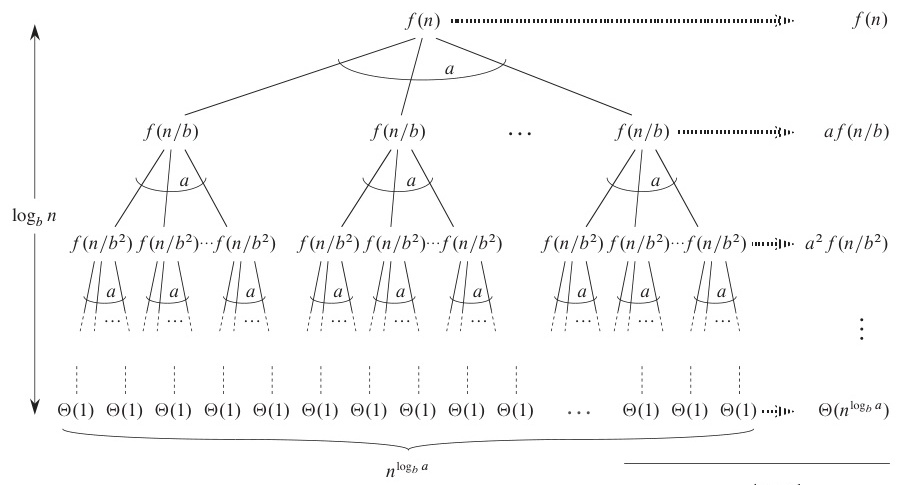
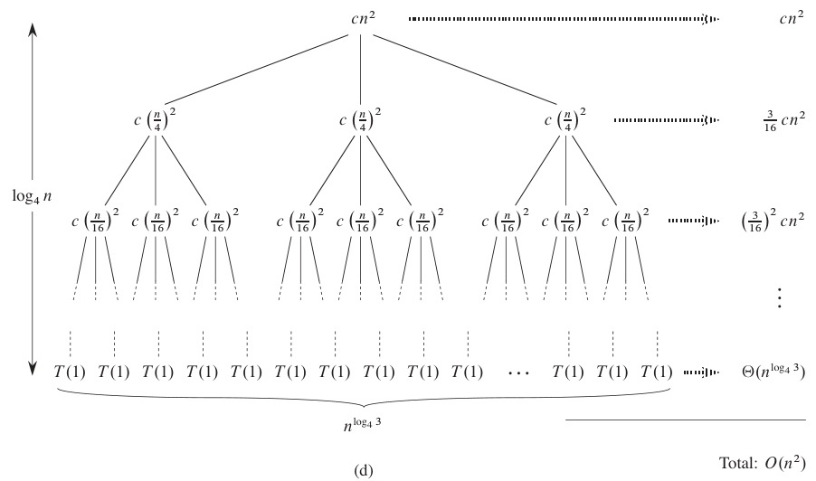
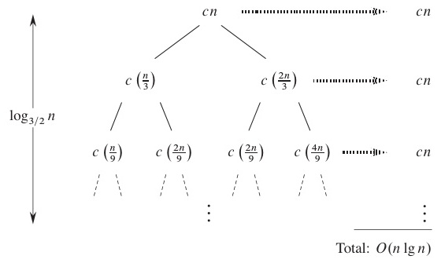
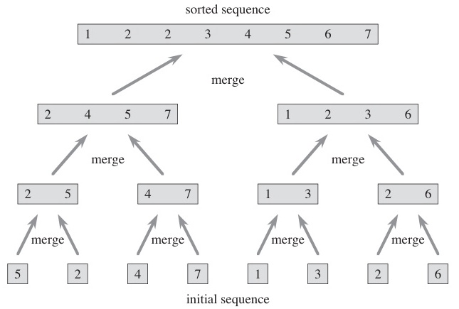
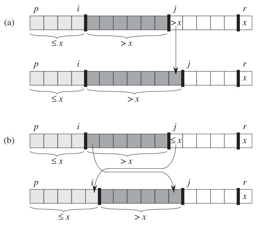
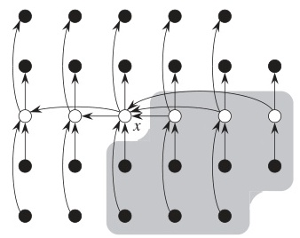

# W04 이론 — 분할 정복 알고리즘

> **최종 수정일:** 2026-03-24

---

## 목차

- [1. 분할 정복 개념](#1-분할-정복-개념)
  - [1.1 분할 정복 패러다임](#11-분할-정복-패러다임)
  - [1.2 분할 정복 개념도](#12-분할-정복-개념도)
  - [1.3 분할 단계](#13-분할-단계)
  - [1.4 정복과 결합](#14-정복과-결합)
  - [1.5 분할 정복 알고리즘의 분류](#15-분할-정복-알고리즘의-분류)
  - [1.6 마스터 정리 — 재귀 트리 직관](#16-마스터-정리--재귀-트리-직관)
  - [1.7 마스터 정리 — 세 가지 경우](#17-마스터-정리--세-가지-경우)
  - [1.8 기타 분할 정복 점화식 패턴](#18-기타-분할-정복-점화식-패턴)
- [2. 병합 정렬](#2-병합-정렬)
  - [2.1 병합 정렬 — 개요](#21-병합-정렬--개요)
  - [2.2 병합 정렬 — 점화식과 분석](#22-병합-정렬--점화식과-분석)
  - [2.3 병합 정렬 — 단계별 예시](#23-병합-정렬--단계별-예시)
- [3. 이진 탐색](#3-이진-탐색)
  - [3.1 이진 탐색 — 알고리즘](#31-이진-탐색--알고리즘)
  - [3.2 이진 탐색 — 분석](#32-이진-탐색--분석)
  - [3.3 이진 탐색 — 단계별 예시](#33-이진-탐색--단계별-예시)
- [4. 퀵 정렬](#4-퀵-정렬)
  - [4.1 퀵 정렬 — 개요](#41-퀵-정렬--개요)
  - [4.2 분할 절차](#42-분할-절차)
  - [4.3 분할 — 단계별 예시](#43-분할--단계별-예시)
  - [4.4 퀵 정렬 — 분석](#44-퀵-정렬--분석)
- [5. 선택 문제](#5-선택-문제)
  - [5.1 선택 문제 — 정의](#51-선택-문제--정의)
  - [5.2 랜덤 선택](#52-랜덤-선택)
  - [5.3 선택 — 예시 1: 2번째로 작은 원소](#53-선택--예시-1-2번째로-작은-원소)
  - [5.4 선택 — 예시 2: 7번째로 작은 원소](#54-선택--예시-2-7번째로-작은-원소)
  - [5.5 선택 — 평균 시간 분석](#55-선택--평균-시간-분석)
  - [5.6 선택 — 최악 시간 분석](#56-선택--최악-시간-분석)
  - [5.7 선형 시간 선택 (중앙값의 중앙값)](#57-선형-시간-선택-중앙값의-중앙값)
  - [5.8 중앙값의 중앙값 — 단계별 예시](#58-중앙값의-중앙값--단계별-예시)
  - [5.9 중앙값의 중앙값 — 균형 보장 이유](#59-중앙값의-중앙값--균형-보장-이유)
  - [5.10 선형 선택 — 시간 복잡도](#510-선형-선택--시간-복잡도)
- [6. 최근접 쌍 문제](#6-최근접-쌍-문제)
  - [6.1 최근접 쌍 — 문제 정의](#61-최근접-쌍--문제-정의)
  - [6.2 최근접 쌍 — 분할 정복 접근](#62-최근접-쌍--분할-정복-접근)
  - [6.3 최근접 쌍 — 중간 띠(Strip)](#63-최근접-쌍--중간-띠strip)
  - [6.4 최근접 쌍 — 의사코드](#64-최근접-쌍--의사코드)
  - [6.5 최근접 쌍 — 실행 예시](#65-최근접-쌍--실행-예시)
  - [6.6 최근접 쌍 — 시간 복잡도](#66-최근접-쌍--시간-복잡도)
- [7. 분할 정복이 부적절한 경우](#7-분할-정복이-부적절한-경우)
  - [7.1 분할 정복 실패 사례 — 피보나치](#71-분할-정복-실패-사례--피보나치)
  - [7.2 피보나치 — 상향식 해법](#72-피보나치--상향식-해법)
  - [7.3 분할 정복 적용 시 주의사항](#73-분할-정복-적용-시-주의사항)
- [요약](#요약)
- [부록](#부록)

---

<br>

## 1. 분할 정복 개념

### 1.1 분할 정복 패러다임

주어진 문제의 입력을 **분할(Divide)** 하고 각 부분을 **정복(Conquer, 해결)** 하는 알고리즘이다.

**세 단계:**
1. **분할(Divide)** — 문제를 더 작은 부분 문제로 나눈다
2. **정복(Conquer)** — 각 부분 문제를 재귀적으로 해결한다
3. **결합(Combine)** — 부분 해를 합쳐 원래 문제의 해를 구한다

**핵심 용어:**
- **부분 문제(Subproblem)**: 분할된 입력에 대해 정의된 문제
- **부분 해(Subsolution)**: 부분 문제의 해
- 부분 문제는 더 이상 나눌 수 없을 때까지(기저 사례, base case) 재귀적으로 분할된다

> **핵심:** 분할 정복의 핵심은 "큰 문제를 작은 문제들로 쪼개면 각각은 쉬워진다"는 아이디어이다. 단, 단순히 나누는 것만으로는 부족하고, 부분 해를 **결합**하는 방법이 효율적이어야 전체 알고리즘이 효율적이 된다.

### 1.2 분할 정복 개념도

```
          ┌──────────┐
          │   문제    │
          └────┬─────┘
               ↓ 분할(Divide)
       ┌───────┴───────┐
  ┌────┴────┐     ┌────┴────┐
  │ 부분문제1 │     │ 부분문제2 │
  └────┬────┘     └────┬────┘
       ↓ 정복          ↓ 정복
  ┌────┴────┐     ┌────┴────┐
  │  부분해1  │     │  부분해2 │
  └────┬────┘     └────┬────┘
       └───────┬───────┘
               ↓ 결합(Combine)
          ┌────┴─────┐
          │    해     │
          └──────────┘
```

### 1.3 분할 단계

**예시:** 입력 크기 $n$을 2개의 부분 문제로 나누며, 각각의 크기는 $n/2$이다.

분할할 때마다 부분 문제의 크기가 절반으로 줄어든다:
- 1회 분할 후: 각 크기 $= n/2$
- 2회 분할 후: 각 크기 $= n/2^2$
- ...
- $k$회 분할 후: 각 크기 $= n/2^k$

**분할은 언제 멈추는가?**
$$n/2^k = 1 \implies k = \log_2 n$$

총 분할 횟수 $= \log_2 n$

> **[이산수학]** $\log_2 n$이 반복적으로 등장하는 이유는, 크기 $n$을 매번 절반으로 나누면 $\log_2 n$번 후에 크기가 1이 되기 때문이다. 이진 탐색, 병합 정렬 등 "절반 분할" 구조에서 항상 $\log n$이 나타나는 근본적인 이유이다.

### 1.4 정복과 결합

- 단순히 입력을 분할하는 것만으로는 대부분의 문제를 풀기에 **충분하지 않다**
- 부분 문제를 **정복**해야 한다: 부분 해를 구해야 한다
- 부분 해를 **결합(합병)** 하여 더 큰 부분 문제의 해를 구성한다

정복 방법은 구체적인 문제에 따라 달라진다.

### 1.5 분할 정복 알고리즘의 분류

일반적인 점화식 형태:

$$T(n) = a \cdot T(n/b) + O(f(n))$$

- $a$ = 분할 후 부분 문제의 수
- $n/b$ = 각 부분 문제의 크기
- $f(n)$ = 분할과 결합에 드는 비용

| $a$ | $b$ | 알고리즘 |
|:-----|:-----|:-----------|
| 2 | 2 | 병합 정렬, 최근접 쌍 |
| 3 | 2 | 큰 정수 곱셈 |
| 7 | 2 | Strassen 행렬 곱셈 |

> **핵심:** 이 점화식에서 $a$, $b$, $f(n)$이 알고리즘의 시간 복잡도를 결정한다. $a$가 클수록 부분 문제가 많아져 비용이 증가하고, $b$가 클수록 부분 문제 크기가 빠르게 줄어든다. $f(n)$은 분할·결합 오버헤드이다.

### 1.6 마스터 정리 — 재귀 트리 직관

$T(n) = a \cdot T(n/b) + O(f(n))$에 대해:

**재귀 트리의 각 레벨에서의 비용:**

| 레벨 | 문제 크기 | 문제 수 | 비용 |
|:------|:----------|:--------|:-----|
| 0 (루트) | $n$ | 1 | $f(n)$ |
| 1 | $n/b$ | $a$ | $a \cdot f(n/b)$ |
| $k$ | $n/b^k$ | $a^k$ | $a^k \cdot f(n/b^k)$ |

**깊이:** $k = \log_b n$ &nbsp; **리프(잎) 수:** $n^{\log_b a}$



> **참고:** 재귀 트리는 분할 정복 점화식을 시각적으로 이해하는 핵심 도구이다. 루트에서 리프까지 각 레벨의 비용을 모두 합하면 전체 시간 복잡도가 된다. 마스터 정리는 이 합산 결과를 $f(n)$과 $n^{\log_b a}$의 비교로 간단히 판정하는 정리이다.

### 1.7 마스터 정리 — 세 가지 경우

$T(n) = a \cdot T(n/b) + O(f(n))$에서, $f(n)$과 $n^{\log_b a}$를 비교한다:

**경우 1:** $f(n) = O(n^{\log_b a - \varepsilon})$ — 리프 비용이 지배적
$$T(n) = \Theta(n^{\log_b a})$$

**경우 2:** $f(n) = \Theta(n^{\log_b a})$ — 비용이 균형
$$T(n) = \Theta(n^{\log_b a} \log n)$$

**경우 3:** $f(n) = \Omega(n^{\log_b a + \varepsilon})$ — 결합 비용이 지배적
$$T(n) = \Theta(f(n))$$



> **참고 (경우 3):** *정규 조건(regularity condition)* 도 필요하다: 어떤 $c < 1$에 대해 $a \cdot f(n/b) \le c \cdot f(n)$이 성립해야 한다.

> **시험 팁:** 마스터 정리 적용 절차는 다음과 같다:
> 1. 점화식에서 $a$, $b$, $f(n)$을 식별한다
> 2. $n^{\log_b a}$를 계산한다
> 3. $f(n)$과 $n^{\log_b a}$의 대소를 비교하여 경우 1, 2, 3 중 하나를 판정한다
> 4. 해당 경우의 공식을 적용한다
>
> 시험에서 점화식이 주어지고 시간 복잡도를 구하라는 문제가 자주 출제되므로, 이 절차를 반드시 숙지해야 한다.

### 1.8 기타 분할 정복 점화식 패턴

| 점화식 | 설명 | 예시 |
|:--------|:------|:------|
| $T(n) = \frac{1}{n}\sum[T(i) + T(n-i)] + O(?)$ | 2부분, 크기 불균등 | 퀵 정렬 |
| $T(n) = T(n/2) + O(?)$ | 2부분, 1개만 필요, 절반 크기 | 이진 탐색 |
| $T(n) = \max\{T(i), T(n-i)\} + O(?)$ | 2부분, 1개만 필요, 크기 불균등 | 선택 |
| $T(n) = T(n-1) + O(?)$ | 크기가 1씩 감소 | 삽입 정렬, 피보나치 |



> **핵심:** 마스터 정리는 $T(n) = aT(n/b) + f(n)$ 형태에만 직접 적용할 수 있다. 퀵 정렬처럼 분할이 불균등하거나 삽입 정렬처럼 크기가 1씩만 줄어드는 경우에는 별도의 분석이 필요하다.

---

<br>

## 2. 병합 정렬

### 2.1 병합 정렬 — 개요

**분할:** $n$개 원소의 배열을 각각 $n/2$ 크기의 두 부분으로 나눈다

**정복:** 각 절반을 재귀적으로 정렬한다

**결합:** 두 정렬된 절반을 하나의 정렬된 배열로 합병한다

```
MERGE-SORT(A, p, r)
  if p < r
    q = floor((p + r) / 2)
    MERGE-SORT(A, p, q)       // 왼쪽 절반 정렬
    MERGE-SORT(A, q+1, r)     // 오른쪽 절반 정렬
    MERGE(A, p, q, r)         // 두 절반 합병
```



> **[자료구조]** 병합 정렬의 핵심은 MERGE 과정이다. 두 정렬된 배열을 하나로 합치려면, 각 배열의 첫 원소를 비교하여 작은 것을 결과 배열에 넣고 포인터를 전진시키는 방식을 반복한다. 이 과정이 $\Theta(n)$이다.

### 2.2 병합 정렬 — 점화식과 분석

**점화식:**
$$T(n) = 2T(n/2) + \Theta(n)$$

- 분할: $O(1)$ — 중간점만 계산
- 정복: $2T(n/2)$ — 절반에 대한 두 번의 재귀 호출
- 결합: $\Theta(n)$ — 두 정렬된 배열을 합병

**마스터 정리 적용:** $a=2, b=2, f(n)=\Theta(n)$
$$n^{\log_b a} = n^{\log_2 2} = n^1 = n$$
$$f(n) = \Theta(n) = \Theta(n^{\log_b a}) \implies \text{경우 2}$$

$$T(n) = \Theta(n \log n)$$

**공간 복잡도:** $O(n)$ (합병을 위한 보조 배열)

> **참고:** 병합 정렬은 항상 $\Theta(n \log n)$이다. 퀵 정렬과 달리 최악의 경우가 없다는 것이 장점이지만, $O(n)$의 추가 공간이 필요하다는 것이 단점이다.

### 2.3 병합 정렬 — 단계별 예시

```
원본:         [38, 27, 43, 3, 9, 82, 10]
                      ↙ 분할 ↘
        [38, 27, 43, 3]      [9, 82, 10]
           ↙ 분할 ↘              ↙ 분할 ↘
      [38, 27]   [43, 3]    [9, 82]  [10]
         ↙↘         ↙↘        ↙↘
      [38] [27]  [43] [3]  [9] [82]
         ↘↙         ↘↙        ↘↙
      [27, 38]   [3, 43]    [9, 82]  [10]
            ↘ 합병 ↙             ↘ 합병 ↙
        [3, 27, 38, 43]       [9, 10, 82]
                       ↘ 합병 ↙
             [3, 9, 10, 27, 38, 43, 82]
```

---

<br>

## 3. 이진 탐색

### 3.1 이진 탐색 — 알고리즘

**아이디어:** **정렬된** 배열에서 탐색 공간을 반복적으로 절반으로 줄여가며 탐색한다.

```
BINARY-SEARCH(A, p, r, key)
  if p > r
    return NOT_FOUND
  mid = floor((p + r) / 2)
  if A[mid] == key
    return mid
  else if A[mid] > key
    return BINARY-SEARCH(A, p, mid-1, key)
  else
    return BINARY-SEARCH(A, mid+1, r, key)
```

**분할 정복 구조:**
- **분할:** key를 중간 원소와 비교
- **정복:** 한쪽 절반에서만 재귀
- **결합:** 자명 (결과를 그대로 반환)

> **핵심:** 이진 탐색은 분할 정복의 특수한 형태로, 두 부분 문제 중 **하나만** 정복하면 된다. 이 때문에 점화식이 $T(n) = T(n/2) + O(1)$이 되어 $\Theta(\log n)$이라는 매우 빠른 시간 복잡도를 달성한다.

### 3.2 이진 탐색 — 분석

**점화식:**
$$T(n) = T(n/2) + O(1)$$

- 크기 $n/2$의 부분 문제 **1개**만 필요
- 각 레벨에서 $O(1)$ 작업 (비교 1회)

**마스터 정리 적용:** $a=1, b=2, f(n)=O(1)$
$$n^{\log_b a} = n^{\log_2 1} = n^0 = 1$$
$$f(n) = O(1) = \Theta(n^{\log_b a}) \implies \text{경우 2}$$

$$T(n) = \Theta(\log n)$$

### 3.3 이진 탐색 — 단계별 예시

정렬된 배열에서 key = **23** 탐색:

```
인덱스: 0   1   2   3   4   5   6   7   8   9
  값: [3,  8, 11, 15, 20, 23, 29, 31, 48, 65]

단계 1: p=0, r=9, mid=4 → A[4]=20 < 23 → 오른쪽 탐색
      [                   23, 29, 31, 48, 65]
단계 2: p=5, r=9, mid=7 → A[7]=31 > 23 → 왼쪽 탐색
      [23, 29]
단계 3: p=5, r=6, mid=5 → A[5]=23 == 23 → 인덱스 5에서 발견!
```

10개 원소에서 **3번의 비교**만으로 탐색 완료 ($\lceil\log_2 10\rceil = 4$ 최대)

> **참고:** 이진 탐색은 **정렬된 배열**에서만 사용할 수 있다. 정렬되지 않은 데이터에 적용하려면 먼저 $O(n \log n)$에 정렬해야 하므로, 탐색을 한 번만 할 경우에는 선형 탐색($O(n)$)이 오히려 더 효율적일 수 있다. 탐색이 여러 번 반복될 때 정렬 + 이진 탐색이 유리해진다.

---

<br>

## 4. 퀵 정렬

### 4.1 퀵 정렬 — 개요

**분할:** 배열을 **피벗(pivot)** 원소 기준으로 분할한다

**정복:** 두 부분 배열을 재귀적으로 정렬한다

**결합:** 자명 (분할 후 제자리 정렬이므로 이미 정렬 완료)

```
QUICKSORT(A, p, r)
  if p < r
    q = PARTITION(A, p, r)
    QUICKSORT(A, p, q-1)    // 피벗 왼쪽 정렬
    QUICKSORT(A, q+1, r)    // 피벗 오른쪽 정렬
```

> **핵심:** 병합 정렬과 퀵 정렬의 핵심 차이: 병합 정렬은 분할이 단순(절반 분할)하고 결합이 어렵다(합병). 반면 퀵 정렬은 분할이 어렵고(피벗 기반 분할) 결합이 자명하다.

### 4.2 분할 절차

**마지막 원소**를 피벗으로 선택한다. 다음 조건을 만족하도록 재배열한다:
- 피벗 이하($\le$)인 원소는 왼쪽으로
- 피벗 초과($>$)인 원소는 오른쪽으로

```
PARTITION(A, p, r)
  pivot = A[r]
  i = p - 1
  for j = p to r - 1
    if A[j] <= pivot
      i = i + 1
      swap A[i] and A[j]
  swap A[i+1] and A[r]
  return i + 1
```

피벗의 최종 인덱스를 반환한다.




> **참고:** 변수 `i`는 "피벗 이하인 원소들의 마지막 인덱스"를 추적한다. `j`가 배열을 순회하면서 피벗 이하인 원소를 발견하면, `i`를 1 증가시키고 `A[i]`와 `A[j]`를 교환하여 해당 원소를 왼쪽 영역에 포함시킨다.

### 4.3 분할 — 단계별 예시

`A = [31, 8, 48, 73, 11, 3, 20, 29, 65, 15]`에서 pivot = **15**로 분할:

```
pivot = A[9] = 15,  i = -1

j=0: A[0]=31 > 15         → 건너뜀            [31, 8, 48, 73, 11, 3, 20, 29, 65, 15]
j=1: A[1]=8  <= 15 → i=0  → swap(A[0],A[1]) [ 8, 31, 48, 73, 11, 3, 20, 29, 65, 15]
j=2: A[2]=48 > 15         → 건너뜀            [ 8, 31, 48, 73, 11, 3, 20, 29, 65, 15]
j=3: A[3]=73 > 15         → 건너뜀            [ 8, 31, 48, 73, 11, 3, 20, 29, 65, 15]
j=4: A[4]=11 <= 15 → i=1  → swap(A[1],A[4]) [ 8, 11, 48, 73, 31, 3, 20, 29, 65, 15]
j=5: A[5]=3  <= 15 → i=2  → swap(A[2],A[5]) [ 8, 11,  3, 73, 31, 48, 20, 29, 65, 15]
j=6: A[6]=20 > 15         → 건너뜀            [ 8, 11,  3, 73, 31, 48, 20, 29, 65, 15]
j=7: A[7]=29 > 15         → 건너뜀            [ 8, 11,  3, 73, 31, 48, 20, 29, 65, 15]
j=8: A[8]=65 > 15         → 건너뜀            [ 8, 11,  3, 73, 31, 48, 20, 29, 65, 15]

최종: swap A[i+1]=A[3]과 A[r]=A[9]:
     [ 8, 11,  3, 15, 31, 48, 20, 29, 65, 73]
                   ^피벗 (인덱스 3)
```

결과: `[8, 11, 3 | 15 | 31, 48, 20, 29, 65, 73]`

### 4.4 퀵 정렬 — 분석

**최선/평균의 경우:**
- 피벗이 배열을 매번 대략 절반으로 나누는 경우
$$T(n) = 2T(n/2) + \Theta(n) \implies T(n) = \Theta(n \log n)$$

**최악의 경우:**
- 피벗이 항상 가장 작거나 가장 큰 원소인 경우
- 분할 결과가 크기 0과 $n-1$로 나뉨
$$T(n) = T(n-1) + \Theta(n) \implies T(n) = \Theta(n^2)$$

**평균의 경우 (정식 분석):**
$$T(n) = \frac{1}{n}\sum_{i=0}^{n-1}[T(i) + T(n-1-i)] + \Theta(n) = \Theta(n \log n)$$

**공간:** $O(\log n)$ 평균 (재귀 스택), $O(n)$ 최악의 경우

> **시험 팁:** 퀵 정렬의 최악의 경우는 이미 정렬된(또는 역순 정렬된) 배열에서 마지막 원소를 피벗으로 선택할 때 발생한다. 이를 방지하기 위해 실무에서는 **랜덤 피벗**, **세 값의 중앙값(median-of-three)** 등의 전략을 사용한다.

---

<br>

## 5. 선택 문제

### 5.1 선택 문제 — 정의

**문제:** 정렬되지 않은 배열 $A[p \ldots r]$에서 $i$번째로 작은 원소를 찾아라.

**두 가지 알고리즘:**
1. 평균 $\Theta(n)$ — 랜덤 선택(Randomized Select)
2. 최악 $\Theta(n)$ — 중앙값의 중앙값(Median of Medians, Linear Select)

**분할 정복 구조:**
- **분할:** 피벗으로 배열을 분할하고, 피벗의 순위를 확인
- **정복:** **하나의** 부분 배열에서만 재귀
- **결합:** 자명

$$T(n) \le \max\{T(k-1),\ T(n-k)\} + \Theta(n)$$

> **참고:** 선택 문제는 "배열 전체를 정렬하지 않고도 $i$번째 원소를 찾을 수 있는가?"라는 질문에 답하는 문제이다. 정렬하면 $O(n \log n)$이 걸리지만, 선택 알고리즘은 $O(n)$으로 해결한다.

### 5.2 랜덤 선택

```
SELECT(A, p, r, i)
  // A[p..r]에서 i번째로 작은 원소를 찾는다
  if p == r
    return A[p]             // 원소가 하나뿐
  q = PARTITION(A, p, r)    // 피벗이 인덱스 q에 위치
  k = q - p + 1             // 피벗은 A[p..r]에서 k번째로 작은 원소
  if i < k
    return SELECT(A, p, q-1, i)       // 왼쪽에서 탐색
  else if i == k
    return A[q]                       // 피벗이 정답
  else
    return SELECT(A, q+1, r, i-k)     // 오른쪽에서 탐색
```

- **평균 시간:** $\Theta(n)$
- **최악 시간:** $\Theta(n^2)$

> **핵심:** 이 알고리즘은 퀵 정렬과 구조가 유사하지만, **한쪽 부분 배열에서만** 재귀한다는 점이 핵심적인 차이이다. 퀵 정렬은 양쪽 모두 재귀하지만, 선택은 원하는 순위가 있는 쪽에서만 재귀하므로 더 빠르다.

### 5.3 선택 — 예시 1: 2번째로 작은 원소

```
입력: [31, 8, 48, 73, 11, 3, 20, 29, 65, 15]   찾기: i=2

단계 1: pivot=15로 PARTITION
  결과: [8, 11, 3 | 15 | 31, 48, 20, 29, 65, 73]
  피벗 위치 k=4 (4번째로 작은 원소)

  i=2 < k=4 → 왼쪽 그룹 [8, 11, 3]에서 탐색

단계 2: [8, 11, 3]에서 pivot=3으로 PARTITION
  결과: [3 | 8, 11]
  피벗 위치 k=1

  i=2 > k=1 → 오른쪽 그룹 [8, 11]에서 (2-1)=1번째로 작은 원소 탐색

단계 3: [8, 11]에서 pivot=11로 PARTITION
  결과: [8 | 11]
  피벗 위치 k=2

  i=1 < k=2 → 왼쪽 그룹 [8]에서 탐색

단계 4: 원소가 하나뿐 → 8 반환
```

### 5.4 선택 — 예시 2: 7번째로 작은 원소

```
입력: [31, 8, 48, 73, 11, 3, 20, 29, 65, 15]   찾기: i=7

단계 1: pivot=15로 PARTITION
  결과: [8, 11, 3 | 15 | 31, 48, 20, 29, 65, 73]
  왼쪽 그룹에 3개 원소, 피벗은 k=4

  i=7 > k=4 → 오른쪽 그룹 [31, 48, 20, 29, 65, 73]에서
              (7-4)=3번째로 작은 원소 탐색

단계 2: [31, 48, 20, 29, 65, 73]에서 재귀적으로 계속
  3번째로 작은 원소를 찾는다...
```

### 5.5 선택 — 평균 시간 분석

찾고자 하는 원소가 항상 **더 큰** 분할에 있다고 가정(평균에 대한 최악 시나리오):

$$T(n) \le T(3n/4) + \Theta(n)$$

전개하면:
$$T(n) \le cn + c \cdot \frac{3n}{4} + c \cdot \left(\frac{3}{4}\right)^2 n + \cdots$$
$$= cn \sum_{k=0}^{\infty}\left(\frac{3}{4}\right)^k = cn \cdot \frac{1}{1 - 3/4} = 4cn$$

$$\therefore T(n) = O(n)$$

$T(n) = \Omega(n)$은 자명(모든 원소를 검사해야 한다)이므로:

$$T(n) = \Theta(n)$$

> **[이산수학]** 무한 등비급수 $\sum_{k=0}^{\infty} r^k = \frac{1}{1-r}$ ($|r| < 1$)이 사용되었다. $r = 3/4 < 1$이므로 급수가 수렴하여 상수 $4c$가 된다. 이처럼 기하급수적 감소는 분할 정복 분석에서 매우 자주 등장한다.

### 5.6 선택 — 최악 시간 분석

**최악의 경우:** 분할이 항상 크기 0과 $n-1$로 나뉜다

$$T(n) = T(n-1) + \Theta(n) = \Theta(n^2)$$

최악의 경우에도 선형 시간을 보장할 수 있는가?

**가능하다!** **중앙값의 중앙값(Median-of-Medians)** 알고리즘을 사용하면 된다.

### 5.7 선형 시간 선택 (중앙값의 중앙값)

```
LINEAR-SELECT(A, p, r, i)
  // A[p..r]에서 i번째로 작은 원소를 찾는다
  1. if |A| <= 5: 정렬 후 i번째 원소 반환
  2. 원소들을 5개씩 그룹으로 나눈다 → ceil(n/5)개 그룹
  3. 각 그룹의 중앙값을 구한다 → m_1, m_2, ..., m_{ceil(n/5)}
  4. M = LINEAR-SELECT(medians, 1, ceil(n/5), ceil(n/10))
     // 중앙값들의 중앙값을 재귀적으로 찾는다
  5. A를 M 기준으로 분할한다
  6. 적절한 쪽에서 재귀한다
```

**핵심 통찰:** M은 **균형 잡힌 피벗**임이 보장된다 — 최소 $3n/10$개의 원소가 M보다 작고, 최소 $3n/10$개가 M보다 크다.

> **참고:** 5개씩 묶는 이유는, 3개씩 묶으면 점화식이 $T(n) = T(n/3) + T(2n/3) + \Theta(n)$이 되어 선형이 되지 않고, 7개 이상은 불필요하게 그룹 내 정렬 비용이 커지기 때문이다. 5가 선형 시간을 보장하는 가장 작은 그룹 크기이다.

### 5.8 중앙값의 중앙값 — 단계별 예시

**단계 2:** 37개 원소를 5개씩 그룹으로 나눈다:

```
그룹 1: [5, 1, 2, 9, 24]       그룹 5: [34, 6, 20, 32, 4]
그룹 2: [17, 33, 18, 16, 26]   그룹 6: [35, 15, 25, 11, 8]
그룹 3: [30, 13, 10, 21, 29]   그룹 7: [28, 23, 27, 22, 19]
그룹 4: [3, 36, 7, 37, 12]     그룹 8: [31, 14]  (5개 미만)
```

**단계 3:** 각 그룹을 정렬하고 중앙값(3번째 원소)을 취한다:

```
그룹 1: [1,2,5,9,24]      → 중앙값 = 5
그룹 2: [16,17,18,26,33]  → 중앙값 = 18
그룹 3: [10,13,21,29,30]  → 중앙값 = 21
그룹 4: [3,7,12,36,37]    → 중앙값 = 12
그룹 5: [4,6,20,32,34]    → 중앙값 = 20
그룹 6: [8,11,15,25,35]   → 중앙값 = 15
그룹 7: [19,22,23,27,28]  → 중앙값 = 23
그룹 8: [14,31]           → 중앙값 = 14
```

**단계 4:** $\{5, 18, 21, 12, 20, 15, 23, 14\}$의 중앙값을 찾는다

이 8개 중앙값에 대해 LINEAR-SELECT를 재귀 호출하여 4번째로 작은 원소를 찾는다:

$$M = 18$$

**단계 5:** 전체 배열을 $M = 18$ 기준으로 분할한다:
- 왼쪽 그룹 ($\le 18$): 18 이하의 원소들
- 오른쪽 그룹 ($> 18$): 18 초과의 원소들

**단계 6:** 원하는 순위가 있는 쪽에서 재귀한다.

### 5.9 중앙값의 중앙값 — 균형 보장 이유

- $\lceil n/5 \rceil$개의 중앙값 중 최소 절반은 $\le M$이다
- 그러한 각 중앙값에 대해, 해당 그룹에서 최소 3개 원소가 $\le M$이다
- 따라서 최소 $3 \times \lceil n/10 \rceil \approx 3n/10$개의 원소가 $\le M$이다
- 마찬가지로, 최소 $3n/10$개의 원소가 $\ge M$이다
- **최악의 경우:** 최대 $7n/10$개의 원소에 대해 재귀한다

각 열 = 5개짜리 그룹. 흰 원 = 중앙값. 음영 영역 = $\ge x$임이 보장된 원소들.



### 5.10 선형 선택 — 시간 복잡도

**점화식:**
$$T(n) = T(n/5) + T(7n/10) + \Theta(n)$$

- $T(n/5)$: 중앙값들의 중앙값 찾기 (단계 4)
- $T(7n/10)$: 더 큰 분할에서 재귀 (단계 6)
- $\Theta(n)$: 그룹 나누기, 그룹 중앙값 구하기, 분할

$1/5 + 7/10 = 9/10 < 1$이므로, 총 작업량이 기하급수적으로 감소한다:

$$T(n) \le cn + \frac{9}{10}cn + \left(\frac{9}{10}\right)^2 cn + \cdots = cn \cdot \frac{1}{1 - 9/10} = 10cn$$

$$\therefore T(n) = O(n)$$

$T(n) = \Omega(n)$은 자명이므로: $T(n) = \Theta(n)$

> **시험 팁:** $1/5 + 7/10 = 9/10 < 1$이라는 조건이 선형 시간을 보장하는 핵심이다. 만약 이 합이 1 이상이면 기하급수적 감소가 성립하지 않아 선형 시간이 되지 않는다. 시험에서 "왜 5개씩 묶는가?" 또는 "왜 선형인가?"라는 질문이 나올 수 있다.

---

<br>

## 6. 최근접 쌍 문제

### 6.1 최근접 쌍 — 문제 정의

**문제:** 2차원 평면 위 $n$개의 점이 주어질 때, **가장 가까운** 두 점의 쌍을 찾아라.

**무차별 대입(Brute-force) 접근:**
- 모든 쌍의 거리를 계산: $\binom{n}{2} = n(n-1)/2$개의 쌍
- 각 거리 계산: $O(1)$
- **총:** $O(n^2)$

분할 정복으로 더 나은 해법을 구할 수 있는가?

### 6.2 최근접 쌍 — 분할 정복 접근

**전처리:** 모든 점을 x좌표 기준으로 정렬한다 — $O(n \log n)$

**분할:** 점 집합 $S$를 왼쪽 절반 $S_L$과 오른쪽 절반 $S_R$로 나눈다

**정복:** $S_L$에서 최근접 쌍 $CP_L$, $S_R$에서 최근접 쌍 $CP_R$을 재귀적으로 찾는다

**결합:** $d = \min(\text{dist}(CP_L), \text{dist}(CP_R))$로 놓고
- 폭 $2d$의 **중간 띠(strip)** 에서 $d$보다 가까운 쌍을 검사한다
- 존재한다면 이 쌍이 $CP_C$이다

**반환:** $CP_L$, $CP_R$, $CP_C$ 중 가장 가까운 쌍

### 6.3 최근접 쌍 — 중간 띠(Strip)

핵심 통찰은 **결합** 단계에 있다:

```
        ←── d ──→←── d ──→
        ┌────────┬────────┐
        │        │        │
        │   S_L  │  S_R   │
        │        │        │
        │   ·  · │ ·      │
        │     ·  │   ·    │
        │        │        │
        └────────┴────────┘
        중간 띠 (폭 2d)
```

- 분할선으로부터 거리 $d$ 이내의 점만 검사하면 된다
- 띠 안의 점들을 y좌표 기준으로 정렬한다
- 각 점에 대해 다음 몇 개의 점(최대 **6개** 이웃)만 비교하면 된다
- 이로써 띠 검사가 점당 $O(n)$이지만 비교 횟수는 상수로 제한된다

> **핵심:** "왜 최대 6개만 비교하면 되는가?"가 이 알고리즘의 핵심 아이디어이다. $d \times 2d$ 직사각형 안에 서로 거리 $d$ 이상인 점은 최대 8개만 존재할 수 있으므로, 각 점에 대해 y좌표 기준으로 가까운 최대 6~7개의 점만 비교하면 충분하다.

### 6.4 최근접 쌍 — 의사코드

```
CLOSEST-PAIR(S)
  입력: S — x좌표 기준으로 정렬된 점들
  출력: 최근접 쌍의 거리

  1. if |S| <= 3: 모든 쌍의 거리를 계산하고 최솟값 반환
  2. S를 x좌표 중앙값 기준으로 S_L과 S_R로 분할
  3. CP_L = CLOSEST-PAIR(S_L)
  4. CP_R = CLOSEST-PAIR(S_R)
  5. d = min(dist(CP_L), dist(CP_R))
     중간 띠(분할선으로부터 거리 d 이내)에서 최근접 쌍 CP_C를 찾는다
  6. return min(CP_L, CP_C, CP_R) (거리 기준)
```

### 6.5 최근접 쌍 — 실행 예시

```
x좌표 정렬된 점: (2,·) (5,·) (10,·) (15,·) (20,·) | (25,·) (26,·) (28,·) (30,·) (37,·)
                 ←──────── S_L ────────→              ←──────── S_R ────────→

단계 1: S_L에서 재귀 → CP_L (거리 = 10)
단계 2: S_R에서 재귀 → CP_R (거리 = 15)
단계 3: d = min(10, 15) = 10

단계 4: 중간 띠 = x ∈ [20-10, 25+10] = [10, 35] 범위의 점
       띠 안의 점: (10,·) (15,·) (20,·) (25,·) (26,·) (28,·) (30,·)

단계 5: 띠를 y좌표로 정렬하고 인접 쌍을 검사
       → CP_C (거리 = 5)를 발견 (예시)

단계 6: return min(10, 5, 15) = 5 → CP_C가 최근접 쌍
```

### 6.6 최근접 쌍 — 시간 복잡도

**점화식 분석:**

| 행 | 비용 |
|:-----|:-----|
| 행 1 (기저 사례) | $O(1)$ |
| 행 2 (분할) | $O(1)$ (이미 정렬됨) |
| 행 3–4 (재귀) | $2T(n/2)$ |
| 행 5 (띠 정렬 + 스캔) | $O(n \log n)$ |
| 행 6 (반환) | $O(1)$ |

$$T(n) = 2T(n/2) + O(n \log n)$$

**마스터 정리 또는 직접 분석:**

$\log n$개의 각 레벨이 $O(n \log n)$을 기여하므로:

$$T(n) = O(n \log^2 n)$$

*참고: 더 정교한 구현(y좌표 사전 정렬)을 사용하면 $O(n \log n)$으로 개선할 수 있다.*

> **참고:** $O(n \log^2 n)$과 $O(n \log n)$의 차이는 띠 내 점들을 매번 정렬하느냐($O(n \log n)$), 아니면 재귀 과정에서 y좌표 정렬을 유지하느냐의 차이이다.

---

<br>

## 7. 분할 정복이 부적절한 경우

### 7.1 분할 정복 실패 사례 — 피보나치

**분할 정복이 부적절한 경우:** 부분 문제들의 전체 입력 크기가 분할 후에 **증가**하는 경우이다.

**피보나치:** $F(n) = F(n-1) + F(n-2)$

```
                    F(6)
                  /     \
              F(5)      F(4)
            /    \      /    \
          F(4)   F(3)  F(3)  F(2)
         /   \   / \   / \
       F(3) F(2) ...  ...
```

- 입력 크기: $n$
- 부분 문제 입력 크기의 합: $(n-1) + (n-2) = 2n - 3 > n$
- $F(2)$가 **5번** 계산됨, $F(3)$이 **3번** 계산됨
- 지수적 중복!

> **핵심:** 분할 정복 vs 동적 프로그래밍의 핵심 구분점은 **부분 문제의 중복** 여부이다. 부분 문제가 겹치지 않으면(병합 정렬) 분할 정복, 겹치면(피보나치) 동적 프로그래밍이 적절하다.

### 7.2 피보나치 — 상향식 해법

분할 정복 대신 **반복적 상향식(iterative bottom-up)** 계산을 사용한다:

```
FIB-NUMBER(n)
  F[0] = 0
  F[1] = 1
  for i = 2 to n
    F[i] = F[i-1] + F[i-2]
  return F[n]
```

**시간:** $\Theta(n)$ — 각 값이 정확히 한 번만 계산된다

**교훈:** 부분 문제가 크게 중복될 때는, 순진한 분할 정복보다 **동적 프로그래밍(Dynamic Programming)** (상향식 또는 메모이제이션)이 더 적절하다.

### 7.3 분할 정복 적용 시 주의사항

**두 가지 핵심 고려사항:**

1. **입력 크기 증가:** 부분 문제들의 전체 크기가 원래 입력 크기를 초과하면, 분할 정복은 지수적 폭발로 이어진다
   - 예시: 피보나치

2. **결합 비용의 중요성:** 단순히 입력을 분할하는 것만으로는 효율성이 보장되지 않는다
   - 부분 해의 결합 비용이 감당 가능해야 한다
   - 많은 기하 문제가 분할 정복에 적합한 이유는, 결합 단계가 문제 구조에 자연스럽게 맞기 때문이다

---

<br>

## 요약

| 알고리즘 | 점화식 | 시간 복잡도 |
|:---------|:-------|:-----------|
| 병합 정렬 | $T(n) = 2T(n/2) + \Theta(n)$ | $\Theta(n \log n)$ |
| 이진 탐색 | $T(n) = T(n/2) + O(1)$ | $\Theta(\log n)$ |
| 퀵 정렬 (평균) | $T(n) = 2T(n/2) + \Theta(n)$ | $\Theta(n \log n)$ |
| 퀵 정렬 (최악) | $T(n) = T(n-1) + \Theta(n)$ | $\Theta(n^2)$ |
| 선택 (평균) | $T(n) \le T(3n/4) + \Theta(n)$ | $\Theta(n)$ |
| 선택 (최악, MoM) | $T(n) = T(n/5) + T(7n/10) + \Theta(n)$ | $\Theta(n)$ |
| 최근접 쌍 | $T(n) = 2T(n/2) + O(n \log n)$ | $O(n \log^2 n)$ |

**핵심 요약:**
- 분할 정복 = 분할 + 정복 + 결합
- 마스터 정리는 점화식을 시간 복잡도로 연결한다
- 부분 문제 크기가 증가하면 분할 정복이 부적절하다 (대신 DP 사용)

---

<br>

## 부록
