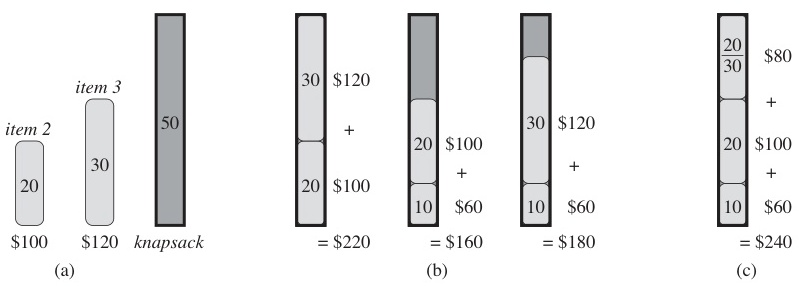
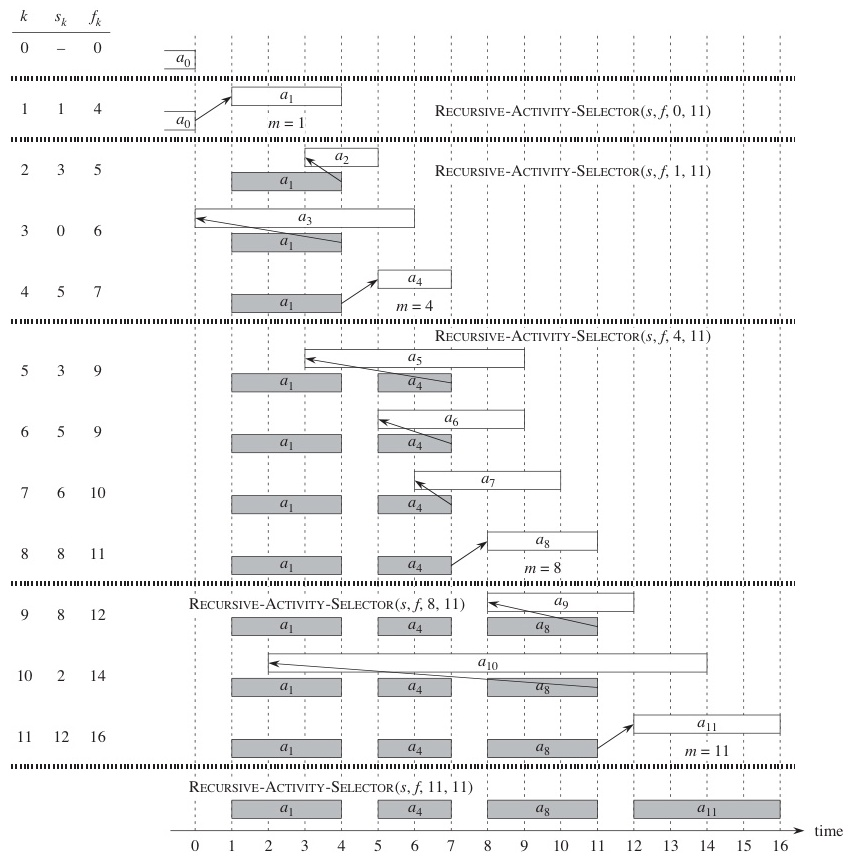
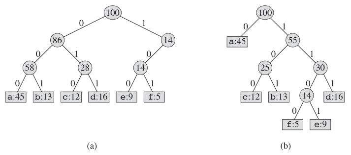
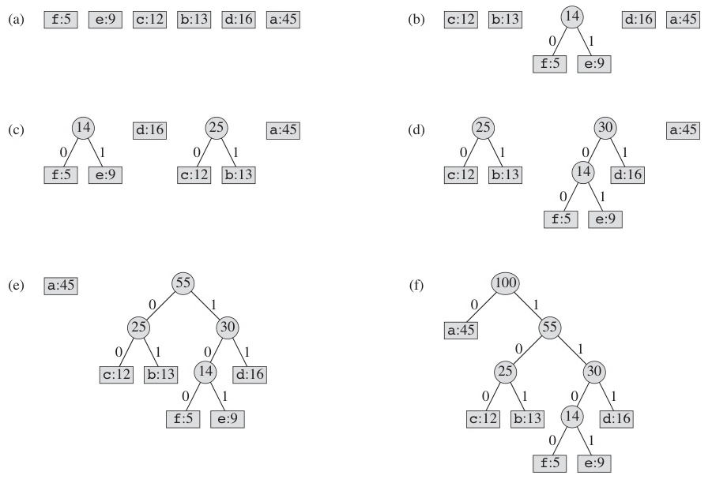
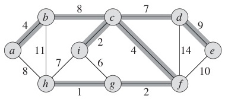
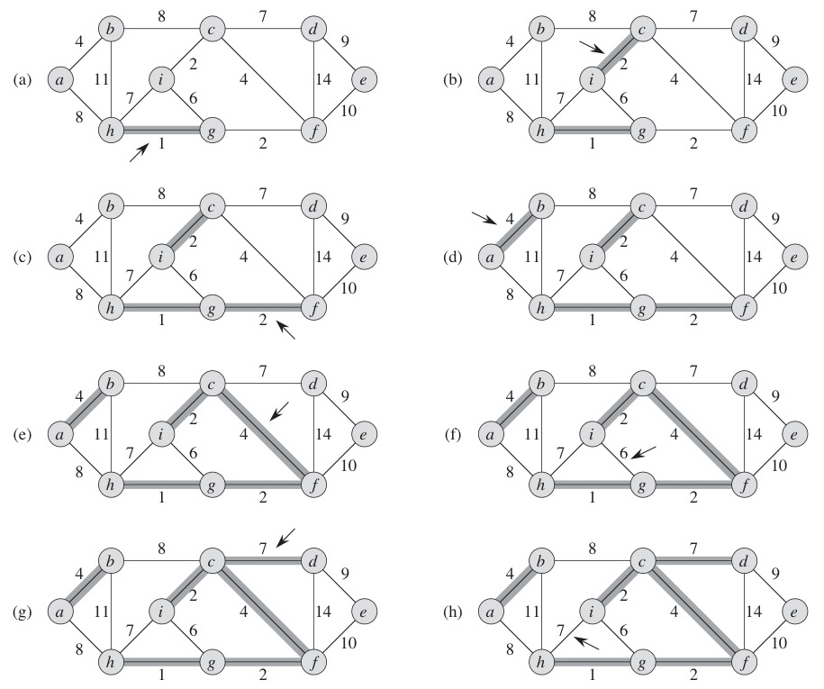
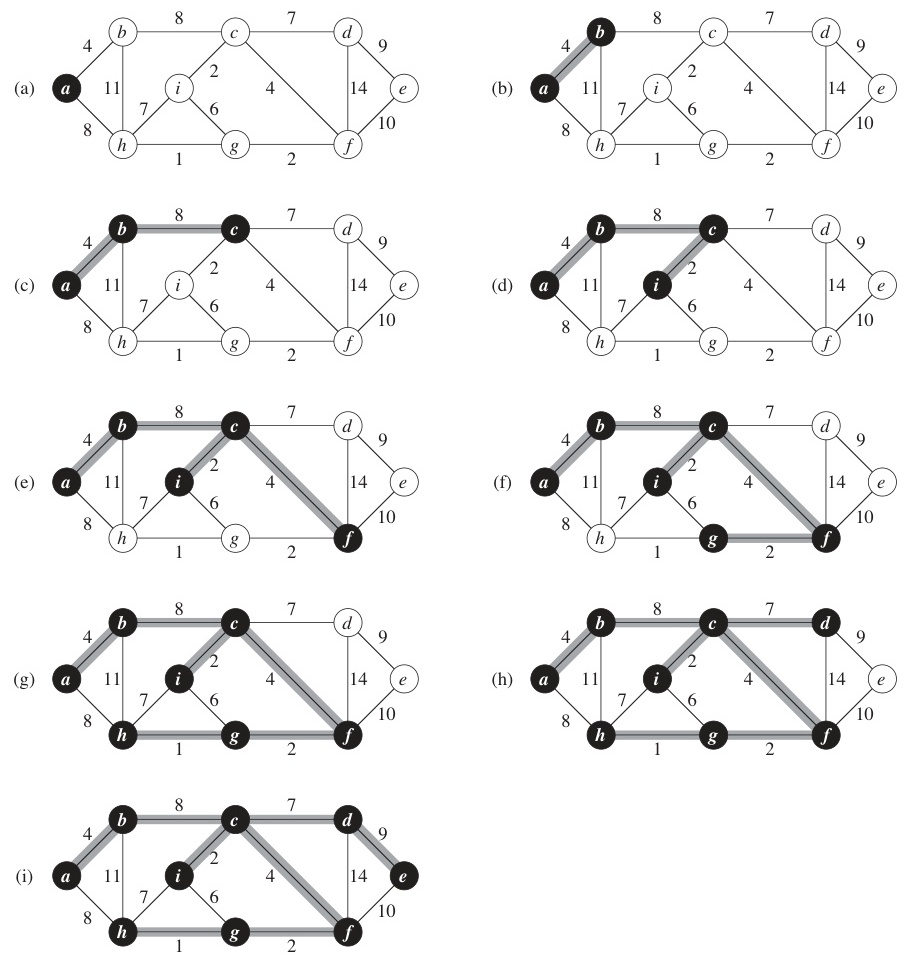
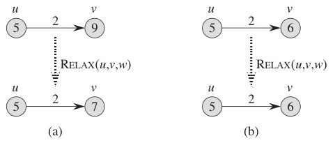
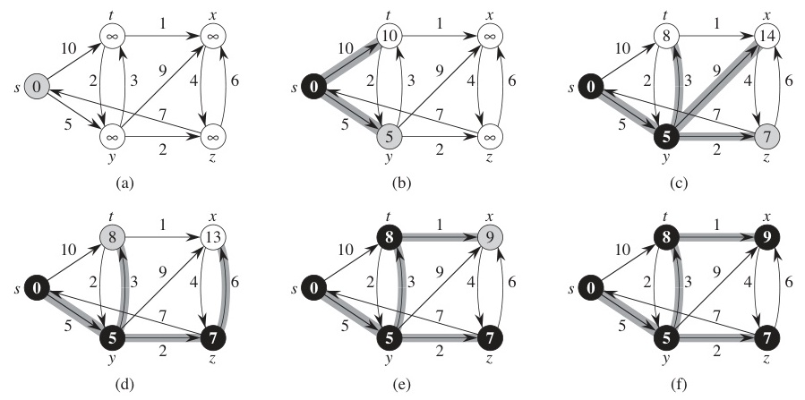

# W05 이론 — 그리디 알고리즘

> **최종 수정일:** 2026-03-31

---

## 목차

- [1. 그리디 알고리즘 기초](#1-그리디-알고리즘-기초)
  - [1.1 그리디 알고리즘이란?](#11-그리디-알고리즘이란)
  - [1.2 그리디 정확성을 위한 핵심 성질](#12-그리디-정확성을-위한-핵심-성질)
  - [1.3 그리디가 실패하는 경우 — 이진 트리 경로 합](#13-그리디가-실패하는-경우--이진-트리-경로-합)
  - [1.4 그리디가 실패하는 경우 — 비표준 동전 거스름돈](#14-그리디가-실패하는-경우--비표준-동전-거스름돈)
  - [1.5 현실 세계의 그리디 알고리즘](#15-현실-세계의-그리디-알고리즘)
- [2. 동전 거스름돈](#2-동전-거스름돈)
  - [2.1 동전 거스름돈 — 그리디 알고리즘](#21-동전-거스름돈--그리디-알고리즘)
- [3. 분할 가능 배낭 문제](#3-분할-가능-배낭-문제)
  - [3.1 분할 가능 배낭 — 문제 정의](#31-분할-가능-배낭--문제-정의)
  - [3.2 분할 가능 배낭 — 알고리즘](#32-분할-가능-배낭--알고리즘)
  - [3.3 분할 가능 배낭 — 풀이 예시](#33-분할-가능-배낭--풀이-예시)
  - [3.4 0-1 배낭 vs 분할 가능 배낭 — 0-1에서 그리디가 실패하는 이유](#34-0-1-배낭-vs-분할-가능-배낭--0-1에서-그리디가-실패하는-이유)
- [4. 작업 스케줄링](#4-작업-스케줄링)
  - [4.1 작업 스케줄링 — 알고리즘](#41-작업-스케줄링--알고리즘)
  - [4.2 작업 스케줄링 — 풀이 예시](#42-작업-스케줄링--풀이-예시)
- [5. 활동 선택 문제](#5-활동-선택-문제)
  - [5.1 활동 선택 — 알고리즘](#51-활동-선택--알고리즘)
- [6. 허프만 코딩](#6-허프만-코딩)
  - [6.1 허프만 코딩 — 개념](#61-허프만-코딩--개념)
  - [6.2 허프만 코딩 — 알고리즘](#62-허프만-코딩--알고리즘)
  - [6.3 허프만 코딩 — 풀이 예시](#63-허프만-코딩--풀이-예시)
  - [6.4 허프만 코딩 — 압축률](#64-허프만-코딩--압축률)
- [7. 최소 신장 트리 (MST)](#7-최소-신장-트리-mst)
  - [7.1 MST — 문제 정의](#71-mst--문제-정의)
  - [7.2 크루스칼 MST 알고리즘](#72-크루스칼-mst-알고리즘)
  - [7.3 프림 MST 알고리즘](#73-프림-mst-알고리즘)
  - [7.4 크루스칼 vs 프림 — 시각적 비교](#74-크루스칼-vs-프림--시각적-비교)
- [8. 다익스트라 최단 경로 알고리즘](#8-다익스트라-최단-경로-알고리즘)
  - [8.1 다익스트라 — 알고리즘](#81-다익스트라--알고리즘)
  - [8.2 다익스트라 — 간선 이완](#82-다익스트라--간선-이완)
  - [8.3 다익스트라 — 실행 추적](#83-다익스트라--실행-추적)
- [9. 그리디 vs 동적 프로그래밍](#9-그리디-vs-동적-프로그래밍)
- [요약](#요약)

---

<br>

## 1. 그리디 알고리즘 기초

### 1.1 그리디 알고리즘이란?

**최적화 문제(optimization problem)** 를 풀기 위한 알고리즘의 한 유형이다.

- **최적화 문제**: 모든 가능한 해 중에서 최선(최대 또는 최소)의 해를 찾는 문제
- 매 단계에서 **지역적으로 최적인 선택** — 지금 당장 가장 좋아 보이는 선택을 한다
- 한번 선택하면 **다시 고려하지 않는다** (백트래킹 없음)

**일반적인 그리디 구조:**

```
Greedy(C):                          // C = 모든 후보의 집합
    S <- {}
    while C != {} and S가 완전한 해가 아닌 동안:
        x <- C에서 가장 좋아 보이는 원소
        C <- C - {x}
        if S ∪ {x}가 가능한 해이면:
            S <- S ∪ {x}
    if S가 완전한 해이면: return S
    else: return "해 없음"
```

> **핵심:** 그리디 알고리즘의 핵심은 미래의 결과를 고려하지 않고 현재 시점에서 가장 좋아 보이는 선택을 항상 한다는 것이다. 이 때문에 그리디 알고리즘은 단순하고 빠르지만, 문제가 적절한 구조적 성질을 가질 때만 최적해를 보장한다.

**용어:** *가능 해(feasible solution)*는 문제의 모든 제약 조건을 만족하는 해이다(아직 완전하지 않을 수 있음). *완전 해(complete solution)*는 더 이상 확장할 수 없으며, 문제에 대한 완전한 답을 나타내는 해이다.

### 1.2 그리디 정확성을 위한 핵심 성질

그리디 알고리즘이 **최적** 해를 생성하려면 두 가지 성질이 성립해야 한다:

**1. 그리디 선택 성질 (Greedy-Choice Property)**
- 지역적으로 최적인(그리디) 선택을 함으로써 전역적으로 최적인 해에 도달할 수 있다
- 적어도 하나의 최적 해가 그리디 선택을 포함한다는 것을 증명할 수 있다

**2. 최적 부분 구조 (Optimal Substructure)**
- 문제의 최적 해가 부분 문제의 최적 해를 포함한다
- 그리디 선택을 한 후, 남은 부분 문제가 동일한 구조를 가진다

> **그리디 vs 동적 프로그래밍:** 둘 다 최적 부분 구조를 필요로 한다. 하지만 DP는 *모든* 부분 문제를 고려하고(상향식), 그리디는 *하나의* 선택만 하고 앞으로 나아간다(하향식, 재고하지 않음).

### 1.3 그리디가 실패하는 경우 — 이진 트리 경로 합

**이진 트리 최대 경로 합:**

```
           10
         /    \
       36      15
      /  \    /  \
    3   18  35    2
   / \ / \ / \  / \
  30 45 55 50 32 67 38 33
```

- **그리디**: 각 노드에서 값이 큰 자식으로 이동
  - 경로: 10 -> 36 -> 18 -> 55 = **119**
- **최적**: 10 -> 15 -> 35 -> 67 = **127**

루트에서의 그리디 선택(36 > 15)이 최선의 경로를 차단한다.

> **핵심:** 이 예시는 그리디의 근본적인 약점을 보여준다: 지역적으로 최적인 선택(15 대신 36)이 전역적으로 최적인 해에 도달하는 것을 막을 수 있다. 그리디 선택 성질이 없으면 그리디 알고리즘은 차선의 결과를 낼 수 있다.

### 1.4 그리디가 실패하는 경우 — 비표준 동전 거스름돈

표준 화폐 단위 (500, 100, 50, 10, 1원):
- 각 화폐 단위가 다음 작은 단위의 **배수**
- 그리디가 항상 **최적** 결과를 제공

비표준 화폐 단위 (예: 160원짜리 동전 추가):
- 200원 만들기: 그리디는 160 + 10 + 10 + 10 + 10 = **5개**
- 최적: 100 + 100 = **2개**

> **핵심:** 그리디가 동전 거스름돈에서 작동하려면 화폐 단위가 특수한 구조(각 단위가 다음 작은 단위의 배수)를 가져야 한다. 임의의 화폐 단위에서는 **동적 프로그래밍**을 사용해야 한다.

### 1.5 현실 세계의 그리디 알고리즘

| 알고리즘 | 실제 응용 |
|-----------|----------------------|
| **동전 거스름돈** | ATM 현금 인출기, 자판기 거스름돈 |
| **분할 가능 배낭** | 투자 포트폴리오 배분, 화물 적재 (석유, 곡물) |
| **활동 선택** | 회의실 예약, TV 방송 편성, CPU 작업 스케줄링 |
| **허프만 코딩** | ZIP/GZIP 압축, JPEG 이미지 인코딩, MP3 오디오 |
| **크루스칼/프림 MST** | 광섬유 네트워크 설계, 도로 건설 계획, 회로 배선 |
| **다익스트라** | GPS 네비게이션 (구글 맵, 네이버 지도), 네트워크 라우팅 (OSPF 프로토콜) |

> 핸드폰이 경로를 찾거나, 파일이 압축되거나, 네트워크 케이블이 설치될 때마다 — 그리디 알고리즘이 작동하고 있을 가능성이 높다.

---

<br>

## 2. 동전 거스름돈

### 2.1 동전 거스름돈 — 그리디 알고리즘

**문제**: 화폐 단위 (500, 100, 50, 10, 1)이 주어졌을 때, 금액 W를 만드는 최소 동전 개수를 구하라.

```
CoinChange(W):
    change = W
    n500 = n100 = n50 = n10 = n1 = 0
    while change >= 500: change -= 500; n500++
    while change >= 100: change -= 100; n100++
    while change >= 50:  change -= 50;  n50++
    while change >= 10:  change -= 10;  n10++
    while change >= 1:   change -= 1;   n1++
    return n500 + n100 + n50 + n10 + n1
```

**예시**: W = 760
- 500원: 1개 (나머지 260)
- 100원: 2개 (나머지 60)
- 50원: 1개 (나머지 10)
- 10원: 1개 (나머지 0)
- **합계: 5개** (표준 화폐 단위에서 최적)

**시간 복잡도**: O(n), 여기서 n = 화폐 단위의 수 (실제로는 상수)

> **참고:** 여기서의 그리디 전략은 간단하다: 항상 가능한 가장 큰 화폐 단위를 사용한다. 한국 원화의 각 화폐 단위가 다음 작은 단위의 배수이기 때문에, 큰 동전을 선택하는 것이 더 좋은 해를 막지 않는다.

---

<br>

## 3. 분할 가능 배낭 문제

### 3.1 분할 가능 배낭 — 문제 정의

**문제 정의:**
- n개의 물건, 각각 무게 $w_i$와 가치 $v_i$를 가짐
- 배낭 용량 C
- **분할 가능**: 물건을 나눌 수 있음 — 물건의 일부분만 가져갈 수 있음
- **목표**: 배낭에 넣은 총 가치를 최대화

**그리디 아이디어:**
1. 각 물건의 **단위 무게당 가치** ($v_i / w_i$)를 계산
2. 단위당 가치 기준으로 **내림차순** 정렬
3. 물건을 그리디하게 가져감 — 들어가면 전부, 아니면 일부

> **0-1 배낭**: 물건을 나눌 수 없음 (가져가거나 남기거나) — **DP** 또는 백트래킹이 필요.
> **분할 가능 배낭**: 물건을 나눌 수 있음 — **그리디**로 최적 해결 가능.

### 3.2 분할 가능 배낭 — 알고리즘

```
FractionalKnapsack(items, C):
    입력:  n개 물건 (각각 무게, 가치), 용량 C
    출력:  배낭에 넣은 물건 목록 L, 총 가치 v

    1. 각 물건의 단위당 가치를 계산
    2. 단위당 가치 내림차순으로 정렬 -> S
    3. L = {}, w = 0, v = 0
    4. S의 각 물건 x에 대해 (정렬 순서대로):
    5.     if w + x.weight <= C:
    6.         x를 전부 L에 추가
    7.         w += x.weight; v += x.value
    8.     else:
    9.         fraction = (C - w) / x.weight
    10.        x의 fraction만큼 L에 추가
    11.        v += fraction * x.value
    12.        break
    13. return L, v
```

> **핵심:** 그리디 선택 성질이 성립하는 이유는, 단위당 가치가 가장 높은 물건이 사용된 용량 단위당 가장 많은 가치를 기여하기 때문이다. 이를 최대한 먼저 가져가는 것이 항상 최적 해의 일부이다.

### 3.3 분할 가능 배낭 — 풀이 예시

**배낭 용량 = 40 kg**

| 물건 | 무게 | 가치 | 가치/무게 |
|------|--------|-------|-------------|
| 백금 | 10 kg | 60 | **6** |
| 금 | 15 kg | 75 | **5** |
| 은 | 25 kg | 10 | 0.4 |
| 주석 | 20 kg | 2 | 0.1 |

| 단계 | 행동 | w | v |
|------|--------|---|---|
| 1 | 백금 전부 가져감 (10 kg) | 10 | 60 |
| 2 | 금 전부 가져감 (15 kg) | 25 | 135 |
| 3 | 은: 15/25 = 0.6만큼 가져감 | 40 | **141** |



### 3.4 0-1 배낭 vs 분할 가능 배낭 — 0-1에서 그리디가 실패하는 이유

**물건 (CLRS Figure 16.2) — 배낭 용량 = 50 lbs:**

| 물건 | 무게 | 가치 | 가치/무게 |
|------|--------|-------|-------------|
| 물건 1 | 10 lbs | $60 | 6 $/lb |
| 물건 2 | 20 lbs | $100 | 5 $/lb |
| 물건 3 | 30 lbs | $120 | 4 $/lb |

**같은 물건, 같은 배낭 (50 lbs) — 다른 결과:**

| | 0-1 배낭 | 분할 가능 배낭 |
|---|---|---|
| **제약** | 가져가거나 남기거나 | 일부만 가져갈 수 있음 |
| **그리디 선택** | 물건 1 (최고 $/lb) | 물건 1 (최고 $/lb) |
| **그리디 결과** | $60 + $100 = **$160** | $60 + $100 + $80 = **$240** |
| **최적** | 물건 2 + 3 = **$220** | 그리디와 동일 = **$240** |

- **(b) 0-1**: 그리디가 물건 1을 먼저 선택 (6 $/lb), 20 lbs의 용량을 낭비 -> 차선
- **(c) 분할 가능**: 그리디가 남은 공간을 물건 3의 2/3로 채움 -> **최적**


*위 그림(CLRS Figure 16.2)은 세 가지 시나리오를 보여준다: (a) 무게와 가치가 있는 물건들, (b) 0-1 배낭 그리디 결과, (c) 분할 가능 배낭 그리디 결과.*

> **핵심:** 0-1 배낭에서는 그리디가 용량을 낭비할 수 있다. "빈 공간 비용"이 그리디를 차선으로 만든다. 0-1 배낭에는 **DP**를 사용하라.

---

<br>

## 4. 작업 스케줄링

### 4.1 작업 스케줄링 — 알고리즘

**문제**: n개의 작업(각각 시작 시간과 종료 시간)을 같은 기계에서 겹치지 않도록 **최소 기계 수**에 배정하라.

**그리디 전략**: **가장 빠른 시작 시간 우선 (Earliest Start Time First)**

```
JobScheduling(jobs):
    입력:  n개 작업, 각각 [시작, 종료]
    출력:  작업의 기계 배정

    1. 시작 시간 기준으로 작업 정렬 -> L
    2. while L이 비어 있지 않은 동안:
    3.     L에서 가장 빠른 시작 시간의 작업 t를 가져옴
    4.     if 기존 기계 중 t.start 시점에 가용한 기계가 있으면:
    5.         t를 해당 기계에 배정
    6.     else:
    7.         새 기계를 생성하고 t를 배정
    8.     L에서 t를 제거
    9. return 기계 배정 결과
```

> 4가지 전략(가장 빠른 시작, 가장 빠른 종료, 가장 짧은 작업, 가장 긴 작업) 중 기계 수 최소화 변형에서는 **가장 빠른 시작 시간 우선**만이 최적 해를 보장한다.

**다른 전략이 실패하는 이유 (반례):** 기계 수 최소화에서 가장 빠른 종료 시간 우선(EFT)을 작업 [1,10], [2,3], [4,5], [6,7]에 적용해 보자. EFT는 종료 시간으로 정렬하여 [2,3], [4,5], [6,7]을 하나의 기계에, [1,10]을 두 번째 기계에 배정한다 — 2개 기계. 한편 EST는 [1,10]을 먼저 처리하고(기계 1), [2,3]은 새 기계 2를 시작하며(기계 1이 10까지 사용 중), [4,5]는 기계 2에(3에 가용), [6,7]은 기계 2에(5에 가용) 배정한다 — 역시 2개 기계. 이 경우 둘 다 같은 결과를 주지만, EFT는 작업이 기계를 얼마나 오래 점유하는지를 고려하지 않기 때문에 일반적으로 최소 기계 수를 보장하지 못한다.

### 4.2 작업 스케줄링 — 풀이 예시

**작업**: t1=[7,8], t2=[3,7], t3=[1,5], t4=[5,9], t5=[0,2], t6=[6,8], t7=[1,6]

**시작 시간 기준 정렬**: [0,2], [1,6], [1,5], [3,7], [5,9], [6,8], [7,8]

| 단계 | 작업 | 배정 | 기계 |
|------|-----|-----------|----------|
| 1 | [0,2] | 기계 1 | M1: [0,2] |
| 2 | [1,6] | 기계 2 (M1이 2까지 사용 중) | M1: [0,2], M2: [1,6] |
| 3 | [1,5] | 기계 3 (M1,M2 사용 중) | +M3: [1,5] |
| 4 | [3,7] | 기계 1 (2에 가용) | M1: [0,2],[3,7] |
| 5 | [5,9] | 기계 3 (5에 가용) | M3: [1,5],[5,9] |
| 6 | [6,8] | 기계 2 (6에 가용) | M2: [1,6],[6,8] |
| 7 | [7,8] | 기계 1 (7에 가용) | M1: [0,2],[3,7],[7,8] |

**결과**: 3개 기계. **시간 복잡도**: O(n log n) + O(mn), 여기서 m = 기계 수.

---

<br>

## 5. 활동 선택 문제

이전 문제(작업 스케줄링)는 모든 작업에 필요한 기계 수를 최소화했다. 이제 질문을 뒤집어 본다: 단 하나의 기계만 있을 때, 들어맞는 작업의 수를 어떻게 최대화할 수 있을까? 이 밀접하게 관련된 문제는 다른 그리디 전략을 필요로 한다.

### 5.1 활동 선택 — 알고리즘

**문제**: 하나의 기계(방)에서 **겹치지 않는 작업의 최대 개수**를 선택하라.

**그리디 전략**: **가장 빠른 종료 시간 우선 (Earliest Finish Time First)**

```
ActivitySelection(jobs):
    종료 시간 기준으로 작업 정렬
    selected = {첫 번째 작업}
    last_finish = 첫 번째 작업의 종료 시간
    for 나머지 각 작업 j에 대해:
        if j.start >= last_finish:
            selected = selected ∪ {j}
            last_finish = j.finish
    return selected
```

- 세 가지 전략(가장 짧은 작업, 가장 빠른 시작, 가장 빠른 종료) 중 단일 기계 변형에서는 **가장 빠른 종료 시간 우선**만이 최적을 보장한다.
- **시간 복잡도**: O(n log n)



> **핵심:** 가장 빨리 끝나는 활동을 선택하면 이후 활동을 위한 남은 시간이 최대한 많아진다. 이것이 그리디 선택 성질이다: 가장 빨리 끝나는 호환 가능한 활동을 선택하는 것은 항상 어떤 최적 해에 포함된다.

### 5.2 활동 선택 — 풀이 예시

**활동 (이미 종료 시간 기준으로 정렬됨):**

| 활동 | 시작 | 종료 |
|----------|-------|--------|
| a1 | 1 | 4 |
| a2 | 3 | 5 |
| a3 | 0 | 6 |
| a4 | 5 | 7 |
| a5 | 3 | 9 |
| a6 | 5 | 9 |
| a7 | 6 | 10 |

**그리디 선택 (가장 빠른 종료 시간 우선):**

| 반복 | 고려 | 조건 | 행동 | 선택됨 | last_finish |
|-----------|----------|-----------|--------|----------|-------------|
| 1 | a1 [1,4) | (첫 번째 활동) | 선택 | {a1} | 4 |
| 2 | a2 [3,5) | 시작 3 < 4 | 건너뜀 | {a1} | 4 |
| 3 | a3 [0,6) | 시작 0 < 4 | 건너뜀 | {a1} | 4 |
| 4 | a4 [5,7) | 시작 5 >= 4 | 선택 | {a1, a4} | 7 |
| 5 | a5 [3,9) | 시작 3 < 7 | 건너뜀 | {a1, a4} | 7 |
| 6 | a6 [5,9) | 시작 5 < 7 | 건너뜀 | {a1, a4} | 7 |
| 7 | a7 [6,10) | 시작 6 < 7 | 건너뜀 | {a1, a4} | 7 |

**결과**: {a1, a4} — 겹치지 않는 활동 2개 선택 (최대 가능).

---

<br>

## 6. 허프만 코딩

### 6.1 허프만 코딩 — 개념

**문제**: 문자에 **가변 길이 이진 코드**를 할당하여 파일을 압축한다.

**핵심 아이디어:**
- 빈도가 높은 문자에 **짧은** 코드를 부여
- 빈도가 낮은 문자에 **긴** 코드를 부여
- 코드는 **접두사 성질(prefix property)** 을 만족: 어떤 코드도 다른 코드의 접두사가 아님
  - 예: 'a' = `101`이면, 다른 코드가 `101`로 시작하지 않으며, `1`이나 `10`은 코드가 아님

**접두사 성질의 이점:**
- 코드 사이에 구분자가 필요 없음
- 비트를 왼쪽에서 오른쪽으로 읽어 모호함 없이 복호화 가능

> 허프만 코딩은 문자 빈도를 기반으로 **이진 트리**를 구축한다. 각 리프(잎)가 문자이다. 왼쪽 간선 = 0, 오른쪽 간선 = 1. 루트에서 리프까지의 경로가 해당 코드가 된다.



### 6.2 허프만 코딩 — 알고리즘

```
HuffmanCoding(characters, frequencies):
    입력:  n개 문자와 각각의 빈도
    출력:  허프만 트리

    1. 각 문자에 대해 빈도를 저장하는 리프 노드 생성
    2. 모든 노드로 최소 우선순위 큐 Q 구축 (빈도 기준)
    3. while |Q| >= 2:
    4.     A = extract-min(Q)      // 최소 빈도
    5.     B = extract-min(Q)      // 두 번째로 작은 빈도
    6.     새 노드 N 생성
    7.     N.left = A, N.right = B
    8.     N.freq = A.freq + B.freq
    9.     N을 Q에 삽입
    10. return Q의 루트           // 허프만 트리의 루트
```

**시간 복잡도**: O(n log n)
- 힙 구축: O(n)
- 루프가 (n-1)번 실행, 각 반복: extract-min 2회 + insert 1회 = O(log n)
- 합계: O(n) + (n-1) * O(log n) = **O(n log n)**

> **핵심:** 그리디 선택은 항상 빈도가 가장 낮은 두 노드를 먼저 합치는 것이다. 이를 통해 빈도가 가장 낮은 문자가 트리에서 가장 깊이(가장 긴 코드) 위치하고, 빈도가 가장 높은 문자는 루트 근처(가장 짧은 코드)에 머무른다.

### 6.3 허프만 코딩 — 풀이 예시

**문자 빈도**: A: 450, T: 90, G: 120, C: 270

**단계별 트리 구축:**

```
단계 1: Q = [T:90, G:120, C:270, A:450]
        T(90) + G(120) 합침 -> node(210)

단계 2: Q = [210, C:270, A:450]
        210 + C(270) 합침 -> node(480)

단계 3: Q = [A:450, 480]
        A(450) + 480 합침 -> node(930)
```

**결과 트리와 코드:**

```
        930
       /   \
     A:450  480          A  = 0    (1 비트)
           /   \         C  = 10   (2 비트)
        210   C:270      T  = 110  (3 비트)
       /   \             G  = 111  (3 비트)
     T:90  G:120
```



### 6.4 허프만 코딩 — 압축률

코드 사용: A = `0`, C = `10`, T = `110`, G = `111`

**압축된 파일 크기:**

| 문자 | 빈도 | 코드 길이 | 사용 비트 |
|------|------|------------|-----------|
| A | 450 | 1 | 450 |
| C | 270 | 2 | 540 |
| T | 90 | 3 | 270 |
| G | 120 | 3 | 360 |
| **합계** | **930** | | **1,620 비트** |

**원본 (8비트 ASCII)**: 930 * 8 = 7,440 비트

**압축률**: 1,620 / 7,440 = **21.8%** (원본의 ~1/5로 압축!)

**복호화 예시**: 문자열 "GATTACA"를 인코딩:
- G=`111`, A=`0`, T=`110`, T=`110`, A=`0`, C=`10`, A=`0`
- 인코딩 결과: `1110110110010`

`1110110110010`을 단계별로 복호화 (트리를 사용하여 왼쪽에서 오른쪽으로 읽기):
- `1` -> `11` -> `111` = **G**
- `0` = **A**
- `1` -> `11` -> `110` = **T**
- `1` -> `11` -> `110` = **T**
- `0` = **A**
- `1` -> `10` = **C**
- `0` = **A**
- 결과: **GATTACA**

> **참고:** 허프만 코딩은 모든 접두사 코드 중에서 증명적으로 최적이다. 주어진 문자 빈도에 대해 다른 어떤 접두사 코드도 더 작은 기대 코드 길이를 달성할 수 없다.

---

<br>

## 7. 최소 신장 트리 (MST)

### 7.1 MST — 문제 정의

**문제**: 가중치가 있는 연결 그래프 G = (V, E)에서, 다음을 만족하는 트리 T를 찾아라:
- **모든** 정점을 연결 (신장)
- 간선 가중치의 **합이 최소**

**신장 트리의 성질:**
- 정확히 **n - 1**개의 간선 (n = |V|)
- 사이클 없음
- 간선을 하나 추가하면 정확히 하나의 사이클이 생김

**두 가지 고전적 그리디 알고리즘:**

| | 크루스칼 | 프림 |
|---|-----------|--------|
| **전략** | 사이클을 만들지 않는 가장 싼 간선 추가 | 시작 정점에서 트리를 키우며 가장 싼 연결 간선 추가 |
| **자료 구조** | Union-Find (서로소 집합) | 우선순위 큐 / 배열 D |
| **복잡도** | O(m log m) | O(n^2) 또는 힙 사용 시 O(m log n) |
| **적합한 경우** | 희소 그래프 | 밀집 그래프 |



*CLRS Figure 23.1 — MST 간선이 음영 처리. 총 가중치 = 37*

### 7.2 크루스칼 MST 알고리즘

```
KruskalMST(G):
    입력:  가중치 그래프 G = (V, E), |V| = n, |E| = m
    출력:  MST T

    1. 모든 간선을 가중치 오름차순으로 정렬 -> L
    2. T = {}
    3. while |T| < n - 1:
    4.     e = L에서 다음으로 작은 간선
    5.     if e를 T에 추가해도 사이클이 생기지 않으면:
    6.         T = T ∪ {e}
    7.     else:
    8.         e를 버림
    9. return T
```

**사이클 감지**: **Union-Find** 자료 구조 사용
- `Find(u)`와 `Find(v)`: 같은 집합이면, 간선 (u,v)를 추가하면 사이클이 생김
- `Union(u,v)`: 간선이 추가될 때 두 집합을 합침
- Union-by-rank + 경로 압축 사용 시: 연산당 거의 O(1)

Union-Find(서로소 집합)는 어떤 정점들이 같은 연결 요소에 속하는지를 추적하는 자료 구조이다. `Find(u)`는 u가 속한 집합의 대표를 반환한다. `Union(u,v)`는 u와 v가 속한 집합을 합친다. 경로 압축(path compression)은 탐색 중 트리 구조를 평탄화하여 Find를 거의 O(1)로 만든다. 랭크 기반 합치기(union-by-rank)는 항상 짧은 트리를 긴 트리 아래에 붙여 트리의 균형을 유지한다.

**시간 복잡도**: O(m log m) — 간선 정렬이 지배적



*CLRS Figure 23.4 — 크루스칼은 간선을 가중치 순서대로 처리; 음영 간선이 성장하는 포레스트에 속함*

> **핵심:** 크루스칼 알고리즘은 간선 중심적이다. 모든 간선을 전역적으로 가장 싼 것부터 비싼 순서로 처리하며, 사이클을 만들지 않는 한 MST에 추가한다. Union-Find 자료 구조가 사이클 감지를 거의 상수 시간에 가능하게 한다.

### 7.3 프림 MST 알고리즘

```
PrimMST(G):
    입력:  가중치 그래프 G = (V, E), |V| = n, |E| = m
    출력:  MST T

    1. 임의의 시작 정점 p를 선택; D[p] = 0
    2. 각 정점 v != p에 대해:
    3.     간선 (p, v)가 존재하면: D[v] = weight(p, v)
    4.     아니면: D[v] = infinity
    5. T = {p}
    6. while |T| < n:
    7.     vmin = T에 속하지 않은 정점 중 D[v]가 최소인 정점
    8.     vmin과 간선 (u, vmin)을 T에 추가    // u는 T에 속함
    9.     T에 속하지 않은 각 정점 w에 대해:
    10.        if weight(vmin, w) < D[w]:
    11.            D[w] = weight(vmin, w)       // 갱신
    12. return T
```

**크루스칼과의 핵심 차이**: 프림은 시작 정점에서 **하나의 트리**를 키움; 크루스칼은 **여러 트리** (포레스트)를 합침.

**시간 복잡도**: 배열 사용 시 O(n^2), 이진 힙 사용 시 O(m log n)



*CLRS Figure 23.5 — 프림은 정점 a에서 하나의 트리를 키움; 검은 정점이 트리에 속하고, 음영 간선이 MST 간선*

> **핵심:** 프림 알고리즘은 정점 중심적이다. MST에 이미 속한 정점 집합을 유지하면서 가장 싼 간선으로 연결할 수 있는 정점을 항상 추가한다. 이는 다익스트라 최단 경로 알고리즘과 구조적으로 매우 유사하다.

### 7.4 크루스칼 vs 프림 — 시각적 비교

**크루스칼** (간선 중심 — 포레스트를 합침):

```
단계 1:  a--b  c  d  e  f     (가장 싼 간선 추가)
단계 2:  a--b  c--d  e  f     (다음으로 싼 간선 추가)
단계 3:  a--b--c--d  e  f     (포레스트 합침)
  ...    하나의 트리가 점차 형성됨
```

**프림** (정점 중심 — 하나의 트리를 키움):

```
단계 1:  [c]                   (c에서 시작)
단계 2:  [c--b]                (트리에 가장 가까운 정점)
단계 3:  [c--b--f]             (트리에 가장 가까운 정점)
  ...    트리가 바깥으로 성장
```

간선 가중치가 모두 다르면 둘 다 같은 MST를 생성하지만, 구축 순서는 다르다.

---

<br>

## 8. 다익스트라 최단 경로 알고리즘

### 8.1 다익스트라 — 알고리즘

**문제**: 가중치 그래프(음이 아닌 가중치)에서 출발 정점 s로부터 다른 모든 정점까지의 최단 경로를 구하라.

어떤 도시에서 다른 모든 도시까지의 최단 운전 거리를 찾고 싶다고 상상해 보자. 먼저 바로 이웃 도시까지의 거리를 알고 시작한다. 그다음 가장 가까운 도시를 '확정'하고(그 거리는 더 나아질 수 없다), 거기서부터 이웃까지의 거리를 갱신한다. 항상 확정되지 않은 가장 가까운 도시를 확정하는 이 과정을 반복하면, 모든 최단 경로를 찾을 수 있다.

```
Dijkstra(G, s):
    입력:  가중치 그래프 G = (V, E), 출발 정점 s
    출력:  배열 D, D[v] = s에서 v까지의 최단 거리

    1. 모든 v에 대해 D[v] = infinity; D[s] = 0
    2. S = {}                       // 확정된 정점 집합
    3. while S != V:
    4.     vmin = S에 속하지 않은 정점 중 D[v]가 최소인 정점
    5.     vmin을 S에 추가            // vmin 확정
    6.     S에 속하지 않은 vmin의 각 이웃 w에 대해:
    7.         if D[vmin] + weight(vmin, w) < D[w]:
    8.             D[w] = D[vmin] + weight(vmin, w)  // 간선 이완
    9. return D
```

**시간 복잡도**: 배열 사용 시 O(n^2), 이진 최소 힙 사용 시 O(m log n)

> **참고:** 다익스트라는 **음의** 간선 가중치에서는 동작하지 않는다. 그 경우에는 **벨만-포드** (O(VE))를 사용한다.

음의 간선에서는, 이미 '확정'한 정점이 나중에 음의 간선을 통한 더 짧은 경로로 도달 가능해질 수 있어, 최소 D 값 정점의 거리가 최적이라는 그리디 불변성이 깨진다.

### 8.2 다익스트라 — 간선 이완

**간선 이완(Edge relaxation)** 은 핵심 연산이다 (6-8행):

```
        s -----> ... -----> vmin -----> w
        |         D[vmin]        wt     |
        |                               |
        +---------> ... ------------->  w
                     D[w] (현재)
```

- `D[vmin] + weight(vmin, w) < D[w]`이면, vmin을 경유하는 것이 w로의 **더 짧은 경로**
- 갱신: `D[w] = D[vmin] + weight(vmin, w)`

**왜 작동하는가**: vmin이 선택될 때(확정되지 않은 정점 중 최소 D 값), 그 최단 거리는 **정확함이 보장된다** — 모든 간선 가중치가 음이 아니므로, 확정되지 않은 정점을 경유하는 어떤 경로도 더 짧을 수 없다.



*CLRS Figure 24.3 — (a) d가 감소 (b) 변화 없음*

> **핵심:** 간선 이완은 최단 경로 알고리즘의 기본 구성 요소이다. 새로 확정된 정점을 경유하는 것이 이웃으로의 더 짧은 경로를 제공하는지 확인한다. 다익스트라의 그리디 선택 성질은 정점이 확정되면 그 거리 값이 최적임을 보장한다.

### 8.3 다익스트라 — 실행 추적



- 출발 정점 *s*는 가장 왼쪽 정점. **검정** = 확정됨 (S에 속함), **흰색** = 우선순위 큐 Q에 있음.
- **(a)** 초기 상태 -> **(b)** s 확정 -> **(c)** y 확정 -> ... -> **(f)** 모두 확정.
- 각 단계에서 최소 d 값을 가진 정점이 추출되고 그 이웃이 이완된다.

**관찰**: 다익스트라는 프림 MST와 구조적으로 매우 유사하다 — 둘 다 각 단계에서 최소 비용 정점을 선택하여 집합을 키운다. 핵심 차이는 "비용"의 의미이다: 프림은 트리까지의 간선 가중치를, 다익스트라는 출발점으로부터의 총 거리를 사용한다.

---

<br>

## 9. 그리디 vs 동적 프로그래밍

| | 그리디 | 동적 프로그래밍 |
|---|--------|-------------------|
| **선택** | 지금 당장 지역적으로 최선인 선택 | *모든* 부분 문제를 고려 |
| **방향** | 하향식 (선택 후 부분 문제 해결) | 상향식 (모든 부분 문제를 풀고 결합) |
| **재고** | 선택을 다시 고려하지 않음 | 모든 부분 문제 해를 저장하고 재사용 |
| **정확성** | 그리디 선택 성질이 성립할 때만 | 최적 부분 구조가 성립하면 항상 정확 |
| **속도** | 일반적으로 더 빠름 | 일반적으로 더 느림 (하지만 더 범용적) |
| **동전 거스름돈** | O(k), 실패할 수 있음 | O(nk), 항상 최적 |
| **배낭** | 분할 가능: 최적 | 0-1: 최적 |
| **최단 경로** | 다익스트라 (음이 아닌 가중치) | 벨만-포드 (임의의 가중치) |

> **경험 법칙:** 그리디를 먼저 시도하라. 그리디 선택 성질을 증명할 수 있으면 그것을 사용하라. 아니면 DP로 대체하라.

> **참고:** DP는 일반적으로 상향식(테이블화)으로 설명되지만, 하향식(메모이제이션)으로도 구현할 수 있다. 그리디가 '하향식'이라 하는 것은 먼저 선택을 한 다음 남은 부분 문제를 푸는 의미이다.

---

<br>

## 요약

| 알고리즘 | 문제 | 시간 복잡도 | 최적? |
|-----------|---------|----------------|----------|
| 동전 거스름돈 (그리디) | 최소 동전 수 | O(k), k = 화폐 단위 수 | 표준 화폐 단위에서만 |
| 분할 가능 배낭 | 최대 가치 (분할 가능) | **O(n log n)** | 예 (항상) |
| 작업 스케줄링 (EST) | 최소 기계 수 | O(n log n) + O(mn) | 예 (항상) |
| 활동 선택 (EFT) | 최대 활동 수, 1개 기계 | **O(n log n)** | 예 (항상) |
| 허프만 코딩 | 최적 접두사 코드 | **O(n log n)** | 예 (항상) |
| 크루스칼 MST | 최소 신장 트리 | **O(m log m)** | 예 (항상) |
| 프림 MST | 최소 신장 트리 | **O(n^2)** / O(m log n) | 예 (항상) |
| 다익스트라 | 최단 경로 | **O(n^2)** / O(m log n) | 예 (음이 아닌 가중치) |

**핵심 요약:**
- 그리디 알고리즘은 매 단계에서 지역적으로 최적인 선택을 하여 전역 최적을 기대한다
- 정확성의 두 조건: **그리디 선택 성질**과 **최적 부분 구조**
- 그리디가 실패할 때 (0-1 배낭, 비표준 동전), **동적 프로그래밍**을 대신 사용한다
- 많은 기본 알고리즘(크루스칼, 프림, 다익스트라, 허프만)이 그리디이며 증명적으로 최적이다

---

<br>
