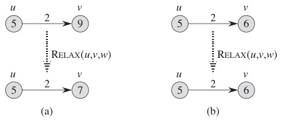
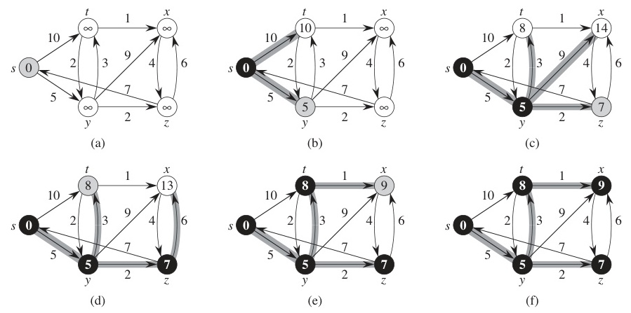
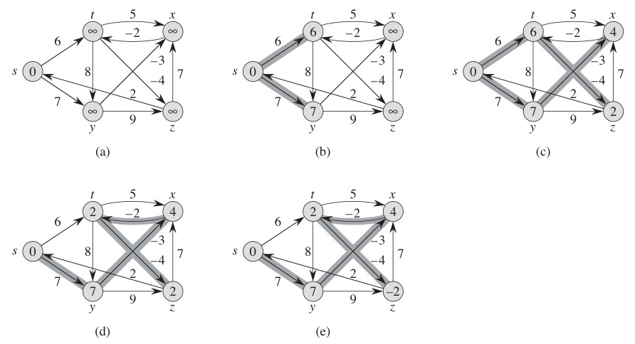
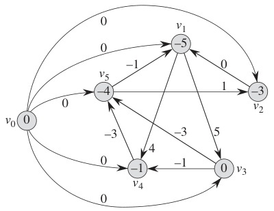

# Week 12 Lecture — Graph Algorithms II

> **Last Updated:** 2026-06-19
>
> Introduction to Algorithms, CLRS - Ch 22, 23, 20

> **Learning Objectives**:
> 1. State the **shortest-path problem** on weighted (di)graphs and explain when it is well-defined (no negative-weight cycle reachable from the source)
> 2. Prove and apply **optimal substructure** of shortest paths
> 3. Define **relaxation** of an edge and recognise it as the core operation shared by every shortest-path algorithm
> 4. Execute **Dijkstra's algorithm** on a graph with non-negative weights, justify the greedy choice, and analyze the running time with a binary heap as $O(E \log V)$
> 5. Construct a small example where Dijkstra **fails on negative edges**, and explain *why* the greedy invariant breaks
> 6. Execute **Bellman-Ford**, derive its $|V|-1$ iteration bound from the path-length argument, and use Phase 2 to **detect negative-weight cycles**
> 7. Re-derive Bellman-Ford as a **dynamic program** indexed by "at most $k$ edges"
> 8. Execute **Floyd-Warshall** using the node-based recurrence $d_{ij}^{(k)} = \min\{d_{ij}^{(k-1)}, d_{ik}^{(k-1)} + d_{kj}^{(k-1)}\}$ and reconstruct paths from the predecessor matrix
> 9. State the alternative **edge-based formulation** of Floyd-Warshall and its connection to matrix multiplication
> 10. Solve shortest paths on a **DAG** in $\Theta(V + E)$ via topological order
> 11. Define **strongly connected components (SCCs)** and execute **Kosaraju's two-pass DFS algorithm** in $\Theta(V + E)$
> 12. Choose the right shortest-path algorithm given graph properties (DAG? negative weights? all pairs?)

---

## Table of Contents

- [1. Shortest Paths — Foundations](#1-shortest-paths--foundations)
  - [1.1 Problem Definition](#11-problem-definition)
  - [1.2 Optimal Substructure](#12-optimal-substructure)
  - [1.3 Relaxation](#13-relaxation)
- [2. Single-Source Shortest Paths](#2-single-source-shortest-paths)
  - [2.1 Dijkstra — Idea](#21-dijkstra--idea)
  - [2.2 Dijkstra — Pseudocode and Complexity](#22-dijkstra--pseudocode-and-complexity)
  - [2.3 Dijkstra — Step-by-Step Example](#23-dijkstra--step-by-step-example)
  - [2.4 Why Dijkstra Fails with Negative Weights](#24-why-dijkstra-fails-with-negative-weights)
  - [2.5 Bellman-Ford — Pseudocode](#25-bellman-ford--pseudocode)
  - [2.6 Bellman-Ford — Step-by-Step Example](#26-bellman-ford--step-by-step-example)
  - [2.7 Bellman-Ford as Dynamic Programming](#27-bellman-ford-as-dynamic-programming)
  - [2.8 Dijkstra vs Bellman-Ford](#28-dijkstra-vs-bellman-ford)
- [3. All-Pairs Shortest Paths — Floyd-Warshall](#3-all-pairs-shortest-paths--floyd-warshall)
  - [3.1 Motivation](#31-motivation)
  - [3.2 Input Matrix](#32-input-matrix)
  - [3.3 Node-Based Recurrence](#33-node-based-recurrence)
  - [3.4 Pseudocode and Complexity](#34-pseudocode-and-complexity)
  - [3.5 Worked Example — k = 0, 1, 2, 3](#35-worked-example--k--0-1-2-3)
  - [3.6 Final Distance Matrix and Path Reconstruction](#36-final-distance-matrix-and-path-reconstruction)
  - [3.7 Predecessor Matrix](#37-predecessor-matrix)
  - [3.8 Edge-Based Formulation](#38-edge-based-formulation)
- [4. DAG Shortest Paths](#4-dag-shortest-paths)
  - [4.1 Algorithm](#41-algorithm)
  - [4.2 Worked Example](#42-worked-example)
- [5. Shortest-Path Algorithms — Big Picture](#5-shortest-path-algorithms--big-picture)
- [6. Strongly Connected Components](#6-strongly-connected-components)
  - [6.1 Definition](#61-definition)
  - [6.2 Kosaraju's Algorithm — Pseudocode](#62-kosarajus-algorithm--pseudocode)
  - [6.3 Kosaraju — Worked Example](#63-kosaraju--worked-example)
  - [6.4 Why Kosaraju Works](#64-why-kosaraju-works)
- [Summary](#summary)
- [Self-Check Questions](#self-check-questions)

---

<br>

## 1. Shortest Paths — Foundations

### 1.1 Problem Definition

- **Setting**: a weighted directed graph $G = (V, E)$ with a weight function $w : E \to \mathbb{R}$.
  - An undirected edge $(u, v)$ is modelled as the two directed edges $(u, v)$ and $(v, u)$ with the same weight.
- **Shortest path** from $u$ to $v$: a path with **minimum total edge weight** among all $u \to v$ paths.
- **Well-definedness**: shortest paths are *undefined* whenever a **negative-weight cycle is reachable from the source** — you can drive the cost to $-\infty$ by traversing the cycle repeatedly.

<br>

**Two flavours of problem:**

| Category | Problem | Algorithms |
|----------|---------|-----------|
| **Single-source** | Shortest paths from one source $r$ to every other vertex | Dijkstra, Bellman-Ford, DAG-ShortestPath |
| **All-pairs** | Shortest paths between **every** ordered pair of vertices | Floyd-Warshall (and "Dijkstra-from-each-vertex" as a baseline) |

> **Why "shortest path" is the right abstraction:** it captures GPS routing, network packet routing, currency arbitrage detection, project scheduling, and dozens more. The choice of algorithm depends entirely on *which assumption you can make about the weights* — non-negative, mixed signs, no cycles at all, etc.

### 1.2 Optimal Substructure

> **Subpaths of shortest paths are themselves shortest paths.**

```
Source ──[5]──> Intermediate ──[3]──> Goal
         ↑                       ↑
     shortest                 shortest
     to here                  from here
```

If the shortest path $S \to G$ goes through an intermediate node $M$ with total cost $5 + 3 = 8$, then:

- the prefix $S \to M$ (cost 5) is itself the shortest $S \to M$ path, and
- the suffix $M \to G$ (cost 3) is itself the shortest $M \to G$ path.

**Proof (cut-and-paste):** if a shorter $S \to M$ path existed, splicing it in front of the $M \to G$ suffix would yield a shorter $S \to G$ path — contradicting optimality of the original.

This property is the reason **dynamic programming** (Bellman-Ford, Floyd-Warshall) and **greedy** (Dijkstra) approaches both work — the answer for a long path decomposes cleanly into answers for shorter sub-paths.

### 1.3 Relaxation

**Relaxation** = updating the current best-known distance estimate when a shorter path is discovered.



*Relaxation: before and after*

```
RELAX(u, v, w):
    if d[u] + w(u, v) < d[v] then
        d[v]    ← d[u] + w(u, v)
        prev[v] ← u
```

- **Before** RELAX: $d[v]$ is some upper bound on the true shortest distance.
- **After** RELAX: either the bound stayed the same, or it tightened to use the path "$\dots \to u \to v$".

```
   (a) Successful relaxation                  (b) No change
     d[u]=5  --(2)-->  d[v]=9                   d[u]=5  --(2)-->  d[v]=6
     becomes d[v] = 5+2 = 7                     5+2 = 7 ≥ 6  →  no update
```

> **Every shortest-path algorithm in this lecture is just a different schedule of RELAX calls.** Dijkstra relaxes outgoing edges of the just-finalized vertex; Bellman-Ford relaxes *every* edge $|V|-1$ times; Floyd-Warshall relaxes through one allowed intermediate vertex per outer iteration. The invariant maintained is always the same: $d[v]$ is an upper bound that is never below the true distance.

---

<br>

## 2. Single-Source Shortest Paths

### 2.1 Dijkstra — Idea

- **Greedy** strategy: at each step, pick the unvisited vertex $u$ with the smallest current estimate $d[u]$ and *finalize* it.
- Maintain a set $S$ of vertices whose shortest distances are already known to be optimal.
- **Requirement**: all edge weights $w(u, v) \geq 0$.
  - Reason: extending a path can only **increase** its total weight, so once we extract the minimum-$d$ vertex from $V \setminus S$, no future relaxation can lower $d[u]$.

> **Key insight**: when Dijkstra extracts $u$ from the priority queue, the invariant "$d[u]$ equals the true shortest distance from $r$ to $u$" is provably true — exactly because every path that has not yet been finalized must leave $S$ through a vertex with $d$-value $\geq d[u]$, and adding non-negative edges can only make things larger.

### 2.2 Dijkstra — Pseudocode and Complexity

```
Dijkstra(G, r):
    S ← ∅
    for each u in V:
        d[u] ← ∞
    d[r] ← 0

    while S ≠ V:                          // n iterations
        u ← extractMin(V - S, d)          // vertex with smallest d
        S ← S ∪ {u}
        for each v in Adj(u):             // relax neighbors
            if v in (V - S) and d[u] + w(u, v) < d[v]:
                d[v]    ← d[u] + w(u, v)
                prev[v] ← u
```

**Running time with a binary min-heap (priority queue):**
- Each vertex is extracted exactly once: $|V|$ extractions, each $O(\log V)$ → $O(V \log V)$.
- Each edge triggers at most one **decrease-key** — the heap operation that lowers a vertex's stored key (its $d$-value) after a successful relaxation and re-sifts it toward the root to restore the heap order: $|E|$ updates, each $O(\log V)$ → $O(E \log V)$.
- **Total: $O((V + E) \log V) = O(E \log V)$** for connected graphs where $E \geq V - 1$.

(With a Fibonacci heap the bound improves to $O(E + V \log V)$ — better for dense graphs in theory.)

### 2.3 Dijkstra — Step-by-Step Example

**Graph** (5 vertices $s, t, x, y, z$; all weights non-negative). Edge list:

```
  s --10--> t        t --1--> x        y --9--> x        z --7--> s
  s -- 5--> y        t --2--> y        y --2--> z        z --6--> x
                     y --3--> t        x --4--> z
```

i.e. $s \to t\,(10)$, $s \to y\,(5)$, $t \to x\,(1)$, $t \to y\,(2)$, $y \to t\,(3)$, $y \to x\,(9)$, $y \to z\,(2)$, $z \to s\,(7)$, $z \to x\,(6)$, $x \to z\,(4)$. (CLRS Fig. 24.6.)

Source $s$. After each iteration, the **bolded** $d$-value identifies the vertex just extracted from the priority queue.

| Step | Extracted | $d[s]$ | $d[t]$ | $d[x]$ | $d[y]$ | $d[z]$ |
|------|-----------|--------|--------|--------|--------|--------|
| Init | —         | **0**  | ∞      | ∞      | ∞      | ∞      |
| (b)  | $s$       | 0      | 10     | ∞      | **5**  | ∞      |
| (c)  | $y$       | 0      | 8      | 14     | 5      | **7**  |
| (d)  | $z$       | 0      | **8**  | 13     | 5      | 7      |
| (e)  | $t$       | 0      | 8      | **9**  | 5      | 7      |
| (f)  | $x$       | 0      | 8      | 9      | 5      | 7      |

The `prev[]` array records each vertex's predecessor on the shortest-path tree, allowing the actual path to be reconstructed by walking backwards from any destination.



*Dijkstra step-by-step execution*

### 2.4 Why Dijkstra Fails with Negative Weights

```
    A ───(1)───> B ──(-2)──> C
    │                        ^
    └────────(0)─────────────┘
```

Edges: $A \to B$ (weight 1), $A \to C$ (weight 0), $B \to C$ (weight $-2$). Source $= A$.

- Init: $d[A] = 0$, $d[B] = \infty$, $d[C] = \infty$.
- Extract $A$ ($d = 0$): relax $A \to B$ → $d[B] = 1$; relax $A \to C$ → $d[C] = 0$.
- Extract $C$ ($d = 0$, **finalized!**): $C$ has no outgoing edges.
- Extract $B$ ($d = 1$): relax $B \to C$: $1 + (-2) = -1 < 0$ — but $C$ is already finalized!
- Dijkstra outputs $d[C] = 0$, whereas the true shortest path is $A \to B \to C$ with cost $1 + (-2) = \mathbf{-1}$.

The greedy invariant — *"extracting the minimum means the distance is final"* — depends on the assumption that **adding more edges can only increase cost**. A negative weight violates this: a *longer* path (more edges) can end up *cheaper*. This is exactly why Bellman-Ford is needed when weights may be negative.

### 2.5 Bellman-Ford — Pseudocode

```
BellmanFord(G, r):
    for each u in V:
        d[u] ← ∞
    d[r] ← 0

    for i ← 1 to |V| - 1:                 // Phase 1: relax |V|-1 times
        for each edge (u, v) in E:
            if d[u] + w(u, v) < d[v]:
                d[v]    ← d[u] + w(u, v)
                prev[v] ← u

    for each edge (u, v) in E:             // Phase 2: detect negative cycle
        if d[u] + w(u, v) < d[v]:
            output "No solution (negative cycle)"
```

**Key ideas:**
- **Negative weights are allowed** — edges can decrease distance estimates.
- After $|V| - 1$ full passes, every shortest path is found. *Why $|V| - 1$?* Any simple shortest path uses at most $|V| - 1$ edges; one pass through all edges propagates correctness one edge further along every path, so $|V| - 1$ passes suffice.
- **Phase 2** sweeps every edge one more time: if anything is still tightening, some path can keep getting shorter, which can only happen if a **negative-weight cycle is reachable** from the source.

**Running time: $\Theta(|V| \cdot |E|)$** — $|V| - 1$ outer iterations × $|E|$ edge relaxations.

### 2.6 Bellman-Ford — Step-by-Step Example

**Graph** (5 vertices $s, t, x, y, z$; some negative edges), source $= s$. Edge list:

```
  s --6--> t        t -- 5--> x        x --(-2)--> t        z --7--> x
  s --7--> y        t -- 8--> y        y --(-3)--> x        z --2--> s
                    t --(-4)-> z        y -- 9 --> z
```

i.e. $s \to t\,(6)$, $s \to y\,(7)$, $t \to x\,(5)$, $t \to y\,(8)$, $t \to z\,(-4)$, $x \to t\,(-2)$, $y \to x\,(-3)$, $y \to z\,(9)$, $z \to x\,(7)$, $z \to s\,(2)$. (CLRS Fig. 24.4.)

The trace below relaxes the edges in the order $(x,t), (t,x), (t,y), (t,z), (y,x), (y,z), (s,t), (s,y), (z,x), (z,s)$ — one fixed order reused every pass:

| Pass    | $d[s]$ | $d[t]$ | $d[x]$ | $d[y]$ | $d[z]$ |
|---------|--------|--------|--------|--------|--------|
| Init    | **0**  | ∞      | ∞      | ∞      | ∞      |
| (b) i=1 | 0      | 6      | ∞      | 7      | ∞      |
| (c) i=2 | 0      | 6      | 4      | 7      | 2      |
| (d) i=3 | 0      | 2      | 4      | 7      | -2     |
| (e) i=4 | 0      | 2      | 4      | 7      | -2     |

After Phase 2 no value tightens further → **no negative cycle**. The recorded `prev[]` defines the shortest-path tree. (Final distances are independent of the relaxation order; only the per-pass progression depends on it.)



*Bellman-Ford step-by-step iterations*

### 2.7 Bellman-Ford as Dynamic Programming

Define
$$d_t^{\,k} = \text{shortest distance from source } r \text{ to } t \text{ using at most } k \text{ edges}.$$

**Base case:**
- $d_r^{\,0} = 0$
- $d_t^{\,0} = \infty$ for all $t \neq r$

**Recurrence** — to reach $v$ in at most $k$ edges, either use $\leq k-1$ edges directly, or take a $\leq k-1$-edge path to some predecessor $u$ and then traverse $(u, v)$:

$$d_v^{\,k} = \min_{(u, v) \in E} \bigl\{\, d_u^{\,k-1} + w(u, v) \,\bigr\}$$

```
       u1 --w1--> v
       u2 --w2--> v     d_v^k = min { d_{u1}^{k-1} + w1,
       u3 --w3--> v                    d_{u2}^{k-1} + w2,
       u4 --w4--> v                    d_{u3}^{k-1} + w3,
                                       d_{u4}^{k-1} + w4 }
```

**Goal**: $d_t^{\,|V|-1}$ for all vertices $t$ (since a simple shortest path uses at most $|V| - 1$ edges).

Bellman-Ford's outer loop is exactly the iteration over $k$; each inner pass over $E$ is the bulk computation of the recurrence for one value of $k$. The detection of a negative cycle corresponds to "the recurrence is still decreasing past $k = |V| - 1$" — impossible without a cycle that contributes negative weight every lap.

### 2.8 Dijkstra vs Bellman-Ford

| Property                  | Dijkstra            | Bellman-Ford           |
|---------------------------|---------------------|------------------------|
| **Negative weights**      | Not allowed         | Allowed                |
| **Negative-cycle detect** | No                  | Yes                    |
| **Strategy**              | Greedy              | Dynamic Programming    |
| **Time complexity**       | $O(E \log V)$       | $\Theta(V \cdot E)$    |
| **Data structure**        | Priority queue (min-heap) | Simple edge list |
| **When to use**           | Non-negative weights | Negative weights possible / cycle detection needed |

---

<br>

## 3. All-Pairs Shortest Paths — Floyd-Warshall

### 3.1 Motivation

**Problem**: compute the shortest path between **every** ordered pair of vertices.

- **Dijkstra from each vertex**: $O(V \cdot E \log V)$ — fine for sparse non-negative graphs.
- **Floyd-Warshall**: $\Theta(V^3)$ — simpler, handles negative weights (provided there is no negative cycle), uses an adjacency matrix.

**Applications**: road atlases (precompute all city-to-city distances), navigation, network routing, transitive-closure computations.

|                    | Dijkstra (single-source) | Floyd-Warshall (all-pairs) |
|--------------------|--------------------------|----------------------------|
| **Computes**       | one source → all vertices | every vertex → every vertex |
| **Input**          | adjacency list           | adjacency matrix           |
| **Negative edges** | not allowed              | allowed (no neg. cycle)    |

### 3.2 Input Matrix

Floyd-Warshall takes an **adjacency matrix** $W$ where:
- $W[i][j] = w(i, j)$ if the edge exists,
- $W[i][j] = \infty$ if no direct edge,
- $W[i][i] = 0$.

**Example** (CLRS):

|       | 1   | 2   | 3   | 4   | 5   |
|-------|-----|-----|-----|-----|-----|
| **1** | 0   | 3   | 8   | ∞   | -4  |
| **2** | ∞   | 0   | ∞   | 1   | 7   |
| **3** | ∞   | 4   | 0   | ∞   | ∞   |
| **4** | 2   | ∞   | -5  | 0   | ∞   |
| **5** | ∞   | ∞   | ∞   | 6   | 0   |

### 3.3 Node-Based Recurrence

Define
$$d_{ij}^{\,(k)} = \text{shortest distance from } i \text{ to } j \text{ using only intermediate vertices in } \{v_1, v_2, \dots, v_k\}.$$

```
        i ────[intermediates from {1,…,k-1}]────> j        (option A: don't use k)
                          OR
        i ────> k ────> j                                  (option B: use k once)
         (d_{ik}^{(k-1)})  (d_{kj}^{(k-1)})
```

**Recurrence:**

$$
d_{ij}^{\,(0)} = w_{ij}, \qquad
d_{ij}^{\,(k)} = \min\bigl\{\, d_{ij}^{\,(k-1)},\; d_{ik}^{\,(k-1)} + d_{kj}^{\,(k-1)} \,\bigr\} \quad (k \geq 1)
$$

Two choices at each step:
1. **Don't use vertex $k$** as an intermediate: keep $d_{ij}^{\,(k-1)}$.
2. **Use vertex $k$** as an intermediate exactly once: $d_{ik}^{\,(k-1)} + d_{kj}^{\,(k-1)}$.

Take the minimum.

> **Why "at most once"?** In any shortest path, no vertex appears more than once (loops only add cost when there are no negative cycles). So the moment we "consider" vertex $k$, it is enough to either include it once or exclude it entirely.

### 3.4 Pseudocode and Complexity

```
FloydWarshall(G):
    // Initialize D^(0)
    for i ← 1 to n:
        for j ← 1 to n:
            d_ij^(0) ← w_ij

    // Main computation
    for k ← 1 to n:                       // intermediate set {1,…,k}
        for i ← 1 to n:                   // source vertex
            for j ← 1 to n:               // destination vertex
                d_ij^(k) ← min { d_ij^(k-1), d_ik^(k-1) + d_kj^(k-1) }
```

**Time: $\Theta(V^3)$.**
- Total subproblems: $\Theta(V^3)$ (three nested loops over $n$).
- Each subproblem: $\Theta(1)$ work (one min, one addition).

In practice the three matrices $D^{(k-1)}$, $D^{(k)}$ can be collapsed into a single in-place matrix because the read pattern guarantees correctness — see the worked example.

### 3.5 Worked Example — k = 0, 1, 2, 3

**$D^{(0)} = W$** (direct edges only, no intermediate vertices):

|       | 1   | 2   | 3   | 4   | 5   |
|-------|-----|-----|-----|-----|-----|
| **1** | 0   | 3   | 8   | ∞   | -4  |
| **2** | ∞   | 0   | ∞   | 1   | 7   |
| **3** | ∞   | 4   | 0   | ∞   | ∞   |
| **4** | 2   | ∞   | -5  | 0   | ∞   |
| **5** | ∞   | ∞   | ∞   | 6   | 0   |

**$D^{(1)}$ — allow vertex 1 as intermediate.** $d_{ij}^{(1)} = \min\{d_{ij}^{(0)},\, d_{i1}^{(0)} + d_{1j}^{(0)}\}$.

- $d_{42}^{(1)} = \min\{d_{42}^{(0)},\, d_{41}^{(0)} + d_{12}^{(0)}\} = \min\{\infty,\, 2 + 3\} = \mathbf{5}$
- $d_{45}^{(1)} = \min\{d_{45}^{(0)},\, d_{41}^{(0)} + d_{15}^{(0)}\} = \min\{\infty,\, 2 + (-4)\} = \mathbf{-2}$

|       | 1   | 2     | 3   | 4   | 5      |
|-------|-----|-------|-----|-----|--------|
| **1** | 0   | 3     | 8   | ∞   | -4     |
| **2** | ∞   | 0     | ∞   | 1   | 7      |
| **3** | ∞   | 4     | 0   | ∞   | ∞      |
| **4** | 2   | **5** | -5  | 0   | **-2** |
| **5** | ∞   | ∞     | ∞   | 6   | 0      |

**$D^{(2)}$ — allow {1, 2} as intermediates.** $d_{ij}^{(2)} = \min\{d_{ij}^{(1)},\, d_{i2}^{(1)} + d_{2j}^{(1)}\}$.

- $d_{14}^{(2)} = \min\{\infty,\, 3 + 1\} = \mathbf{4}$
- $d_{34}^{(2)} = \min\{\infty,\, 4 + 1\} = \mathbf{5}$

|       | 1   | 2   | 3   | 4     | 5      |
|-------|-----|-----|-----|-------|--------|
| **1** | 0   | 3   | 8   | **4** | -4     |
| **2** | ∞   | 0   | ∞   | 1     | 7      |
| **3** | ∞   | 4   | 0   | **5** | **11** |
| **4** | 2   | 5   | -5  | 0     | -2     |
| **5** | ∞   | ∞   | ∞   | 6     | 0      |

**$D^{(3)}$ — allow {1, 2, 3} as intermediates.** $d_{ij}^{(3)} = \min\{d_{ij}^{(2)},\, d_{i3}^{(2)} + d_{3j}^{(2)}\}$.

- $d_{42}^{(3)} = \min\{5,\, (-5) + 4\} = \mathbf{-1}$

|       | 1   | 2      | 3   | 4   | 5   |
|-------|-----|--------|-----|-----|-----|
| **1** | 0   | 3      | 8   | 4   | -4  |
| **2** | ∞   | 0      | ∞   | 1   | 7   |
| **3** | ∞   | 4      | 0   | 5   | 11  |
| **4** | 2   | **-1** | -5  | 0   | -2  |
| **5** | ∞   | ∞      | ∞   | 6   | 0   |

> **In-place computation is safe** (cf. §3.4). At iteration $k$ the only entries read are $d_{ik}$ and $d_{kj}$ — those in row $k$ and column $k$. But $d_{kk}^{(k)} = d_{kk}^{(k-1)} = 0$ (no negative cycle), so $d_{ik}^{(k)} = d_{ik}^{(k-1)}$ and $d_{kj}^{(k)} = d_{kj}^{(k-1)}$: row $k$ and column $k$ are *unchanged* by the $k$-th pass. Overwriting $d_{ij}$ in place therefore reads the same values whether or not it has already been updated this pass — a single matrix suffices. Re-running the $D^{(0)} \to D^{(5)}$ example with one in-place array reproduces the matrix in §3.6 exactly.

### 3.6 Final Distance Matrix and Path Reconstruction

After computing $D^{(4)}$ and $D^{(5)}$, the **all-pairs shortest distances** are:

|       | 1   | 2   | 3   | 4   | 5   |
|-------|-----|-----|-----|-----|-----|
| **1** | 0   | 1   | -3  | 2   | -4  |
| **2** | 3   | 0   | -4  | 1   | -1  |
| **3** | 7   | 4   | 0   | 5   | 3   |
| **4** | 2   | -1  | -5  | 0   | -2  |
| **5** | 8   | 5   | 1   | 6   | 0   |

**Path reconstruction example** — shortest path $1 \to 2$, cost $= 1$:

Trace the predecessor matrix backwards:
- $1 \to 5 \to 4 \to 3 \to 2$ with total weight $(-4) + 6 + (-5) + 4 = 1$. ✓

### 3.7 Predecessor Matrix

A **predecessor matrix** $\Pi^{(k)}$ is maintained alongside $D^{(k)}$:

- $\pi_{ij}^{(k)} = $ predecessor of $j$ on the shortest path from $i$ to $j$ using intermediates from $\{1, \dots, k\}$.

**Base case ($k = 0$):**

```
π_{ij}^(0) = i      if i ≠ j and w_{ij} < ∞
π_{ij}^(0) = NIL    if i = j or w_{ij} = ∞
```

**Recurrence ($k \geq 1$):**

```
π_{ij}^(k) = π_{ij}^(k-1)        if d_{ij}^(k-1) ≤ d_{ik}^(k-1) + d_{kj}^(k-1)
π_{ij}^(k) = π_{kj}^(k-1)        otherwise   (path was improved via k)
```

To reconstruct the path from $i$ to $j$: start at $j$, follow predecessors backwards until you reach $i$, then reverse.

### 3.8 Edge-Based Formulation

An alternative formulation indexes by **number of edges allowed** instead of vertex set:

Define $\ell_{ij}^{\,(m)}$ = shortest distance from $i$ to $j$ using **at most $m$ edges**.

**Recurrence:**

$$
\ell_{ij}^{\,(m)} = \min_{1 \leq k \leq n} \bigl\{\, \ell_{ik}^{\,(m-1)} + w_{kj} \,\bigr\}
$$

This is structurally identical to **matrix multiplication** where:
- "multiply" becomes addition: $\ell_{ik} + w_{kj}$
- "add" becomes minimum.

We write this **min-plus (tropical) product** as $\boxtimes$: for matrices $A, B$,
$$(A \boxtimes B)_{ij} = \min_{1 \leq k \leq n} \bigl\{\, A_{ik} + B_{kj} \,\bigr\}.$$
It is exactly ordinary matrix multiplication with $(+, \times)$ replaced by $(\min, +)$. The recurrence above is then simply $L^{(m)} = L^{(m-1)} \boxtimes W$.

**Computation:** $L^{(1)} = W$, $L^{(2)} = L^{(1)} \boxtimes W$, $\dots$, $L^{(n-1)}$ is the final answer (any simple shortest path uses at most $n - 1$ edges).

**Time**: $\Theta(n^4)$ naïvely, or $\Theta(n^3 \log n)$ with **repeated squaring** (since the operation is associative, $L^{(2k)} = L^{(k)} \boxtimes L^{(k)}$).

> **Why have two formulations?** The node-based formulation gives the clean $\Theta(V^3)$ bound of Floyd-Warshall directly. The edge-based "min-plus matrix multiplication" view exposes the structural link to fast matrix multiplication and is the entry point for theoretically faster algorithms (e.g. via Strassen-like techniques on the tropical semiring).

---

<br>

## 4. DAG Shortest Paths

### 4.1 Algorithm

For **directed acyclic graphs** (DAGs) — even with negative edge weights — shortest paths can be computed in **linear time**.

```
DAG-ShortestPath(G, r):
    for each u in V:
        d[u] ← ∞
    d[r] ← 0

    Topologically sort the vertices of G

    for each u in V (in topological order):
        for each v in Adj(u):
            if d[u] + w(u, v) < d[v]:
                d[v]    ← d[u] + w(u, v)
                prev[v] ← u
```

**Time: $\Theta(V + E)$.**
- Topological sort: $\Theta(V + E)$ (Week 11).
- Single pass over edges (relax each one exactly once, because every edge $(u, v)$ has $u$ visited before $v$ in topo order): $\Theta(V + E)$.

**Why it works:** in a DAG, by the time we process $u$ in topological order, every path ending at $u$ has been fully explored — so $d[u]$ is already correct, and one outgoing relaxation per edge is enough. Cycles can never sneak in to invalidate the order, which is why the same trick fails on general graphs.

This is **much faster than Dijkstra ($O(E \log V)$) and Bellman-Ford ($\Theta(VE)$)** when the graph is a DAG — e.g., for PERT charts, dependency networks, and one-shot decision diagrams.

### 4.2 Worked Example

**DAG** (6 vertices; every edge points forward in the topological order $v_0, v_1, v_2, v_3, v_4, v_5$). Edge list:

```
  v0 --(-5)--> v1        v1 --2--> v2        v2 --4--> v5
  v0 --(-4)--> v4        v1 --5--> v3        v3 --(-1)--> v5
                         v4 --6--> v2
```

i.e. $v_0 \to v_1\,(-5)$, $v_0 \to v_4\,(-4)$, $v_1 \to v_2\,(2)$, $v_1 \to v_3\,(5)$, $v_2 \to v_5\,(4)$, $v_3 \to v_5\,(-1)$, $v_4 \to v_2\,(6)$.

Source $= v_0$, processed in topological order $v_0, v_1, v_2, v_3, v_4, v_5$:

| Step | Process | $d[v_0]$ | $d[v_1]$ | $d[v_2]$ | $d[v_3]$ | $d[v_4]$ | $d[v_5]$ |
|------|---------|----------|----------|----------|----------|----------|----------|
| Init | —       | **0**    | ∞        | ∞        | ∞        | ∞        | ∞        |
| (a)  | $v_0$   | 0        | **-5**   | ∞        | ∞        | **-4**   | ∞        |
| (b)  | $v_1$   | 0        | -5       | **-3**   | **0**    | -4       | ∞        |
| (c)  | $v_2$   | 0        | -5       | -3       | 0        | -4       | **1**    |
| (d)  | $v_3$   | 0        | -5       | -3       | 0        | -4       | **-1**   |
| (e)  | $v_4$   | 0        | -5       | -3       | 0        | -4       | -1       |
| (f)  | $v_5$   | 0        | -5       | -3       | 0        | -4       | -1       |

Each vertex is processed exactly once; every outgoing edge is relaxed exactly once. The bolded `d`-values mark each relaxation that improved a distance. Note $d[v_5]$ is first set to $1$ via $v_2 \to v_5$ at step (c), then improved to $-1$ via $v_3 \to v_5$ at step (d) — the topological order guarantees both contributors ($v_2, v_3$) are processed before $v_5$.



*DAG shortest paths example*

---

<br>

## 5. Shortest-Path Algorithms — Big Picture

| Algorithm           | Problem              | Neg. weights | Time                 | Technique         |
|---------------------|----------------------|--------------|----------------------|-------------------|
| **Dijkstra**        | single-source        | No           | $O(E \log V)$        | Greedy            |
| **Bellman-Ford**    | single-source        | Yes          | $\Theta(V \cdot E)$  | Dynamic Programming |
| **DAG-ShortestPath**| single-source (DAG)  | Yes          | $\Theta(V + E)$      | Topological order |
| **Floyd-Warshall**  | all-pairs            | Yes          | $\Theta(V^3)$        | Dynamic Programming |

**Decision flow:**
1. **Is the graph a DAG?** Use DAG-ShortestPath (linear time, accepts negative weights).
2. **Are all weights non-negative?** Use Dijkstra (efficient single-source).
3. **Can weights be negative?** Use Bellman-Ford (also detects negative cycles).
4. **Do you need all pairs?** Floyd-Warshall if the graph is dense or weights may be negative; otherwise $|V| \times$ Dijkstra.

---

<br>

## 6. Strongly Connected Components

### 6.1 Definition

- A directed graph is **strongly connected** if for every ordered pair of vertices $(u, v)$ there exists a path $u \to v$ **and** a path $v \to u$.
- A **Strongly Connected Component (SCC)** of a directed graph $G$ is a **maximal** subgraph that is strongly connected — i.e., add any other vertex and strong connectivity is lost.

```
Example:
    1 --> 2 --> 3 --> 4
    ^     |     ^     |
    |     v     |     v
    6 <-- 5     8 <-- 7
          |           |
          v           v
          9 --> 10    (dead end)

SCCs: {1, 2, 5, 6}, {3, 4, 7, 8}, {9}, {10}
```

Every directed graph "condenses" into a DAG whose nodes are its SCCs — a tremendously useful fact for analyzing call graphs, dependency tangles, and dataflow systems.

### 6.2 Kosaraju's Algorithm — Pseudocode

```
StronglyConnectedComponents(G):

1. Run DFS on G and compute finish times f[v] for every vertex v.
   (Recall from Week 11: f[v] is the time at which DFS finishes exploring v
    — i.e., when v is colored black after all its descendants are done.)

2. Construct G^R (reverse every edge in G).

3. Run DFS on G^R, but process vertices in DECREASING order of f[v]
   (start from the vertex that finished LAST in step 1).

4. Each DFS tree formed in step 3 is one strongly connected component.
```

**Time: $\Theta(V + E)$.**
- Step 1 (DFS on $G$): $\Theta(V + E)$.
- Step 2 (build reversed graph): $\Theta(V + E)$.
- Step 3 (DFS on $G^R$ in finish-time order): $\Theta(V + E)$.

Two DFS passes, one edge reversal — that's it.

### 6.3 Kosaraju — Worked Example

**Step 1:** DFS on $G$, recording finish times.

```
Graph G — three cycles joined by ONE-WAY bridges (a clean condensation DAG):

  Component A {1,2,3,4}:   1 --> 2 --> 3 --> 4 --> 1   (a directed 4-cycle)
  Component B {5,6,7,8}:   5 --> 6 --> 7 --> 8 --> 5   (a directed 4-cycle)
  Component C {9,10}:      9 <--> 10                    (a 2-cycle: 9->10, 10->9)

  Bridges (one-directional, NO return path):
       3 --> 5    (A → B)
       7 --> 9    (B → C)
```

These bridges go *only* A → B → C, so no vertex in B or C can return to A, and none in C can return to B. The condensation is the DAG $A \to B \to C$, giving exactly three SCCs.

DFS starting at vertex 1 (visiting neighbors in ascending order) produces the finish-time order:
$$f[4]=1,\; f[8]=2,\; f[10]=3,\; f[9]=4,\; f[7]=5,\; f[6]=6,\; f[5]=7,\; f[3]=8,\; f[2]=9,\; f[1]=10.$$

The DFS path is $1 \to 2 \to 3 \to 4$ (back-edge $4 \to 1$, so 4 finishes first), then $3 \to 5 \to 6 \to 7 \to 8$ (back-edge $8 \to 5$), then $7 \to 9 \to 10$ (back-edge $10 \to 9$). Vertices in component A finish *last* because the bridges keep the recursion descending into B and C before unwinding back up through A.

**Step 2:** reverse all edges to obtain $G^R$ (the bridges become $5 \to 3$ and $9 \to 7$).

**Step 3:** DFS on $G^R$ in **decreasing** finish-time order, i.e., processing roots $1, 2, 3, 5, 6, 7, 9, 10, 8, 4$.

- Start DFS from vertex **1** ($f=10$) in $G^R$: reaches $\{1, 4, 3, 2\}$ → **SCC 1**. (In $G^R$, $1 \to 4 \to 3 \to 2 \to 1$; the reversed bridge $5 \to 3$ points *into* this set, not out, so DFS cannot escape.)
- Next unvisited root by decreasing $f$ is **5** ($f=7$): reaches $\{5, 8, 7, 6\}$ → **SCC 2**. (The reversed bridge $9 \to 7$ points into this set.)
- Next unvisited root is **9** ($f=4$): reaches $\{9, 10\}$ → **SCC 3**.

**Result: 3 SCCs** = $\{1, 2, 3, 4\}$, $\{5, 6, 7, 8\}$, $\{9, 10\}$.

### 6.4 Why Kosaraju Works

**Key invariant:** if $u$ and $v$ are in the same SCC, then
- $u \to v$ in $G$ implies $v \to u$ in $G^R$, and
- $v \to u$ in $G$ implies $u \to v$ in $G^R$.

So $u$ and $v$ are in the **same SCC of $G^R$** as well — reversing edges does not break SCCs.

**Why finish-time order is the right schedule:**
- The vertex with the **largest** finish time in DFS($G$) belongs to a *source SCC* of the SCC-DAG — an SCC with no incoming edges from any other SCC.
- Running DFS from that vertex in $G^R$ reaches *only* the source SCC, because every edge that would leave it in $G$ now points *into* it in $G^R$ (and DFS from this vertex cannot get back out).
- After "peeling off" that SCC, the next-largest unprocessed finish time identifies the next source SCC of the *remaining* SCC-DAG, and so on.

This is the textbook **two-pass DFS** trick — a beautifully economical use of DFS finish times for a globally meaningful task.

---

<br>

## Summary

| Topic                          | Key Points                                                                |
|--------------------------------|---------------------------------------------------------------------------|
| **Shortest-path foundations**  | Optimal substructure; relaxation is the universal core operation          |
| **Dijkstra**                   | Greedy, non-negative weights only, $O(E \log V)$ with binary heap         |
| **Why Dijkstra fails on neg.** | A longer path can be cheaper → greedy "finalize on extract" breaks        |
| **Bellman-Ford**               | DP, negative weights OK, $\Theta(VE)$, detects negative cycles in Phase 2 |
| **Bellman-Ford as DP**         | $d_v^k = \min_{(u,v)\in E} (d_u^{k-1} + w(u,v))$; outer loop is $k$       |
| **Floyd-Warshall (node-based)**| $d_{ij}^{(k)} = \min\{d_{ij}^{(k-1)},\, d_{ik}^{(k-1)} + d_{kj}^{(k-1)}\}$; $\Theta(V^3)$ |
| **Predecessor matrix**         | Built alongside $D^{(k)}$ for path reconstruction                         |
| **Edge-based formulation**     | $\ell^{(m)}_{ij} = \min_k (\ell^{(m-1)}_{ik} + w_{kj})$ — min-plus matrix mult; $\Theta(n^3 \log n)$ with repeated squaring |
| **DAG shortest paths**         | Topological order + one relaxation pass = $\Theta(V + E)$                 |
| **Strongly Connected Components** | Kosaraju: DFS on $G$ → reverse → DFS on $G^R$ in decreasing $f[v]$; $\Theta(V + E)$ |

**Key takeaways:**
- **Relaxation is the universal hammer.** All four shortest-path algorithms are just different schedules of RELAX calls.
- **Greedy works only with non-negative weights.** Otherwise switch to DP (Bellman-Ford / Floyd-Warshall) or exploit special structure (DAG).
- **DAG-ShortestPath is the cheapest option** when the graph has no cycles — almost always worth a topological-sort check first.
- **Floyd-Warshall's two formulations** (node vs edge / matrix-mult) give the same answer; the node-based view gives the clean $\Theta(V^3)$ bound, the edge-based view connects to a beautiful algebraic structure.
- **SCCs reduce a directed graph to a DAG.** Once you know the SCCs, many "is everything reachable / circular / consistent?" questions become trivial DAG queries.

> "Shortest paths and SCCs are the two lenses through which a directed graph becomes structured enough to reason about."

**Next week:** NP-Completeness & Approximation Algorithms.

---

<br>

## Self-Check Questions

1. **Well-definedness:** Why are shortest paths undefined in the presence of a negative-weight cycle reachable from the source? Give a 3-vertex example.

   > **Answer:** A negative-weight cycle can be traversed any number of times. Each lap *decreases* the total cost by the (negative) sum of cycle weights, so the infimum of path costs is $-\infty$ and no actual path attains it. **Example:** vertices $A, B, C$ with $A \to B$ (1), $B \to C$ (-3), $C \to B$ (1) — the cycle $B \to C \to B$ has weight $-2$. From $A$, the path $A, B, C, B, C, B, \dots$ has unbounded-below cost.

2. **Optimal substructure proof:** Prove rigorously that any subpath of a shortest path is itself a shortest path.

   > **Answer:** Let $P = v_0 \to v_1 \to \dots \to v_k$ be a shortest $v_0 \to v_k$ path of cost $w(P)$. Pick any sub-segment $P_{ij} = v_i \to \dots \to v_j$. Suppose for contradiction there is a strictly shorter path $Q$ from $v_i$ to $v_j$ with $w(Q) < w(P_{ij})$. Then $P' = v_0 \to \dots \to v_i \overset{Q}{\to} v_j \to \dots \to v_k$ has cost $w(P) - w(P_{ij}) + w(Q) < w(P)$, contradicting optimality of $P$. So $w(Q) \geq w(P_{ij})$, i.e., $P_{ij}$ is itself shortest. (This is the standard **cut-and-paste argument**.)

3. **Dijkstra trace:** Run Dijkstra on the graph from §2.3 starting at $t$ instead of $s$. Report the final $d$-values and the order of extraction.

   > **Answer:** Using the same edge set (deduced from the table: $s \to t$ (10), $s \to y$ (5), $t \to x$ (1), $t \to y$ (2), $y \to t$ (3), $y \to x$ (9), $y \to z$ (2), $z \to s$ (7), $z \to x$ (6), $x \to z$ (4)). From $t$: init $d[t]=0$, others $\infty$. Extract $t$ → relax $x:1$, $y:2$. Extract $x$ ($d=1$) → relax $z: 1+4=5$. Extract $y$ ($d=2$) → relax $z: \min(5, 2+2)=4$, $x: \min(1, 2+9)=1$. Extract $z$ ($d=4$) → relax $s: 4+7=11$, $x: \min(1, 4+6)=1$. Extract $s$ ($d=11$) → relax $y: \min(2, 11+5)=2$. Final: $d[t]=0, d[x]=1, d[y]=2, d[z]=4, d[s]=11$. Order: $t, x, y, z, s$.

4. **Failure on negatives:** Construct a 4-vertex graph with exactly one negative edge on which Dijkstra produces a wrong answer. Show the exact step where the invariant breaks.

   > **Answer:** Vertices $\{A, B, C, D\}$, edges $A \to B$ (2), $A \to C$ (3), $B \to D$ (1), $C \to D$ ($-2$). Source $A$. Init $d[A]=0$; extract $A$ → $d[B]=2, d[C]=3$. Extract $B$ ($d=2$) → $d[D] = 3$. Extract $D$ ($d=3$, **finalized**) → no outgoing edges. Extract $C$ ($d=3$) → relax $C \to D$: $3 + (-2) = 1 < 3$, but $D$ is already finalized. Dijkstra reports $d[D] = 3$, true shortest is $A \to C \to D$ with cost $1$. **Invariant breaks** at "extract $D$": the greedy claim *"no future relaxation can lower $d[D]$"* requires that all unexplored paths to $D$ cost at least $d[D]$. With the negative edge $C \to D$, the path $A \to C \to D$ later turns out cheaper.

5. **Why $|V|-1$ iterations?** Prove that Bellman-Ford correctly computes all shortest distances after $|V|-1$ iterations, but not always after $|V|-2$.

   > **Answer:** Any simple shortest path has at most $|V| - 1$ edges. **Induction claim:** after $i$ iterations, $d[v]$ is at most the cost of any shortest path from $r$ to $v$ that uses **at most $i$ edges**. Base case $i = 0$: $d[r] = 0$, $d[v] = \infty$ for $v \neq r$ — correct (no path has 0 edges to anywhere except $r$). Inductive step: in iteration $i$, the relaxation of edge $(u, v)$ for the predecessor $u$ on the $\leq i$-edge shortest path uses $d[u] \leq $ optimal $(\leq i-1)$-edge distance to $u$, and so $d[v]$ updates to a valid $\leq i$-edge bound. After $|V| - 1$ iterations every simple path is fully relaxed. **Not after $|V| - 2$:** consider the linear chain $v_0 \to v_1 \to \dots \to v_{n-1}$ with all weights 1, and an edge ordering that always relaxes the *last* edge first — then exactly $|V| - 1$ iterations are needed.

6. **Bellman-Ford as DP:** Re-derive the algorithm from the recurrence $d_v^k = \min_{(u,v) \in E} (d_u^{k-1} + w(u, v))$. Show why iterating $k$ from 1 to $|V| - 1$ and relaxing every edge implements this.

   > **Answer:** Maintain a single $d[\cdot]$ array (size $|V|$). At iteration $k$, before the inner sweep, $d[u]$ holds the optimal "at most $k - 1$ edges" distance. The inner sweep over all edges performs the min update for every potential predecessor $u$ of every $v$, exactly evaluating $d_v^k = \min_{(u,v)} (d_u^{k-1} + w(u, v))$ — except that within one sweep $d[u]$ may already have been updated to its $k$-th value, which can only *improve* the bound (and never violates correctness because we are taking a min). So after iteration $k$, $d[\cdot]$ is correct for "at most $k$ edges". After $|V| - 1$ iterations it is correct overall.

7. **Floyd-Warshall trace:** Continue the §3.5 example, compute $D^{(4)}$ and $D^{(5)}$, and verify the final matrix in §3.6.

   > **Answer:** **$D^{(4)}$**: allow $\{1,2,3,4\}$. Use the recurrence with $k = 4$. Notable updates: $d_{15}^{(4)} = \min(-4, 4 + (-2)) = -4$ (no change). $d_{25}^{(4)} = \min(7, 1 + (-2)) = -1$. $d_{35}^{(4)} = \min(11, 5 + (-2)) = 3$. $d_{21}^{(4)} = \min(\infty, 1 + 2) = 3$. $d_{23}^{(4)} = \min(\infty, 1 + (-5)) = -4$. $d_{31}^{(4)} = \min(\infty, 5 + 2) = 7$. $d_{33}^{(4)} = \min(0, 5 + (-5)) = 0$ (no change). **$D^{(5)}$**: allow $\{1,2,3,4,5\}$. Notable: $d_{12}^{(5)} = \min(3, -4 + 5) = 1$. $d_{13}^{(5)} = \min(-1, -4 + 1) = -3$. $d_{14}^{(5)} = \min(4, -4 + 6) = 2$. $d_{52}^{(5)} = \min(\infty, 6 + (-1)) = 5$. $d_{51}^{(5)} = \min(\infty, 6 + 2) = 8$. $d_{53}^{(5)} = \min(\infty, 6 + (-5)) = 1$. Final matches §3.6. ✓

8. **Edge-based formulation:** Show why $L^{(2k)} = L^{(k)} \boxtimes L^{(k)}$ in the min-plus semiring, and conclude the $\Theta(n^3 \log n)$ bound via repeated squaring.

   > **Answer:** $\ell_{ij}^{(2k)}$ is the cost of a shortest $i \to j$ path with at most $2k$ edges. Any such path decomposes as a prefix of length $\leq k$ from $i$ to some intermediate $m$, plus a suffix of length $\leq k$ from $m$ to $j$. So $\ell_{ij}^{(2k)} = \min_m (\ell_{im}^{(k)} + \ell_{mj}^{(k)})$ — exactly $L^{(k)} \boxtimes L^{(k)}$. Since $L^{(n-1)}$ is the answer and $n - 1 \leq 2^{\lceil \log_2(n-1) \rceil}$, we need only $\lceil \log_2(n-1) \rceil$ squarings. Each squaring is $\Theta(n^3)$ (triple loop), giving **$\Theta(n^3 \log n)$** total.

9. **DAG advantage:** On a DAG with $V = 10^6$ and $E = 5 \cdot 10^6$ and negative edges, which algorithm should you use and what is the speedup over Bellman-Ford?

   > **Answer:** Use **DAG-ShortestPath**: topological sort + linear-time relaxation = $\Theta(V + E) = 6 \cdot 10^6$ operations. **Bellman-Ford** runs in $\Theta(VE) = 5 \cdot 10^{12}$ operations — about $10^6$ times slower. The speedup factor is $V$ (precisely, $|V|$), which is the whole point of exploiting the DAG structure. Dijkstra is *not* an option because of negative edges.

10. **Kosaraju trace:** Run Kosaraju on the directed graph with edges $\{(1,2), (2,3), (3,1), (3,4), (4,5), (5,4)\}$. Report the SCCs and the finish times that drive the second pass.

    > **Answer:** **Step 1** — DFS on $G$ starting at 1: visit 1 → 2 → 3 → 1 (back edge) → 3 visits 4 → 4 → 5 → 4 (back edge), 5 finishes ($f=1$), 4 finishes ($f=2$), 3 finishes ($f=3$), 2 finishes ($f=4$), 1 finishes ($f=5$). **Step 2** — reverse all edges: $G^R$ has $\{(2,1), (3,2), (1,3), (4,3), (5,4), (4,5)\}$. **Step 3** — DFS on $G^R$ in decreasing $f$ order: start at 1 ($f=5$) → in $G^R$, 1 → 3 → 2; reaches $\{1, 2, 3\}$ = **SCC 1**. Next unprocessed by decreasing $f$ is 4 ($f=2$) → in $G^R$, 4 → 5; reaches $\{4, 5\}$ = **SCC 2**. **Result:** SCCs = $\{1, 2, 3\}$ and $\{4, 5\}$.

11. **Why finish-time ordering?** Why does Kosaraju require *decreasing* finish-time order in step 3? What would go wrong with arbitrary order, or with *increasing* finish-time order?

    > **Answer:** The vertex with the **largest** $f[\cdot]$ in DFS($G$) belongs to a **source SCC** of the SCC-DAG (no incoming SCC edges). In $G^R$, that SCC becomes a *sink*: DFS from this vertex in $G^R$ cannot escape its SCC, so it discovers exactly that SCC. **Arbitrary order:** the first DFS in $G^R$ might start in a non-source SCC and walk into another SCC via a still-present cross-SCC edge in $G^R$, merging them incorrectly. **Increasing order:** you would start at a sink SCC of $G$, which is a *source* SCC in $G^R$ — DFS could walk into other SCCs via $G^R$ edges and again merge them. Only "decreasing $f$" guarantees you always start at a current source SCC in $G^R$ and "peel" SCCs one at a time.

12. **Algorithm choice:** For each scenario, state the best algorithm and justify in one sentence.

    | Scenario | Best algorithm |
    |----------|----------------|
    | (a) GPS routing, road weights are travel times (non-negative) | ? |
    | (b) Currency-exchange graph, edges weighted by $-\log(\text{rate})$, detect arbitrage cycle | ? |
    | (c) Precompute all city-to-city distances in a country atlas | ? |
    | (d) Build-system dependency graph, compute earliest finish time | ? |

    > **Answer:** **(a)** Dijkstra — single-source, non-negative weights, $O(E \log V)$. **(b)** Bellman-Ford — negative weights are possible (an arbitrage opportunity is exactly a negative-weight cycle, and Phase 2 detects it). **(c)** Floyd-Warshall — all-pairs query is the entire point; $\Theta(V^3)$ is acceptable because a country has thousands of cities, not millions, and the matrix is precomputed once. **(d)** DAG-ShortestPath (more precisely, the longest-path variant on the DAG of tasks, but the algorithm template is the same) — dependency graph is acyclic, $\Theta(V + E)$.
